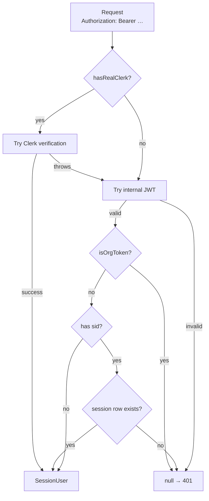
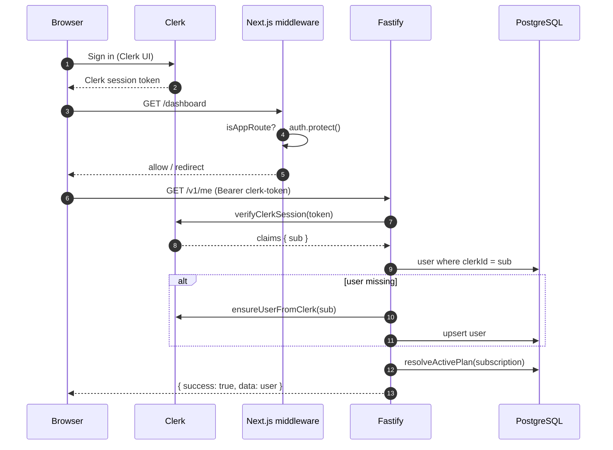
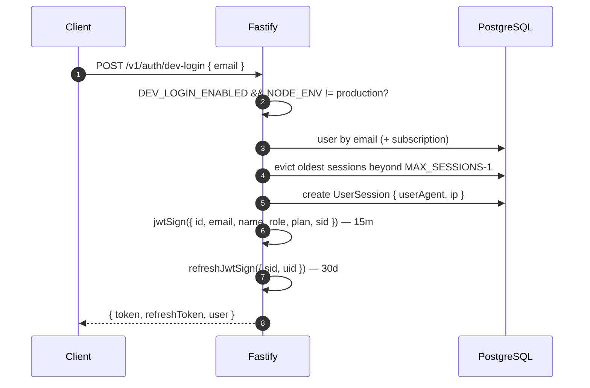
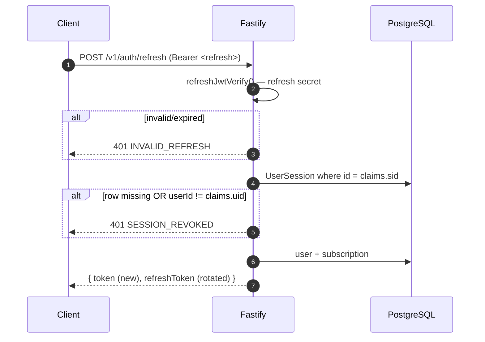
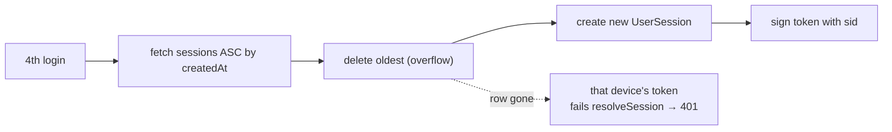
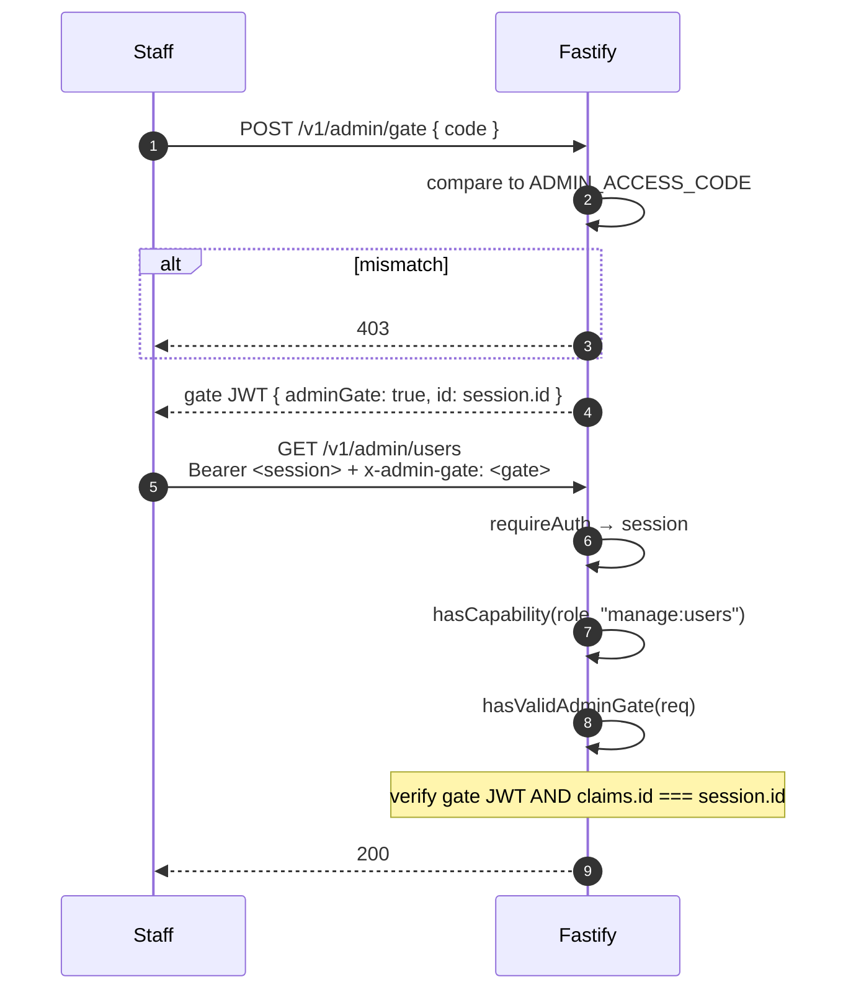
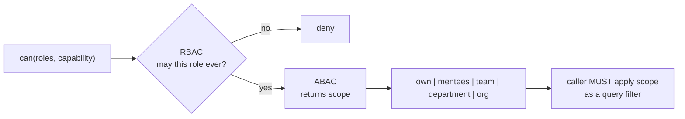
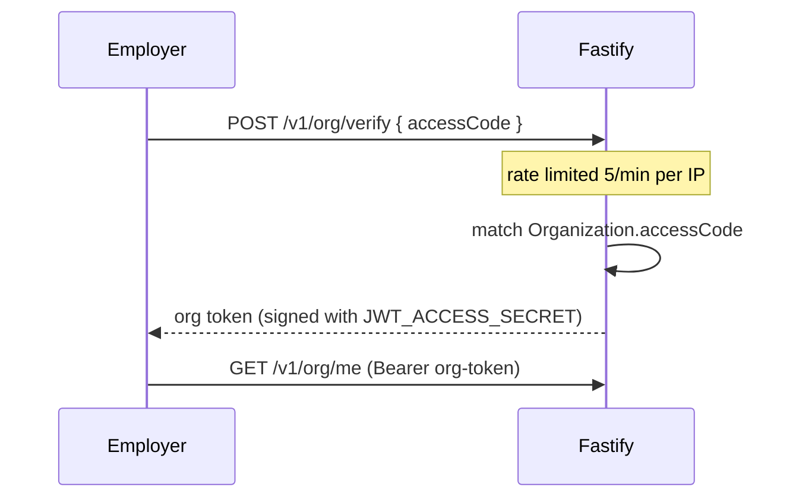

# Authentication & Authorization

**Audience:** backend/frontend engineers, security engineers.
**Related:** [SECURITY](SECURITY.md) · [API_DOCUMENTATION](API_DOCUMENTATION.md) · [THIRD_PARTY_SERVICES](THIRD_PARTY_SERVICES.md)

---

## Table of Contents

- [Overview](#overview)
- [Token types](#token-types)
- [Session resolution](#session-resolution)
- [Clerk flow](#clerk-flow)
- [Internal JWT flow](#internal-jwt-flow)
- [Refresh tokens](#refresh-tokens)
- [Concurrent-session cap](#concurrent-session-cap)
- [Dev login](#dev-login)
- [Guest flow](#guest-flow)
- [Middleware reference](#middleware-reference)
- [Authorization — plans](#authorization--plans)
- [Authorization — staff RBAC](#authorization--staff-rbac)
- [The admin gate](#the-admin-gate)
- [Authorization — organization RBAC + ABAC](#authorization--organization-rbac--abac)
- [Org portal tokens](#org-portal-tokens)
- [Frontend integration](#frontend-integration)
- [Security considerations](#security-considerations)

---

## Overview

EYF runs **two authentication mechanisms side by side**:

| Mechanism | When | Token |
| --- | --- | --- |
| **Clerk** | Production; whenever real Clerk keys are present | Clerk session token |
| **Internal JWT** | Fallback; local dev; org portal | HS256 JWT signed by the API |

This is what lets the whole product run with **no external keys**. The switch is `hasRealClerk()` (`apps/api/src/services/clerk.ts`, key detection isolated in `clerk-key.ts` so it is unit-testable).



> [!NOTE]
> Clerk failure **falls through** to the internal JWT rather than rejecting (`middleware/auth.ts:44`). A Clerk outage does not lock out users holding internal tokens.

---

## Token types

| Token | Signed with | Lifetime | Carries | Purpose |
| --- | --- | --- | --- | --- |
| Clerk session | Clerk | Clerk-managed | `sub` = `clerkId` | Primary production auth |
| Access JWT | `JWT_ACCESS_SECRET` | **15m** | `id`, `email`, `name`, `role`, `plan`, `sid` | API calls |
| Refresh JWT | `JWT_REFRESH_SECRET` | **30d** | `sid`, `uid` | Rotate access tokens |
| Admin-gate JWT | `JWT_ACCESS_SECRET` | short | `adminGate: true`, `id` | Second factor for `/admin` |
| Org portal JWT | `JWT_ACCESS_SECRET` | — | org claims | Employer portal |

> [!WARNING]
> Access and refresh tokens use **separate secrets** and separate Fastify namespaces (`app.ts:93-105`). This is deliberate: a stolen refresh token cannot be replayed as an access token because it will not verify under the access secret, and vice versa. Never collapse them into one secret.

Both secrets are `z.string().min(32)` in `env.ts` — 256-bit minimum. The in-code rationale: *"A short secret makes HS256 tokens offline-forgeable — including admin tokens."*

---

## Session resolution

`resolveSession()` (`apps/api/src/middleware/auth.ts:15`) is the single entry point. It returns a `SessionUser` or `null`.

```ts
type SessionUser = {
  id: string;
  email: string;
  name: string;
  role: "GUEST" | "STUDENT_FREE" | "STUDENT_BASIC" | "STUDENT_PRO"
      | "STUDENT_ELITE" | "MENTOR" | "MODERATOR" | "CONTENT_CREATOR" | "ADMIN";
  plan: "free" | "basic" | "pro" | "elite";
};
```

The `plan` is **not** read from a token claim on the Clerk path — it is resolved live from the database via `resolveActivePlan(user.subscription)`. An expired subscription therefore downgrades immediately rather than at token expiry.

---

## Clerk flow



### Just-in-time user sync

If the `user.created` webhook has not arrived (or there is no webhook tunnel locally), the first authenticated request **upserts the user on the fly** (`middleware/auth.ts:32`). The webhook is an optimisation, not a hard dependency.

### Clerk webhook

`POST /v1/auth/clerk-webhook` verifies the `svix` signature against `CLERK_WEBHOOK_SECRET` over the **raw** body (`fastify-raw-body`).

> [!WARNING]
> **Never gate Clerk on key presence in the web app the naive way.** `apps/web/middleware.ts` explicitly avoids running `clerkMiddleware` when the publishable key is a placeholder, because Clerk 404s app routes when it cannot reach a fake host. The code checks against both `pk_test_replace` and a known placeholder value before deciding.

---

## Internal JWT flow

Used when Clerk keys are absent, or when Clerk verification fails.



---

## Refresh tokens



Three properties worth noting:

1. **Rotation** — every refresh issues a *new* refresh token.
2. **Server-side revocation** — the `UserSession` row must still exist. An evicted session cannot be revived by a still-valid refresh token.
3. **Binding** — `claims.uid` must match `sess.userId`, so a refresh token cannot be pointed at another user's session.

---

## Concurrent-session cap

`MAX_SESSIONS = 3` (`routes/auth.ts:11`) — an account-sharing control.



Enforcement is in `resolveSession()`: a token carrying `sid` is valid **only while the session row exists** (`middleware/auth.ts:57`). Deleting the row is therefore an immediate, server-side logout — real revocation, not just expiry.

`lastSeenAt` is updated at most once every 5 minutes to avoid a write on every request:

```ts
if (Date.now() - active.lastSeenAt.getTime() > 5 * 60 * 1000) {
  void prisma.userSession.update({ /* … */ }).catch(() => {});
}
```

> [!TIP]
> The write is fire-and-forget (`void` + `.catch(() => {})`). Session liveness tracking must never fail a user's request.

---

## Dev login

```ts
if (!env.DEV_LOGIN_ENABLED || env.NODE_ENV === "production") {
  return reply.code(404).send({ success: false, error: { code: "NOT_FOUND", message: "Not found" } });
}
```

> [!WARNING]
> **This endpoint mints a valid session for any seed user by email — including `ADMIN`.** It is protected by two *independent* fail-closed guards:
> 1. `DEV_LOGIN_ENABLED` defaults to `false` in `env.ts` (opt-in, not opt-out).
> 2. `NODE_ENV === "production"` blocks it regardless.
>
> Either guard alone blocks it, so a deploy that forgets `NODE_ENV=production` still cannot hand out admin tokens. It returns **404, not 403** — the endpoint does not advertise its own existence.
>
> This was a previously identified critical finding; the fail-closed default is the fix. Never set `DEV_LOGIN_ENABLED=true` in a deployed environment.

---

## Guest flow

There is no anonymous session object. "Guest" is expressed two ways:

| Mechanism | Meaning |
| --- | --- |
| `Role.GUEST` enum | A user row may hold the `GUEST` role |
| No `Authorization` header | Public routes serve unauthenticated traffic |

Public routes (no `requireAuth`) include problem/job/internship/mentor listings, forum reads, `GET /v1/billing/plans`, certificate/score verification, and health endpoints. Anonymous requests are rate-limited **by IP** at the `free` tier (60/min).

---

## Middleware reference

| Guard | Signature | Sets | Failure |
| --- | --- | --- | --- |
| `app.requireAuth` | `preHandler` | `req.session` | `401 UNAUTHENTICATED` |
| `app.requirePlan(plans)` | factory | `req.session` if absent | `402 PLAN_UPGRADE_REQUIRED` |
| `app.requireRole(roles)` | factory | `req.session` if absent | `403 FORBIDDEN` |
| `requirePermission(cap)` | factory | — | `403 FORBIDDEN` / `403 ADMIN_GATE_REQUIRED` |
| `requireOrgCapability(cap)` | factory | `req.orgCtx` | `403` |

Registered as a Fastify plugin via `fastify-plugin` (`name: "eyf-auth"`) so the decorators are visible app-wide.

```ts
app.get("/:orgId/courses", { preHandler: [app.requireAuth, requireOrgCapability("learn:author")] }, handler);
```

> [!TIP]
> `requirePlan` and `requireRole` re-resolve the session if it is not already set, so they work standalone. Still list `app.requireAuth` first — it makes the requirement explicit and populates `req.session` for the rate limiter.

---

## Authorization — plans

```ts
export const PLAN_RANK = { free: 0, basic: 1, pro: 2, elite: 3 };

export function meetsPlan(userPlan, requiredPlans) {
  if (requiredPlans.length === 0) return { ok: true };
  const minRequired = requiredPlans.reduce((lo, p) => PLAN_RANK[p] < PLAN_RANK[lo] ? p : lo, requiredPlans[0]);
  return PLAN_RANK[userPlan] >= PLAN_RANK[minRequired] ? { ok: true } : { ok: false, minRequired };
}
```

`requirePlan(["pro"])` means **"pro or above"** — the *lowest* tier in the list is the minimum. The failure carries the upgrade target:

```json
{
  "success": false,
  "error": {
    "code": "PLAN_UPGRADE_REQUIRED",
    "message": "This feature requires the pro plan or higher.",
    "upgradeRequired": true,
    "plan": "pro"
  }
}
```

> [!WARNING]
> **Plan gating is globally disabled unless `BILLING_ENABLED=true`:**
> ```ts
> if (!env.BILLING_ENABLED) return;   // middleware/auth.ts:97
> ```
> Every authenticated user gets full access. Intentional pre-launch — but it means plan enforcement is **off by default** and has never run in production.

---

## Authorization — staff RBAC

Capability-based, defined once in `packages/types/src/permissions.ts` and shared by web (nav gating) and API (route gating).

| Capability | Grants |
| --- | --- |
| `manage:content` | CRUD problems, subjects, jobs, companies, tracks, experiences |
| `manage:users` | List users, change role/plan, suspend |
| `manage:payments` | View subscriptions/transactions, issue refunds |
| `moderate` | Forum/OA moderation + admin overview |
| `verify:mentors` | Approve/reject mentor applications |
| `view:analytics` | Admin dashboards, metrics, audit log |
| `issue:certificates` | Mint certificates for arbitrary users |

### Role → capability matrix

| Role | `manage:content` | `manage:users` | `manage:payments` | `moderate` | `verify:mentors` | `view:analytics` | `issue:certificates` |
| --- | :-: | :-: | :-: | :-: | :-: | :-: | :-: |
| `ADMIN` | ✅ | ✅ | ✅ | ✅ | ✅ | ✅ | ✅ |
| `CONTENT_CREATOR` | ✅ | — | — | ✅ | — | — | — |
| `MODERATOR` | — | — | — | ✅ | — | — | — |

```ts
capabilitiesFor(role)          // readonly Capability[]
hasCapability(role, cap)       // boolean
isStaffRole(role)              // any capability at all → can enter /admin
```

> [!TIP]
> To add a staff power: add a capability to `CAPABILITIES`, map it in `ROLE_CAPABILITIES`, and use `requirePermission("your:cap")` on the route. **No other code changes.** That is the entire point of the layer — never write `role === "ADMIN"` in a route.

---

## The admin gate

A second factor on top of the staff role. When `ADMIN_ACCESS_CODE` is set, `requirePermission` **also** demands a valid `x-admin-gate` token.



```ts
export function hasValidAdminGate(req: FastifyRequest): boolean {
  const token = req.headers["x-admin-gate"];
  if (typeof token !== "string" || !token) return false;
  try {
    const claims = req.server.jwt.verify<{ id?: string; adminGate?: boolean }>(token);
    return claims.adminGate === true && claims.id === req.session?.id;
  } catch { return false; }
}
```

> [!NOTE]
> The gate token is **bound to the user** (`claims.id === req.session?.id`), so one staff member's gate token cannot be lent to another. Stolen staff credentials alone cannot reach admin data without the code.

> [!WARNING]
> `ADMIN_ACCESS_CODE` is **optional**. Unset = the gate is disabled entirely and the staff role alone suffices. Fine for dev; **set a strong value in production** ([GO-LIVE](GO-LIVE.md)).

---

## Authorization — organization RBAC + ABAC

The enterprise platform needs more than "may this role do this?" — it needs "over *which rows*?". `packages/types/src/org-permissions.ts` answers both.



### 21 org capabilities

| Group | Capabilities |
| --- | --- |
| Tenant | `org:manage`, `org:billing`, `org:members`, `org:audit`, `org:branding` |
| Learning | `learn:author`, `learn:publish`, `learn:enroll`, `learn:teach`, `learn:review` |
| Assessment | `assess:author`, `assess:administer`, `assess:grade`, `assess:view-results` |
| People | `people:skills-read`, `mentor:mentees` |
| Hiring | `talent:search`, `hire:pipeline`, `hire:offer` |
| Reporting | `reports:team`, `reports:org` |

### 11 org roles

`OWNER` · `ADMIN` · `HR` · `RECRUITER` · `LND` · `ENG_MANAGER` · `INSTRUCTOR` · `MENTOR` · `REVIEWER` · `MEMBER` · `INTERN`

`OWNER` holds every capability at `org` scope (built programmatically from `ORG_CAPABILITIES`).

### Scopes, narrow → wide

| Scope | Reach |
| --- | --- |
| `own` | Only the actor's own rows |
| `mentees` | The actor's mentees |
| `team` | The actor's team |
| `department` | The actor's department |
| `org` | The whole tenant |

> [!WARNING]
> **`can()` deciding and the repository filtering is a two-step contract.** The capability map returns a *scope*; the caller **must** apply it as a query filter. Returning `{ scope: "department" }` and then querying org-wide is a cross-tenant/over-reach bug that no type checks.

### Workflow rules live in routes, not the map

Per the module's own comment, *"footnote rules that are workflow constraints (two-person publish, offer approval chain, OWNER-only role grants) are enforced in routes, not here — this map answers reach, not ceremony."*

| Rule | Enforced in |
| --- | --- |
| Two-person publish (`learn:author` ≠ `learn:publish`) | `routes/org-learn.ts` |
| Offer approval chain (`hire:pipeline` → `hire:offer`) | `routes/org-hire.ts` |
| Last-owner protection | `routes/orgs.ts` (`400 LAST_OWNER`) |

---

## Org portal tokens

The legacy employer portal authenticates with an **org access code**, not a user account:



> [!WARNING]
> Org tokens are signed with the **same secret** as user sessions. Without a guard, an org token would be a valid user session — a confused-deputy vulnerability. `resolveSession()` rejects them explicitly:
> ```ts
> if (isOrgToken(session)) return null;   // middleware/auth.ts:53
> ```
> Any new token type minted with `JWT_ACCESS_SECRET` **must** be rejected the same way.

`POST /v1/org/verify` is hard-capped at **5/min per IP** (`lib/rate-limits.ts`) because the access code is a guessable credential.

---

## Frontend integration

| Concern | Implementation |
| --- | --- |
| Route protection | `apps/web/middleware.ts` — `clerkMiddleware` + `createRouteMatcher` over ~25 route prefixes |
| Placeholder-key fallback | Vanilla passthrough when the Clerk key is a placeholder |
| Client auth helpers | `apps/web/lib/auth.ts` (`EyfAuth`) |
| Role in the UI | `apps/web/lib/use-role.ts` |
| Admin gating | `apps/web/components/admin-gate.tsx`, `staff-link.tsx` |
| Data fetching | `lib/use-api.ts` (SWR) attaches the bearer token |

The web app gates navigation with the **same** `hasCapability`/`isStaffRole` functions the API gates routes with — one source of truth, so the menu can never offer an action the API will refuse.

---

## Security considerations

| Consideration | Status |
| --- | --- |
| Secret length | Enforced ≥32 chars by Zod at boot |
| Secret separation | Access ≠ refresh secret |
| Token lifetime | Access 15m, refresh 30d |
| Refresh rotation | ✅ on every refresh |
| Server-side revocation | ✅ via `UserSession` + `sid` |
| Session cap | ✅ 3 concurrent |
| Confused deputy | ✅ `isOrgToken()` rejection |
| Admin second factor | ✅ when `ADMIN_ACCESS_CODE` set |
| Dev-login exposure | ✅ fail-closed ×2, returns 404 |
| Brute force (org code) | ✅ 5/min |
| Brute force (general) | ✅ per-plan Redis limits |
| Password storage | **Not applicable** — no passwords; Clerk owns credentials |
| OAuth | Delegated to Clerk — **not implemented** in this codebase |
| MFA | Delegated to Clerk — **not implemented** in this codebase |
| Plan enforcement | ⚠️ **disabled** unless `BILLING_ENABLED=true` |

> [!NOTE]
> **EYF stores no passwords and implements no OAuth or MFA directly.** Credential handling, social login, and MFA are Clerk's responsibility. There is no password-hashing code to review — see [SECURITY](SECURITY.md).

---

**Next:** [SECURITY.md](SECURITY.md) · [API_DOCUMENTATION.md](API_DOCUMENTATION.md)
