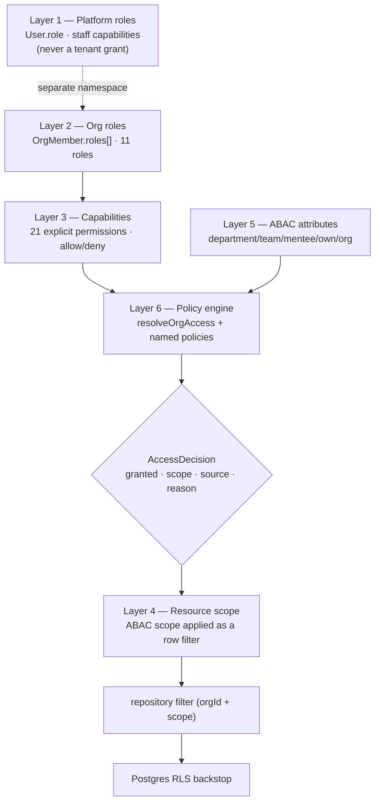
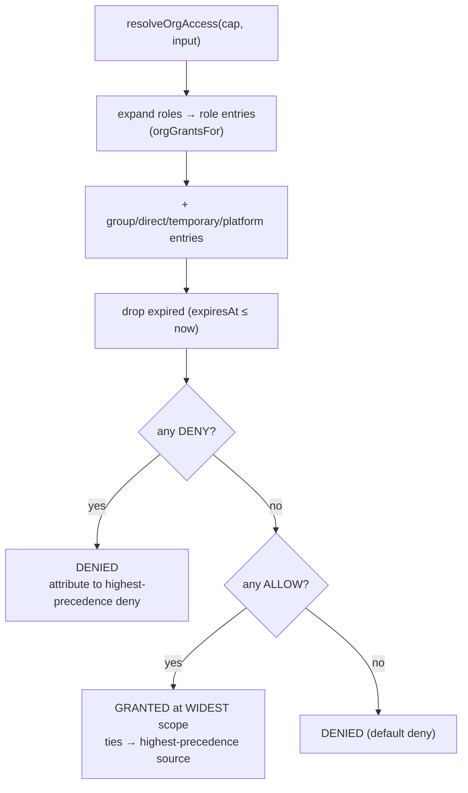
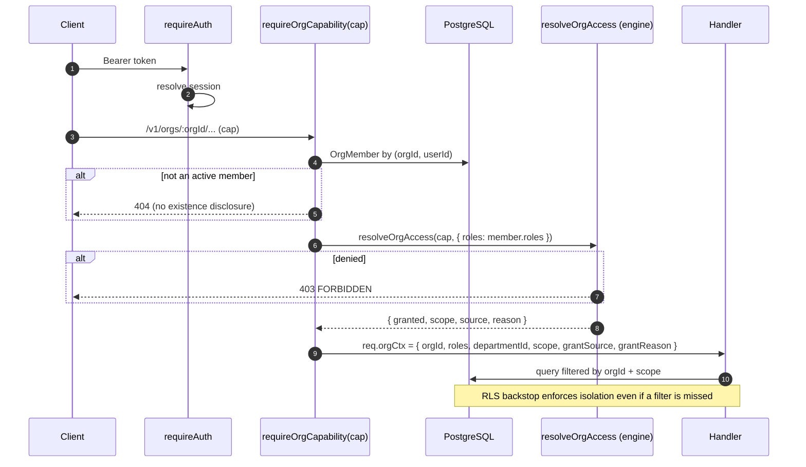

# Authorization Architecture

**Audience:** backend/security engineers, tech leads.
**Related:** [AUTHENTICATION](AUTHENTICATION.md) · [SECURITY](SECURITY.md) · [DATABASE](DATABASE.md)

This document describes EYF's layered authorization model, the deterministic permission-resolution engine, and — honestly — **what is implemented today versus what is designed but not yet built**. It supersedes nothing in [AUTHENTICATION](AUTHENTICATION.md); it goes deeper on the authorization (not authentication) side.

> [!NOTE]
> **Scope honesty.** The engine, layered model, explicit allow/deny, temporary-access expiry, multi-source resolution, composable policies, and platform/tenant separation described here are **implemented and unit-tested** (`packages/types/src/authz.ts`, `authz.test.ts` — 20 tests, plus the pre-existing `org-permissions.test.ts`). The DB-backed sources that feed the engine (custom roles, permission groups, per-member overrides, delegation, impersonation) require schema migrations and are a **documented roadmap**, marked ⏳ below. Nothing here claims functionality that is not in the repository.

---

## Table of Contents

- [Status at a glance](#status-at-a-glance)
- [The six layers](#the-six-layers)
- [Resolution engine](#resolution-engine)
- [Conflict resolution rules](#conflict-resolution-rules)
- [Permission matrix](#permission-matrix)
- [How a request is authorized today](#how-a-request-is-authorized-today)
- [Composable policies](#composable-policies)
- [Backward compatibility](#backward-compatibility)
- [Tenant isolation](#tenant-isolation)
- [Roadmap — the DB-backed layers](#roadmap--the-db-backed-layers)
- [Developer guide](#developer-guide)
- [Security properties](#security-properties)

---

## Status at a glance

| Capability | Status | Where |
| --- | --- | --- |
| Platform vs. tenant role separation (Layer 1) | ✅ Implemented | `authz.ts`, `permissions.ts`, `org-permissions.ts` |
| 11 org roles (Layer 2) | ✅ Implemented | `org-permissions.ts` |
| 21 explicit capabilities (Layer 3) | ✅ Implemented | `org-permissions.ts` |
| Explicit **allow / deny** | ✅ Implemented | `authz.ts` |
| **Temporary access** (expiry) | ✅ Engine ready | `authz.ts` (needs a data source to populate) |
| Multi-source resolution (role/group/direct/temp/platform) | ✅ Engine ready | `authz.ts` |
| ABAC scopes `own→org` (Layer 5) | ✅ Implemented | `org-permissions.ts`, `middleware/org.ts` |
| Composable named policies (Layer 6) | ✅ Implemented | `authz.ts` |
| Deterministic resolution + conflict rules | ✅ Implemented | `authz.ts` |
| Row-Level Security tenant isolation | ✅ Implemented | `packages/db/scripts/apply-rls.ts` |
| Custom roles (DB) | ⏳ Roadmap | needs `OrgRole`/`RolePermission` tables |
| Permission groups | ⏳ Roadmap | needs `Group`/`GroupPermission` tables |
| Per-member overrides | ⏳ Roadmap | needs `MemberPermission` table |
| Delegation | ⏳ Roadmap | needs `Delegation` table |
| Impersonation | ⏳ Roadmap | needs session plumbing + banner |
| Teams as a permission source | ⏳ Roadmap | `Team`/`TeamMember` models exist; not yet a grant source |

---

## The six layers



### Layer 1 — Platform roles

Platform authority lives on **`User.role`** (a single enum) and is resolved by the **staff capability engine** (`packages/types/src/permissions.ts`): `ADMIN`, `CONTENT_CREATOR`, `MODERATOR` → 7 capabilities (`manage:content`, `manage:users`, …).

Tenant authority lives on **`OrgMember.roles[]`** and is resolved by the **org engine**. These are **separate namespaces in separate columns evaluated by separate engines**. The name `ADMIN` exists in both, but a platform `ADMIN` and a tenant `ADMIN` are different grants that never cross — the engines share no input. `authz.ts` makes this explicit and testable:

```ts
isPlatformRole("ADMIN")        // true  — staff authority
isOrgRoleName("ADMIN")         // true  — tenant role name (different grant)
invalidTenantRoles(["OWNER","SUPPORT_ENGINEER"]) // ["SUPPORT_ENGINEER"]
```

> [!NOTE]
> Persistence already enforces the separation: `OrgMember.roles` is typed `OrgRole[]` and every write is validated with `z.nativeEnum(OrgRole)`, so a platform-role string cannot be stored as a tenant role. `invalidTenantRoles` is the shared primitive for future code paths (custom roles) that handle role strings without the enum.

### Layer 2 — Org roles

`OWNER`, `ADMIN`, `HR`, `RECRUITER`, `LND`, `ENG_MANAGER`, `INSTRUCTOR`, `MENTOR`, `REVIEWER`, `MEMBER`, `INTERN`. A member may hold several; grants are the union.

### Layer 3 — Capabilities (explicit permissions)

21 capabilities, not role checks. See the [matrix](#permission-matrix). Each resolved entry is an **allow or a deny**.

### Layer 4 — Resource scope

The engine returns a **scope**; the caller applies it as a query filter. `canInOrg`/`resolveOrgAccess` decide, the repository filters — the two-step contract.

### Layer 5 — ABAC attributes

Scope encodes the attribute reach: `own < mentees < team < department < org`. `middleware/org.ts` attaches the scope and the member's `departmentId` so handlers filter accordingly.

### Layer 6 — Policy engine

`resolveOrgAccess()` plus named, composable policies (`CanInviteMember`, `CanViewBilling`, …).

---

## Resolution engine

`packages/types/src/authz.ts` — a pure, deterministic function that composes every source into one auditable decision.

```ts
type PermissionEntry = {
  capability: OrgCapability;
  effect: "allow" | "deny";
  scope?: OrgScope;          // allows only
  source: "role" | "group" | "direct" | "temporary" | "platform";
  expiresAt?: number | null; // temporary access
  reason?: string;           // audit
};

resolveOrgAccess(capability, {
  roles,     // → expanded via the shared orgGrantsFor (role source)
  entries,   // group / direct / temporary / platform facts
  now,       // injectable clock
}): AccessDecision // { granted, effect, scope?, source, reason }
```

The **role** layer reuses `orgGrantsFor` from `org-permissions.ts` — role logic has exactly one definition. The other sources are supplied as `entries`; today the middleware passes only `roles`, so the engine returns precisely what `canInOrg` returned (proven — see [Backward compatibility](#backward-compatibility)). When the roadmap sources land, they populate `entries` with **no change to the engine**.



---

## Conflict resolution rules

Deterministic and OWASP-aligned (deny by default; explicit deny is absolute):

| # | Rule |
| --- | --- |
| 1 | **Expiry first** — entries past `expiresAt` are dropped before evaluation. |
| 2 | **Deny wins** — any applicable deny → DENIED, regardless of any allow or source. |
| 3 | **Widest allow** — with no deny, the widest-scope allow wins (`org > department > team > mentees > own`). |
| 4 | **Default deny** — no applicable entry → DENIED. |
| 5 | **Source precedence** (`platform > temporary > direct > group > role`) breaks ties for attribution and equal-scope allows — it **never** overrides deny-wins. |
| 6 | **Order independence** — the decision does not depend on entry order (tested). |

> [!TIP]
> A **platform deny** is a kill-switch (security hold), a **platform allow** is break-glass. Both are just entries; deny-wins makes the kill-switch absolute.

---

## Permission matrix

Org role → capability (scope). Empty = no grant. Source: `org-permissions.ts` (PRD §9).

| Capability | OWNER | ADMIN | HR | RECRUITER | LND | ENG_MGR | INSTRUCTOR | MENTOR | REVIEWER | MEMBER | INTERN |
| --- | --- | --- | --- | --- | --- | --- | --- | --- | --- | --- | --- |
| org:manage | org | org | | | | | | | | | |
| org:billing | org | | | | | | | | | | |
| org:members | org | org | org | | | | | | | | |
| org:audit | org | org | | | | | | | | | |
| org:branding | org | org | | | | | | | | | |
| learn:author | org | org | | | org | | org | | | | |
| learn:publish | org | org | | | org | | | | | | |
| learn:enroll | org | org | org | | org | dept | | | | | |
| learn:teach | org | org | | | org | | org | org | | | |
| learn:review | org | org | | | | | | | org | | |
| assess:author | org | org | | | org | | org | | | | |
| assess:administer | org | org | org | org | org | dept | | | | | |
| assess:grade | org | org | | | org | | org | | org | | |
| assess:view-results | org | org | org | org | org | dept | own | mentees | own | own | own |
| people:skills-read | org | org | org | | org | dept | | mentees | | own | own |
| mentor:mentees | org | org | | | | | | mentees | | | |
| talent:search | org | org | org | org | | org | | | | | |
| hire:pipeline | org | org | org | org | | org | | | | | |
| hire:offer | org | org | org | | | | | | | | |
| reports:team | org | org | org | | org | dept | own | mentees | | | |
| reports:org | org | org | org | | org | | | | | | |

---

## How a request is authorized today



`req.orgCtx.grantSource` / `grantReason` are now available for audit logging of *why* access was granted.

---

## Composable policies

Layer 6 — self-documenting wrappers, one per real capability, so call sites read as intent and audit logs carry the policy name:

```ts
import { CanInviteMember, CanPublishCourse } from "@eyf/types";

if (!CanInviteMember({ roles }).granted) return forbidden();

// With future sources, the SAME policy composes them — no call-site change:
CanPublishCourse({ roles, entries: [temporaryGrant, platformDeny], now: Date.now() });
```

Available: `CanManageOrg`, `CanViewBilling`, `CanInviteMember`, `CanViewAudit`, `CanManageBranding`, `CanAuthorCourse`, `CanPublishCourse`, `CanEnrollLearners`, `CanAuthorAssessment`, `CanGradeAssessment`, `CanViewResults`, `CanReadSkills`, `CanSearchTalent`, `CanManagePipeline`, `CanMakeOffer`, `CanViewOrgReports`. (Only capabilities that exist are modelled — no invented permissions.)

---

## Backward compatibility

The engine is an **additive superset**. Guarantees:

| Guarantee | How it's ensured |
| --- | --- |
| `canInOrg` unchanged | Not modified; still exported and used by the web nav |
| Middleware behaviour identical | `resolveOrgAccess(cap, { roles })` ≡ `canInOrg(roles, cap)` |
| Proof | `authz.test.ts` fuzzes **all single roles + all pairs + large unions × all 21 capabilities** and asserts `engine.granted`/`scope` equals `canInOrg` |
| No route change | `requireOrgCapability` signature unchanged; `OrgContext` gains only optional fields |
| Full suite green | 135/135 API + 66/66 `@eyf/types` tests pass |

> [!NOTE]
> The equivalence test is the load-bearing contract: it is why swapping the middleware's decision function from `canInOrg` to `resolveOrgAccess` is provably a no-op today, while unlocking allow/deny/temporary/multi-source for tomorrow.

---

## Tenant isolation

Authorization sits on top of three isolation layers (see [SECURITY](SECURITY.md), [DATABASE](DATABASE.md)):

| Layer | Mechanism | Status |
| --- | --- | --- |
| Route | `requireOrgCapability` resolves membership from the **path** `:orgId` (never the token) and returns 404 for non-members | ✅ |
| Scope | Engine returns `scope`; handlers filter by `orgId` + scope | ✅ |
| Database | Postgres RLS (`app.org_id` GUC), applied + **verified** on every deploy (`db:rls`, `db:rls:verify --strict`) | ✅ |

---

## Roadmap — the DB-backed layers

Each is **additive**: the engine already accepts these as `entries`; the work is schema + a resolver that loads them. None requires an engine rewrite — the point of the design.

### Custom roles (⏳)
Move org roles from the `OrgRole` enum to `OrgRole`/`RolePermission` tables so tenants define their own. The engine's role layer reads grants from the DB instead of the static map. Migration: additive tables + a backfill of the current 11 roles.

### Permission groups (⏳)
`Group` + `GroupMember` + `GroupPermission`. Membership yields `source: "group"` entries. `Team`/`TeamMember` models **already exist** and are the natural first group source.

### Per-member overrides (⏳)
`MemberPermission(memberId, capability, effect, scope?, expiresAt?)` → `direct`/`temporary` entries. This is where **temporary elevated access** (e.g. break-glass billing for 30 min) is stored; the engine already auto-expires it.

### Delegation (⏳)
`Delegation(fromMemberId, toMemberId, capabilities[], expiresAt)` → time-boxed `direct` entries for the delegate, audited.

### Impersonation (⏳)
Platform-admin-only, reason required, audit + banner, read-only option, one-click exit, session isolation. Belongs at the **session** layer (`middleware/auth.ts`), emitting a distinct token with an `impersonatedBy` claim; every action logs both identities.

> [!WARNING]
> Impersonation is a high-blast-radius feature. It must ship with the audit + banner + platform-only gate together, never piecemeal.

---

## Developer guide

**Gate an org route** (unchanged):
```ts
const author = { preHandler: [app.requireAuth, requireOrgCapability("learn:author")] };
app.post("/:orgId/courses", author, handler);
```

**Apply the scope** the engine returned:
```ts
const { orgId, scope, departmentId } = req.orgCtx!;
const where =
  scope === "org"        ? { orgId }
  : scope === "department" ? { orgId, departmentId }
  : { orgId, authorMemberId: req.orgCtx!.memberId }; // own
```

**Use a policy in shared/pure code:**
```ts
import { CanViewBilling } from "@eyf/types";
const decision = CanViewBilling({ roles });
if (!decision.granted) log.warn({ reason: decision.reason });
```

**Add a capability:** add to `ORG_CAPABILITIES`, grant it per role in `ORG_ROLE_CAPABILITIES` (with a scope), optionally add a `Can…` policy, gate the route with `requireOrgCapability("your:cap")`. Update the [matrix](#permission-matrix) and add a test.

---

## Security properties

Verified by tests and design:

| Property | Defence |
| --- | --- |
| Deny by default | No entry → denied (Rule 4) |
| No privilege escalation via source | Deny-wins independent of source precedence (Rule 2) |
| Horizontal isolation | Scope filter + RLS; membership from path not token |
| Confused deputy | Platform vs. tenant engines share no input; org tokens rejected on user routes |
| Least privilege | Line roles get `own`/`department` scope, not `org` |
| TOCTOU on temporary access | Expiry evaluated at decision time with an injectable clock |
| Auditability | Every decision carries `source` + `reason`; `recordAudit` on mutations |
| Determinism | Order-independent (tested) — no flaky authz |

---

**Next:** [AUTHENTICATION.md](AUTHENTICATION.md) · [SECURITY.md](SECURITY.md) · [DATABASE.md](DATABASE.md)
