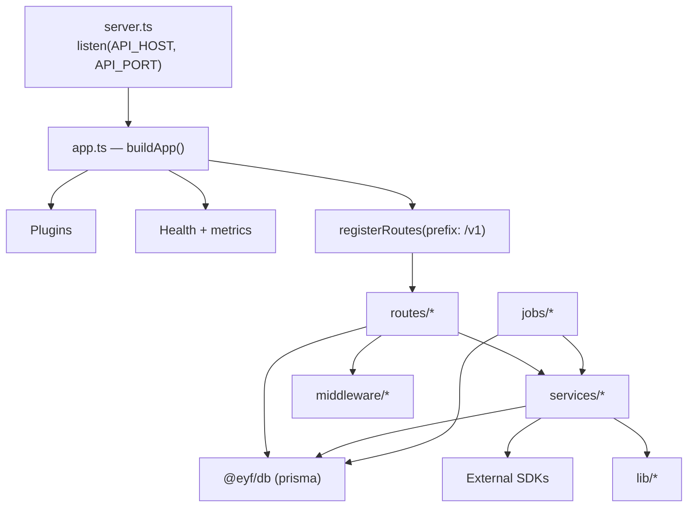
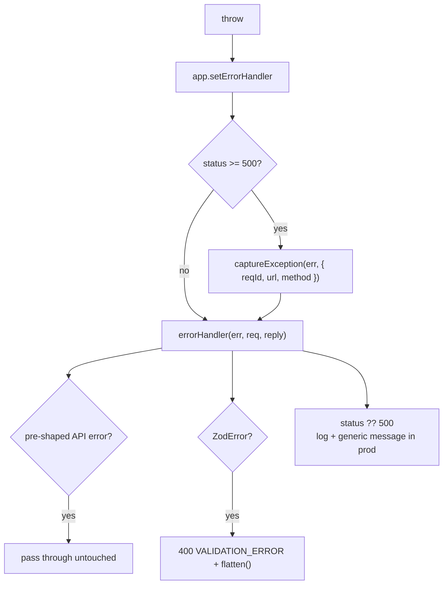
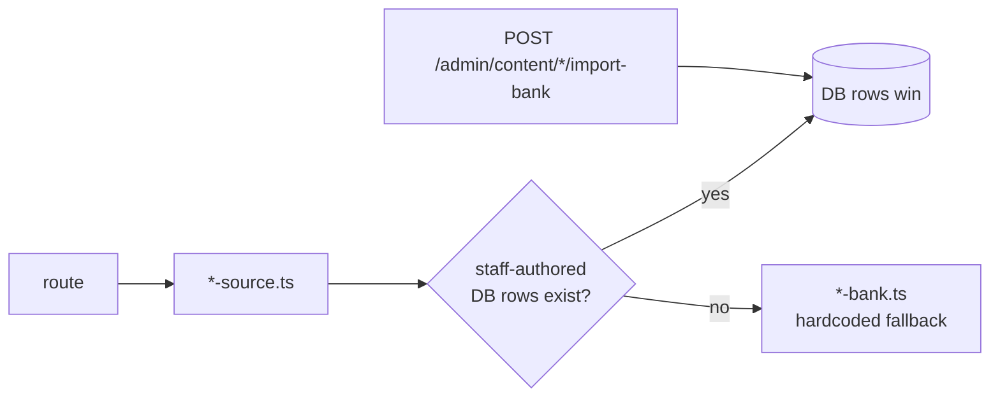

# Backend

**Audience:** backend engineers.
**Related:** [SYSTEM_ARCHITECTURE](SYSTEM_ARCHITECTURE.md) · [API_DOCUMENTATION](API_DOCUMENTATION.md) · [DATABASE](DATABASE.md) · [CODEBASE_GUIDE](CODEBASE_GUIDE.md)

---

## Table of Contents

- [Overview](#overview)
- [Architecture](#architecture)
- [Bootstrap sequence](#bootstrap-sequence)
- [Layering — routes, services, lib](#layering--routes-services-lib)
- [There are no controllers or repositories](#there-are-no-controllers-or-repositories)
- [Dependency injection](#dependency-injection)
- [Middleware](#middleware)
- [Validation](#validation)
- [Error handling](#error-handling)
- [Logging](#logging)
- [Observability](#observability)
- [Caching](#caching)
- [Background jobs](#background-jobs)
- [The bank → source pattern](#the-bank--source-pattern)
- [Business logic](#business-logic)
- [Type augmentation](#type-augmentation)
- [Adding a route](#adding-a-route)

---

## Overview

| Property | Value |
| --- | --- |
| Framework | Fastify 5 |
| Runtime | Node 20 |
| Language | TypeScript (ESM — note the `.js` import suffixes) |
| Validation | Zod |
| ORM | Prisma 5.22 via `@eyf/db` |
| Queues | BullMQ on Redis 7 |
| Tests | Vitest — 135 tests across 22 files |
| Size | ~14,400 LOC |

> [!NOTE]
> The API is **ESM**. Relative imports carry a `.js` suffix (`import { env } from "./env.js"`) even though the source is `.ts`. This is required by Node's ESM resolver — it is not a mistake.

---

## Architecture

```
apps/api/src/
├── server.ts       Process entry
├── app.ts          buildApp() — composition root
├── env.ts          Zod environment contract
├── augment.d.ts    Fastify type augmentation
├── routes/         61 modules → 328 endpoints  (HTTP layer)
├── services/       36 modules                  (domain + integrations)
├── lib/            30 modules                  (infrastructure)
├── middleware/     4 modules                   (cross-cutting guards)
└── jobs/           6 modules                   (queues + workers)
```



---

## Bootstrap sequence

`buildApp()` is the composition root. **Order is load-bearing.**

| # | Step | Why here |
| --- | --- | --- |
| 1 | `initSentry()` | Capture failures from the very first line |
| 2 | `Fastify({ logger, trustProxy, bodyLimit, genReqId })` | Base instance + correlation ids |
| 3 | `addContentTypeParser` (audio) | Raw audio buffers for transcription |
| 4 | `helmet` | Security headers before anything can respond |
| 5 | `cors` | Origin allowlist |
| 6 | `sensible` | HTTP helpers |
| 7 | `rateLimit` | Reads `req.session` for the per-plan `max` |
| 8 | `jwt` (access, 15m) | Signing/verification |
| 9 | `jwt` (refresh, 30d, `namespace: "refresh"`) | Separate secret |
| 10 | `rawBody` | Webhook signatures need the raw body |
| 11 | `authPlugin` | Decorates `requireAuth` / `requirePlan` / `requireRole` |
| 12 | `onResponse` hook | Metrics + echo `x-request-id` |
| 13 | `setErrorHandler` | Sentry on 5xx → `errorHandler` |
| 14 | Health + `/metrics` | Registered with `rateLimit: false` |
| 15 | `registerRoutes({ prefix: "/v1" })` | All 328 endpoints |

> [!WARNING]
> Registering `rateLimit` before `authPlugin` is intentional — but the limiter's `max` callback runs **per request**, by which time route `preHandler`s have populated `req.session`. Reordering these breaks per-plan limiting silently: everyone would be limited at the `free` tier.

---

## Layering — routes, services, lib

| Layer | Responsibility | May import |
| --- | --- | --- |
| `routes/` | HTTP: parse, guard, shape the envelope | services, lib, middleware, `@eyf/db`, `@eyf/types` |
| `services/` | Domain logic + third-party adapters | lib, `@eyf/db`, `@eyf/types`, SDKs |
| `lib/` | Infrastructure primitives | `@eyf/db`, `@eyf/types`, env |
| `middleware/` | Cross-cutting guards | lib, services, `@eyf/types` |
| `jobs/` | Async processing | services, lib, `@eyf/db` |

A representative handler — thin, guarded, validated, audited:

```ts
app.post("/:orgId/courses", author, async (req, reply) => {
  const body = z.object({
    title: z.string().trim().min(2).max(120),
    description: z.string().max(2000).default(""),
  }).parse(req.body);

  const course = await prisma.course.create({
    data: {
      orgId: req.orgCtx!.orgId,
      title: body.title,
      description: body.description,
      authorMemberId: req.orgCtx!.memberId,
    },
  });

  await recordAudit(req, { action: "create", entity: "org-course", entityId: course.id,
                           summary: `Drafted course "${course.title}"` });
  return reply.code(201).send({ success: true, data: course });
});
```

---

## There are no controllers or repositories

> [!NOTE]
> **This codebase has no controller layer and no repository layer** — deliberately. Fastify route handlers *are* the controllers. Prisma *is* the data-access layer.
>
> The one repository-style abstraction that exists — `orgDb()` in `lib/org-scoped.ts` — is **dead code with zero call sites**, despite an in-file "CODE-REVIEW RULE" mandating its use. See [SECURITY](SECURITY.md).

Guard chains and prefixes are declared once per module:

```ts
const author    = { preHandler: [app.requireAuth, requireOrgCapability("learn:author")] };
const publisher = { preHandler: [app.requireAuth, requireOrgCapability("learn:publish")] };
const member    = { preHandler: [app.requireAuth, requireOrgMember] };
```

This is the closest thing to a controller convention — **follow it**.

---

## Dependency injection

There is **no DI container**. Fastify's decorator system plus ES module imports do the job:

| Mechanism | Example |
| --- | --- |
| Fastify decorators | `app.decorate("requireAuth", …)` → `app.requireAuth` |
| `fastify-plugin` | `fp(authPluginInner, { name: "eyf-auth" })` — breaks encapsulation so decorators are global |
| Module singletons | `prisma` from `@eyf/db`; `redis` from `lib/redis.ts` |
| Request decorators | `req.session`, `req.orgCtx` |

> [!TIP]
> Wrapping a plugin in `fastify-plugin` is what makes its decorators visible to sibling plugins. Without `fp`, `authPlugin`'s decorators would be scoped to its own encapsulation context and `app.requireAuth` would be undefined in routes.

Testability is achieved by **module boundaries**, not injection — e.g. `services/clerk-key.ts` is split from `clerk.ts` precisely so key detection can be unit-tested without pulling in env + prisma + the Clerk SDK.

---

## Middleware

| File | Exports | Purpose |
| --- | --- | --- |
| `auth.ts` | `authPlugin` → `requireAuth`, `requirePlan`, `requireRole` | Session resolution + gating |
| `permissions.ts` | `requirePermission(cap)`, `hasValidAdminGate()` | Staff capability + admin gate |
| `org.ts` | org context resolution → `req.orgCtx` | Tenant resolution |
| `error.ts` | `errorHandler` | Central error shaping |

Full behaviour: [AUTHENTICATION](AUTHENTICATION.md).

---

## Validation

Zod, at runtime, inside handlers.

```ts
const { courseId } = req.params as { courseId: string };
const body = z.object({ title: z.string().trim().min(2).max(120).optional() }).parse(req.body);
```

> [!NOTE]
> Route params are **cast**, not parsed (`req.params as { courseId: string }`). Fastify guarantees the segment exists because it matched the path, but the value is unvalidated — always treat it as untrusted input in the query (e.g. `where: { id: courseId, orgId }`), never interpolate it into raw SQL.

Env is validated once at import time:

```ts
export const env = schema.parse(process.env);   // throws → process refuses to boot
```

---

## Error handling



Three cases, in order:

1. **Pre-shaped errors pass through.** The rate limiter *throws* its response body; `errorHandler` detects `{ success: false, error }` and preserves the payload and status. Without this it would render as a 500.
2. **ZodError → 400** with `details: err.flatten()`.
3. **Everything else** → `err.statusCode ?? 500`; in production 5xx messages become *"Something went wrong on our end."*

> [!TIP]
> To return a domain error, `reply.code(409).send({ success: false, error: { code: "NOT_EDITABLE", message: "…" } })` directly. Reserve throwing for genuinely exceptional paths.

### Silent-failure exceptions

Two places deliberately swallow errors — both correct:

```ts
void prisma.userSession.update({ … }).catch(() => {});  // lastSeenAt — must never fail a request
try { … } catch { /* fall through to internal JWT */ }  // Clerk outage must not lock users out
```

---

## Logging

Pino, configured in `app.ts`:

```ts
logger: {
  level: env.API_LOG_LEVEL,
  transport: env.NODE_ENV === "development"
    ? { target: "pino-pretty", options: { translateTime: "HH:MM:ss", ignore: "pid,hostname" } }
    : undefined,
},
disableRequestLogging: false,
genReqId: (req) => (req.headers["x-request-id"] as string) ?? crypto.randomUUID(),
```

| Property | Value |
| --- | --- |
| Level | `API_LOG_LEVEL` (`fatal`…`trace`, default `info`) |
| Pretty | Development only — production emits JSON |
| Correlation | Inbound `x-request-id` reused, else a UUID; echoed on every response |
| Access log | Enabled |

> [!NOTE]
> `pino-pretty` is referenced as a **transport target string**, never imported. Static analysis reports `pino`/`pino-pretty` as unused dependencies — they are false positives. Do not remove them.

---

## Observability

`lib/observability.ts` exposes:

| Export | Purpose |
| --- | --- |
| `initSentry()` | No-ops without `SENTRY_DSN` |
| `captureException(err, ctx)` | 5xx reporting |
| `registry` | Prometheus registry |
| `httpRequests` | Counter — `{ method, route, status }` |
| `httpDuration` | Histogram — seconds |

```ts
app.addHook("onResponse", async (req, reply) => {
  reply.header("x-request-id", req.id);
  const route = (req.routeOptions?.url ?? req.url.split("?")[0]) as string;
  const labels = { method: req.method, route, status: String(reply.statusCode) };
  httpRequests.inc(labels);
  httpDuration.observe(labels, reply.elapsedTime / 1000);
});
```

> [!TIP]
> The `route` label uses `req.routeOptions.url` (the **pattern**, e.g. `/v1/problems/:slug`), not the raw URL. This is what keeps Prometheus cardinality bounded — never label with the concrete path.

Health endpoints:

| Endpoint | Semantics |
| --- | --- |
| `/livez` | Process alive; touches nothing |
| `/readyz` | `checkReadiness()` → Postgres + Redis; 503 when unhealthy |
| `/health`, `/v1/health` | Back-compat shallow checks |
| `/metrics` | Prometheus; `METRICS_TOKEN` when set |

---

## Caching

| Layer | Mechanism |
| --- | --- |
| Rate-limit counters | Redis (`eyf-rl:`) |
| Queues | Redis (BullMQ) |
| Application cache | `lib/redis.ts` (shared ioredis) |
| HTTP cache | **Not implemented** — no `Cache-Control` strategy on API responses |

> [!NOTE]
> There is no response-caching layer on the API. Read-heavy public endpoints (`/v1/problems`, `/v1/jobs`) are served from Postgres on every request. See [PERFORMANCE](PERFORMANCE.md).

---

## Background jobs

```
jobs/
├── queue.ts          judgeQueue + judgeQueueEvents
├── scheduler.ts      cronQueue + registerCronJobs()
├── judge.worker.ts   Judge0 dispatch + verdicts
├── cron.worker.ts    streaks, digests, leaderboard
├── webhook.queue.ts  org webhook queue
└── webhook.worker.ts org webhook delivery
```

```ts
export const judgeQueue = new Queue<JudgeJobData, void, "judge">("judge", {
  connection: redis,
  defaultJobOptions: {
    attempts: 3,
    backoff: { type: "exponential", delay: 1_000 },
    removeOnComplete: { age: 3600, count: 1000 },
    removeOnFail:     { age: 86_400 },
  },
});
```

Scheduled jobs (`registerCronJobs()` via `upsertJobScheduler` — idempotent):

| Job | Pattern | Local |
| --- | --- | --- |
| `streak-break-alert` | `30 15 * * *` | 21:00 IST |
| `weekly-leaderboard` | Mondays | 08:00 IST |
| `daily-digest` | Daily | 07:00 IST |

Run workers separately:

```bash
pnpm --filter @eyf/api dev:worker
pnpm --filter @eyf/api dev:cron
```

> [!WARNING]
> `judgeQueueEvents = new QueueEvents("judge", { connection: redis })` is exported but never referenced. It looks like dead code, **but instantiating it opens a Redis subscriber connection at import time**. Removing it changes runtime behaviour. Decide deliberately: either it is needed, or it is an idle subscriber consuming a connection on every boot.

---

## The bank → source pattern

Content lives in two generations:

| Generation | Files | Role |
| --- | --- | --- |
| Legacy | `lib/*-bank.ts` | Hardcoded TS arrays |
| Current | `lib/*-source.ts` | **DB-first**, bank as fallback |



Why the fallback survives: a fresh install has no rows, and in-flight sessions must resolve **legacy question ids** across a bank→DB cutover (`assessmentLookupSource`).

> [!TIP]
> New code must call `*Source` functions. The legacy selectors (`pickQuestions`, `promptsByKind`) have been removed as dead code; only the **data** arrays remain as fallback.

---

## Business logic

Pure, shared logic lives in `@eyf/types`, not in the API:

| Logic | Location | Consumed by |
| --- | --- | --- |
| Readiness scoring | `packages/types/src/readiness.ts` | web + `services/guidance.ts` |
| Plan ranking | `packages/types/src/index.ts` | web + `middleware/auth.ts` |
| Staff capabilities | `packages/types/src/permissions.ts` | web nav + `middleware/permissions.ts` |
| Org capabilities | `packages/types/src/org-permissions.ts` | web + org routes |
| Skill ledger | `packages/types/src/skill-ledger.ts` | `lib/skill-ledger.ts` |

> [!TIP]
> If logic must agree between web and API, it belongs in `@eyf/types`. Pure functions there are unit-tested (46 tests) with no database — the cheapest, fastest tests in the repo.

---

## Type augmentation

`apps/api/src/augment.d.ts` teaches TypeScript about Fastify decorations (`req.session`, `req.orgCtx`, `app.requireAuth`, …).

> [!NOTE]
> Because `req.session`/`req.orgCtx` are optional in the type, routes use non-null assertions (`req.orgCtx!.orgId`) — **271 occurrences** across the API. This is a deliberate, consistent pattern justified by the guard running first, not sloppiness. Typing decorated requests more precisely would remove them; it is a large mechanical change with real regression risk.

---

## Adding a route

1. **Create the module**

```ts
// apps/api/src/routes/widgets.ts
import type { FastifyInstance } from "fastify";
import { z } from "zod";
import { prisma } from "@eyf/db";
import { recordAudit } from "../lib/audit.js";

export async function widgetRoutes(app: FastifyInstance) {
  const auth = { preHandler: [app.requireAuth] };

  app.get("/", auth, async (req) => {
    const widgets = await prisma.widget.findMany({ where: { userId: req.session!.id } });
    return { success: true, data: widgets };
  });

  app.post("/", auth, async (req, reply) => {
    const body = z.object({ name: z.string().trim().min(1).max(80) }).parse(req.body);
    const widget = await prisma.widget.create({ data: { ...body, userId: req.session!.id } });
    await recordAudit(req, { action: "create", entity: "widget", entityId: widget.id, summary: `Created ${widget.name}` });
    return reply.code(201).send({ success: true, data: widget });
  });
}
```

2. **Register it** in `routes/index.ts`:

```ts
import { widgetRoutes } from "./widgets.js";      // note the .js suffix
await app.register(widgetRoutes, { prefix: "/widgets" });
```

3. **Checklist**
   - [ ] `.js` suffix on the relative import
   - [ ] Envelope `{ success, data }` on every path
   - [ ] Zod on every body
   - [ ] Guards in `preHandler`
   - [ ] `recordAudit` for privileged mutations
   - [ ] Org routes: filter by `orgId` **explicitly**
   - [ ] Test — unit if pure, `*.integration.test.ts` if it touches the DB

---

**Next:** [API_DOCUMENTATION.md](API_DOCUMENTATION.md) · [DATABASE.md](DATABASE.md) · [TESTING.md](TESTING.md)
