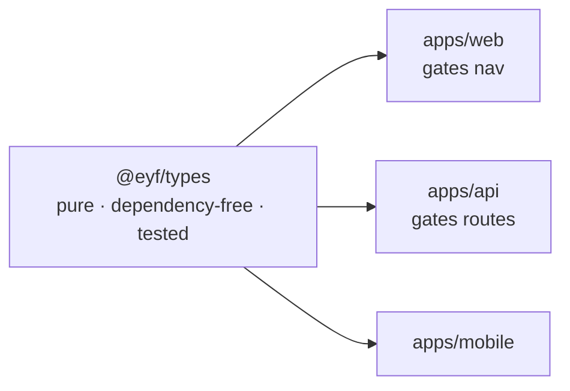
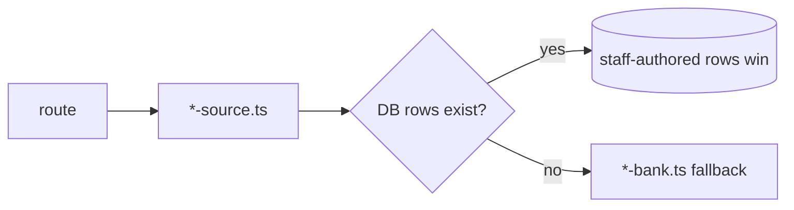
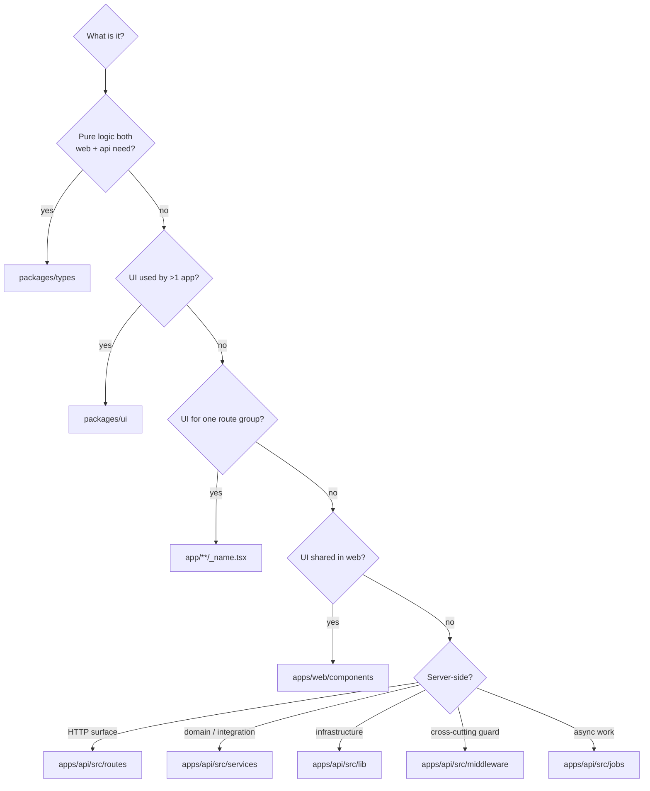

# Codebase Guide

**Audience:** engineers, new joiners, contributors.
**Related:** [FOLDER_STRUCTURE](FOLDER_STRUCTURE.md) · [BACKEND](BACKEND.md) · [FRONTEND](FRONTEND.md) · [CONTRIBUTING](CONTRIBUTING.md)

How this codebase is written, why, and how to extend it without fighting it.

---

## Table of Contents

- [The five principles](#the-five-principles)
- [Coding conventions](#coding-conventions)
- [Naming conventions](#naming-conventions)
- [Architecture patterns](#architecture-patterns)
- [Where does my code go?](#where-does-my-code-go)
- [Comment philosophy](#comment-philosophy)
- [Error-handling patterns](#error-handling-patterns)
- [Reusable utilities](#reusable-utilities)
- [Component patterns](#component-patterns)
- [Anti-patterns](#anti-patterns)
- [How to extend the project](#how-to-extend-the-project)

---

## The five principles

Everything else follows from these. They are visible throughout the code.

| # | Principle | Consequence |
| --- | --- | --- |
| 1 | **Degrade, never crash** | Every third-party key is `.optional()`; features no-op |
| 2 | **One implementation of shared logic** | Readiness, plans, permissions live in `@eyf/types` |
| 3 | **Policy in one place** | Capability maps are the only definition of authority |
| 4 | **Fail closed** | `DEV_LOGIN_ENABLED` defaults false; `TRUST_PROXY_HOPS` is an exact count |
| 5 | **Comments explain _why_** | Not what — the code already says what |

---

## Coding conventions

| Convention | Rule |
| --- | --- |
| Language | TypeScript, `strict: true`, `noUncheckedIndexedAccess` |
| Modules | ESM — **relative imports carry `.js`** in the API |
| Indent | 2 spaces |
| Quotes | Double |
| Semicolons | Yes |
| Trailing commas | Yes (multiline) |
| Formatter | **None** — no Prettier config ([CONFIGURATION](CONFIGURATION.md#prettier)) |
| Lint | `--max-warnings 0` everywhere |

> [!WARNING]
> The API is ESM. `import { env } from "./env.js"` is correct **even though the file is `env.ts`**. Node's ESM resolver requires the runtime extension. Omitting it fails at runtime, not compile time.

> [!NOTE]
> There is no Prettier. Style is consistent by convention and review, not tooling. Match surrounding code exactly.

### Type safety in practice

| Metric | Value |
| --- | --- |
| `: any` in hand-written code | **0** |
| `as any` | **2** — both at untyped SDK boundaries |
| Non-null assertions in API | 271 — the `req.session!` / `req.orgCtx!` pattern |

Both `as any` are justified and localised:

```ts
await upsertUserFromClerk(event.data as any);   // routes/auth.ts — Clerk webhook payload
const rp = razorpay as any;                     // services/payouts.ts — untyped SDK
```

> [!TIP]
> `@typescript-eslint/no-explicit-any` is **off** only because the generated Prisma client would trip it. Hand-written code has zero `any` — keep it that way. If you need `any`, confine it to a single SDK boundary line with a comment.

---

## Naming conventions

| Pattern | Use | Example |
| --- | --- | --- |
| `kebab-case.ts` | All modules (default) | `org-scoped.ts` |
| `PascalCase.tsx` | Legacy only — **do not extend** | `AntigravityBackground.tsx` |
| `_name.tsx` | Colocated non-route module | `_field.tsx`, `_tabs.tsx` |
| `*.test.ts` | Unit test, colocated | `srs.test.ts` |
| `*.integration.test.ts` | Needs a real database | `orgs.integration.test.ts` |
| `*-bank.ts` | Legacy hardcoded content | `mcq-bank.ts` |
| `*-source.ts` | DB-first source (**use this**) | `mcq-source.ts` |
| `(group)/` | Route group, not a URL segment | `(app)`, `(admin)` |
| `use*` | React hook | `useReadiness` |
| `require*` | Fastify guard | `requireAuth`, `requirePermission` |
| `SCREAMING_SNAKE` | Module constant | `MAX_SESSIONS`, `RATE_LIMIT_PER_MIN` |

Domain vocabulary is consistent — see [GLOSSARY](GLOSSARY.md). Notably: **`Role`** = platform role, **`OrgRole`** = tenant role. They are different axes; never infer one from the other.

---

## Architecture patterns

### 1. Shared pure logic (`@eyf/types`)

The most important pattern in the repo.



Because both sides import the same `hasCapability()`, the menu can never offer an action the API refuses.

> [!TIP]
> **If logic must agree between web and API, it belongs in `@eyf/types`.** It is pure, has no database, and its 46 tests run in milliseconds — the cheapest correctness in the codebase.

### 2. Capability-based authority

Never `if (role === "ADMIN")`. Declare a capability:

```ts
preHandler: [app.requireAuth, requirePermission("manage:content")]
```

Adding a staff power = add a capability + map it to a role. **No other code changes.**

### 3. Graceful degradation

```ts
ANTHROPIC_API_KEY: z.string().optional(),
```

Then no-op without it and give the UI a specific code (`AI_UNAVAILABLE`).

### 4. Bank → source



New code calls `*Source`. The bank keeps a fresh install alive and resolves legacy ids across a cutover.

### 5. Extract to make testable

`clerk-key.ts` is split from `clerk.ts` *"so it can be unit-tested in isolation"* without importing env + prisma + the SDK. **Copy this** whenever a pure decision hides inside an integration module.

### 6. Escape-hatch RLS

Policies pass everything when `app.org_id` is unset (admin/cron) and filter hard when set. A tripwire, not a replacement for filtering.

---

## Where does my code go?



| Layer | May import |
| --- | --- |
| `routes/` | services, lib, middleware, `@eyf/db`, `@eyf/types` |
| `services/` | lib, `@eyf/db`, `@eyf/types`, SDKs |
| `lib/` | `@eyf/db`, `@eyf/types`, env |
| `packages/*` | **Never** import from `apps/*` |

> [!WARNING]
> Packages must never depend on apps. `madge --circular` currently reports **zero** cycles in both `apps/web` and `apps/api` — keep it that way.

---

## Comment philosophy

This codebase has unusually good comments. The rule: **explain _why_, never _what_.**

Real examples:

```ts
// Trust exactly the number of proxy hops in front of us (LB/CDN), so a
// client can't spoof X-Forwarded-For past the real edge. `true` would trust
// any hop — which defeats IP-based rate limiting.
trustProxy: env.TRUST_PROXY_HOPS,
```

```ts
// cuids are [a-z0-9]; guard anyway — GUC values can't be parameterized.
if (!/^[a-zA-Z0-9_-]{1,64}$/.test(orgId)) throw new Error("invalid orgId");
```

```ts
// INVARIANT: only tables with a literal `orgId` column belong in ORG_TABLES.
// A table isolated transitively (e.g. org_offers via reqId→JobRequisition)
// must NOT be listed — the policy references "orgId" and would deny every write.
```

Each records a decision a future reader cannot recover from the code.

| Write a comment when | Don't when |
| --- | --- |
| A non-obvious constraint drove the choice | It restates the next line |
| The obvious alternative is wrong | It says who wrote it or when |
| An invariant must hold | It explains syntax |
| A workaround exists for a real bug | It will rot immediately |

> [!WARNING]
> **A stale comment is worse than none.** When you change behaviour, update the comment. A real example: `assessment-bank.ts` advertised an "adaptive picker" long after selection moved to `assessment-source.ts` — corrected during cleanup.

---

## Error-handling patterns

### API — return, don't throw, for domain errors

```ts
if (!course) return reply.code(404).send({ success: false, error: { code: "NOT_FOUND", message: "Course not found." } });
if (!EDITABLE.includes(course.status)) {
  return reply.code(409).send({ success: false, error: { code: "NOT_EDITABLE", message: "Published courses are edited as a new draft." } });
}
```

Zod throws; `errorHandler` converts it to `400 VALIDATION_ERROR`.

### Deliberate silent failures — the only two

```ts
void prisma.userSession.update({ … }).catch(() => {});   // lastSeenAt must never fail a request
try { … } catch { /* fall through to internal JWT */ }   // a Clerk outage must not lock users out
```

> [!TIP]
> `no-empty` is configured with `allowEmptyCatch: true` **for these cases**. If you add a third, comment *why* the failure is safe to ignore — an uncommented empty catch will be treated as a bug in review.

### Web — map codes to human messages

```ts
if (e.code === "AI_UNAVAILABLE") return e.message || "This AI feature isn't configured yet.";
if (e.status === 402) return e.message || "Upgrade your plan to use this.";
```

### Check-then-act for ownership

```ts
const course = await courseInOrg(req.orgCtx!.orgId, courseId);
if (!course) return reply.code(404).send(/* … */);
const updated = await prisma.course.update({ where: { id: courseId }, data: body });
```

> [!TIP]
> The ownership check is **structural**, not delegated to the caller's `where`. This is the pattern `orgDb().updateScoped()` was designed to encode.

---

## Reusable utilities

Before writing a helper, check these:

| Need | Use |
| --- | --- |
| Class names | `cn()` from `@eyf/ui` |
| API read | `useApi()` |
| API write | `useApiAction()` |
| Prisma | `prisma` from `@eyf/db` — **never** `new PrismaClient()` |
| Redis | `redis` from `lib/redis.ts` |
| Audit trail | `recordAudit()` from `lib/audit.ts` |
| Plan check | `meetsPlan()` from `@eyf/types` |
| Staff capability | `hasCapability()` / `isStaffRole()` |
| Org capability | `can()` from `@eyf/types/org-permissions` |
| Active plan | `resolveActivePlan()` from `lib/subscription.ts` |
| Outbound user URL | `assertSafeUrl()` from `lib/ssrf.ts` |
| Tenant transaction | `withOrgContext()` from `lib/org-scoped.ts` |
| Readiness | `computeReadiness()` from `@eyf/types` |
| Reduced motion | `useIsReduced()` / `useReducedMotion()` |

---

## Component patterns

### Loading + empty are not optional

```tsx
if (isLoading) return <SkeletonRows />;
if (!data?.length) {
  return <EmptyState icon={<Icons.doc width={28} height={28} />} title="No notes yet"
                     description="Write the first theory note — it lands on the student subject page immediately." />;
}
```

> [!TIP]
> `EmptyState` descriptions tell the user **what happens next**, not just that the list is empty. Match that voice.

### Colocate what only one route group uses

```tsx
/** Labelled form field wrapper shared across the content-management pages. */
export function Field({ label, hint, children }: { label: string; hint?: string; children: React.ReactNode }) { … }
```

### Reduced motion at the primitive

```tsx
const reduce = useReducedMotion();
<motion.div initial={reduce ? false : { opacity: 0, y }} … />
```

`initial={reduce ? false : …}` **disables** the animation rather than shortening it.

### Dynamic-import browser-only libraries

```tsx
const AntigravityBackground = dynamic(() => import("@/components/AntigravityBackground"), { ssr: false });
```

---

## Anti-patterns

| ❌ Don't | ✅ Do | Why |
| --- | --- | --- |
| `if (role === "ADMIN")` | `requirePermission("manage:users")` | Authority has one definition |
| `new PrismaClient()` | `import { prisma } from "@eyf/db"` | Pool exhaustion |
| Duplicate logic in web + api | Put it in `@eyf/types` | They will drift |
| `import "./env"` (no `.js`) | `import "./env.js"` | ESM runtime resolution |
| `$executeRawUnsafe` with input | `$executeRaw` (tagged) | Injection |
| `trustProxy: true` | `TRUST_PROXY_HOPS` | Spoofable `X-Forwarded-For` |
| `API_CORS_ORIGINS=*` | Exact origins | Used with `credentials: true` |
| Secret behind `NEXT_PUBLIC_` | Server-side only | Inlined into the client bundle |
| Skipping the empty state | `EmptyState` | Blank screens read as bugs |
| Hardcoded hex colours | Design tokens | Breaks dark mode |
| New `*-bank.ts` consumer | `*-source.ts` | Bank is fallback only |
| Mocking Prisma in tests | Real DB integration test | Mocks miss constraints/RLS |
| Un-commented empty catch | Comment why it's safe | Reads as a swallowed bug |

---

## How to extend the project

### Add an API endpoint → [BACKEND](BACKEND.md#adding-a-route)
### Add a page → [FRONTEND](FRONTEND.md#adding-a-page)
### Add a third-party integration → [THIRD_PARTY_SERVICES](THIRD_PARTY_SERVICES.md#adding-an-integration)

### Add a staff capability

```ts
// packages/types/src/permissions.ts
export const CAPABILITIES = [/* … */, "manage:widgets"] as const;
const ROLE_CAPABILITIES = { ADMIN: CAPABILITIES, CONTENT_CREATOR: ["manage:content", "moderate", "manage:widgets"], … };
```

```ts
preHandler: [app.requireAuth, requirePermission("manage:widgets")]
```

Web nav gating picks it up automatically via `hasCapability`.

### Add an org capability

1. Add to `ORG_CAPABILITIES` in `packages/types/src/org-permissions.ts`.
2. Grant it per role **with a scope** (`own`/`mentees`/`team`/`department`/`org`).
3. Guard the route with `requireOrgCapability("your:cap")`.
4. **Apply the returned scope as a query filter** — this is the half the type system cannot enforce.
5. Add a cross-tenant integration test asserting the **negative**.

> [!WARNING]
> `can()` returns a *scope*; the caller must filter. Granting `{ scope: "department" }` then querying org-wide is an over-reach bug that compiles fine.

### Add a database model

1. Edit `packages/db/prisma/schema.prisma` — **additive only**.
2. `@@map("snake_case")`, `cuid()` id, index leading with `userId`/`orgId`.
3. `pnpm db:migrate` → `pnpm db:generate`.
4. Org-scoped **with a literal `orgId` column**? Add it to `ORG_TABLES` in `scripts/apply-rls.ts` and run `pnpm --filter @eyf/db db:rls`.
5. Add an integration test.

> [!WARNING]
> Only add a table to `ORG_TABLES` if it has a **literal `orgId` column**. The policy references `"orgId"`; listing a transitively-isolated table (like `org_offers`) denies every write.

> [!WARNING]
> Migrations must be **backward-compatible**. CD runs `migrate deploy` *before* the new code deploys — a destructive change breaks the running version. Expand now, contract in a later release.

### Add a background job

1. Define the queue (`jobs/`) with `attempts` + backoff.
2. Add the worker; register in `docker-compose.prod.yml` with its own `CMD`.
3. Recurring? Register in `scheduler.ts` via `upsertJobScheduler` (cron in **UTC** — comment the IST equivalent, as existing jobs do).

### Definition of done

- [ ] `pnpm typecheck` clean
- [ ] `pnpm lint` clean (`--max-warnings 0`)
- [ ] Tests added; `pnpm test:ci` passes (RLS false negative aside)
- [ ] Shared logic lives in `@eyf/types`
- [ ] Envelope + specific error codes
- [ ] Loading + empty states
- [ ] Comments explain *why*; no stale comments
- [ ] New env vars: `.optional()`, documented, added to `globalEnv` if build-affecting
- [ ] Org routes: scope applied as a filter + negative test

---

**Next:** [CONTRIBUTING.md](CONTRIBUTING.md) · [BACKEND.md](BACKEND.md) · [FRONTEND.md](FRONTEND.md)
