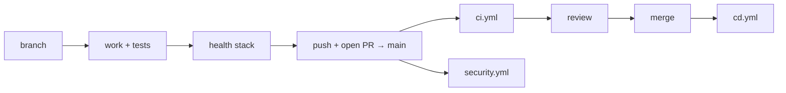

# Contributing

**Audience:** contributors, new team members, open-source contributors.
**Related:** [CODEBASE_GUIDE](CODEBASE_GUIDE.md) · [TESTING](TESTING.md) · [TROUBLESHOOTING](TROUBLESHOOTING.md)

---

## Table of Contents

- [Before you start](#before-you-start)
- [Development setup](#development-setup)
- [Verifying your setup](#verifying-your-setup)
- [The health stack](#the-health-stack)
- [Branching](#branching)
- [Commit messages](#commit-messages)
- [Pull request process](#pull-request-process)
- [Coding standards](#coding-standards)
- [Review checklist](#review-checklist)
- [What not to change](#what-not-to-change)
- [Licence](#licence)

---

## Before you start

| Requirement | Version |
| --- | --- |
| Node | `>=20.10.0` (see `.node-version`) |
| pnpm | `9.12.0` (pinned via `packageManager`; use corepack) |
| Docker | For Postgres 16 + Redis 7 |

```bash
corepack enable    # installs the pinned pnpm
```

> [!WARNING]
> Use the pinned pnpm. A different major version can produce a lockfile that fails CI's `--frozen-lockfile`.

Read [CODEBASE_GUIDE](CODEBASE_GUIDE.md) first — it explains the five principles the code follows. Working against them creates review friction.

---

## Development setup

```bash
git clone <repo> && cd EYF
pnpm install
cp .env.example .env

pnpm docker:up                     # Postgres 16 + Redis 7
pnpm db:generate
pnpm db:migrate
pnpm db:seed
pnpm --filter @eyf/db db:rls       # tenant-isolation policies

pnpm dev                           # web :3000 · api :4000
```

Optional, each in its own terminal:

```bash
pnpm --filter @eyf/api dev:worker  # judge dispatch
pnpm --filter @eyf/api dev:cron    # streaks, digests
docker compose --profile judge up -d
```

> [!TIP]
> **No external keys are needed.** Every integration no-ops without credentials and auth falls back to dev-login. Sign in with a seeded email via `POST /v1/auth/dev-login`.

### Two setup gotchas

> [!WARNING]
> **1. `.env` files have drifted.** `.env`, `apps/api/.env`, and `packages/db/.env` may contain stale `user:password` credentials while `docker-compose.yml` provisions `eyf:eyf`; `packages/db/.env` may omit `DIRECT_DATABASE_URL` (required by the Prisma schema). Re-copy from `.env.example`, which is correct.
>
> Note also that the API reads **`apps/api/.env`**, not the root `.env`. Editing only the root file changes nothing.

> [!WARNING]
> **2. Port 5432 conflicts.** If you run a local Postgres (e.g. Homebrew), it binds `127.0.0.1:5432` while Docker binds `*:5432`. The more specific bind wins, so `localhost:5432` silently reaches the **wrong** server. Symptom: `permission denied for schema public`.
> ```bash
> lsof -nP -iTCP:5432 -sTCP:LISTEN
> psql "$DATABASE_URL" -c "SELECT version();"   # "(Homebrew)" ⇒ wrong server
> ```
> Fix: stop the local service, or map the container to `5433`.

More: [TROUBLESHOOTING](TROUBLESHOOTING.md).

---

## Verifying your setup

```bash
pnpm typecheck    # 6 packages
pnpm lint         # 0 warnings
pnpm test:ci      # @eyf/types + @eyf/api
```

Expected:

| Check | Expected |
| --- | --- |
| `typecheck` | 6/6 pass |
| `lint` | 0 warnings |
| `@eyf/types` tests | 46/46 pass |
| `@eyf/api` tests | **134 pass / 1 fail** |

> [!NOTE]
> **One failing test is expected.** The RLS isolation test (`orgs.integration.test.ts`) is a **false negative**: the dev container's `eyf` role is a Postgres superuser, and superusers bypass RLS unconditionally. The policy is correct — see [TESTING](TESTING.md#the-rls-false-negative). **Do not "fix" it by weakening the assertion.**

If you see `66 skipped` instead, your database is not reachable — integration tests skip rather than fail.

---

## The health stack

Defined in `CLAUDE.md`. These three commands are the contract:

```bash
pnpm typecheck
pnpm lint
pnpm test:ci
```

Run them before every push. CI runs the same plus `migrate deploy`, `db:rls`, and `build`.

---

## Branching

| Branch | Role |
| --- | --- |
| `main` | Default; PR base; triggers CD on merge |
| `develop` | Active development |
| `feat/*`, `fix/*`, `chore/*`, `docs/*` | Work branches |

```bash
git checkout -b feat/skill-decay-tuning
```

> [!WARNING]
> Never commit directly to `main` — a merge triggers `cd.yml`, which runs **production migrations** and publishes images.

---

## Commit messages

**Conventional Commits**, used consistently across 410 commits.

```
<type>(<scope>): <subject>
```

Distribution in this repo:

| Type | Count | Use |
| --- | --- | --- |
| `feat` | 221 | New capability |
| `fix` | 86 | Bug fix |
| `style` | 11 | Visual/formatting only |
| `chore` | 10 | Tooling, deps |
| `polish` | 7 | Refinement |
| `docs` | 5 | Documentation |
| `refactor` | — | No behaviour change |
| `test`, `perf`, `ci`, `revert` | few | As named |

Common scopes: `api` · `web` · `auth` · `design` · `enterprise` · `landing` · `pipeline` · `specs` · `pwa`

Real examples:

```
feat(enterprise): Phase 3 EPIC-16/17 — evidence-based hiring from the talent pool
fix(api): security + correctness fixes from /cso + /review audit
refactor(web): clarify AntigravityBackground naming/coupling (no behavior change)
style(design): FINDING-F1 — fix footer readability on the landing
```

> [!TIP]
> Subjects state **what changed and why it matters**, not what files moved. `(no behavior change)` is a genuinely useful signal to reviewers — use it.

---

## Pull request process



1. Branch from the latest `main`.
2. Make the change; add tests.
3. Run the health stack locally.
4. Open a PR against `main`.
5. CI must be green (RLS false negative aside).
6. Address review.
7. Merge — this triggers CD (migrations + image publish).

### PR description should cover

- **What** changed and **why**
- Behaviour change: yes/no
- Migration included: yes/no — **and whether it is additive**
- New env vars (and whether they are `.optional()`)
- How you verified it

> [!WARNING]
> Call out migrations explicitly. CD runs `migrate deploy` **before** the new code deploys, so a destructive migration breaks the running version. Expand now, contract in a later release. See [DATABASE](DATABASE.md#expandcontract).

---

## Coding standards

Full detail: [CODEBASE_GUIDE](CODEBASE_GUIDE.md).

| Standard | Rule |
| --- | --- |
| TypeScript | `strict`, `noUncheckedIndexedAccess`; **no `any`** in hand-written code |
| ESM (api) | Relative imports carry `.js` — `import { env } from "./env.js"` |
| Formatting | 2 spaces, double quotes, semicolons, trailing commas — **no Prettier**, match surrounding code |
| Lint | `--max-warnings 0` |
| Naming | `kebab-case.ts`; `_name.tsx` for colocated; `*.integration.test.ts` for DB tests |
| Shared logic | Belongs in `@eyf/types` |
| Authority | Capabilities, never `role === "ADMIN"` |
| Integrations | Keys `.optional()`; no-op without them |
| Comments | Explain **why**; never leave a stale one |

---

## Review checklist

### Correctness
- [ ] Health stack passes
- [ ] Tests added — unit for pure logic, `*.integration.test.ts` if it touches the DB
- [ ] Response envelope `{ success, data }` / `{ success, error }`
- [ ] Specific error `code`s, not generic 500s

### Architecture
- [ ] Shared logic in `@eyf/types`, not duplicated
- [ ] Routes thin; domain logic in services
- [ ] No new circular dependency (`madge --circular` is currently zero)
- [ ] Packages do not import from apps

### Security
- [ ] Zod on every body
- [ ] Guards in `preHandler`
- [ ] Org routes filter by `orgId` **explicitly**, and apply the ABAC scope as a filter
- [ ] Negative cross-tenant test for new org endpoints
- [ ] No new `$executeRawUnsafe` with user input
- [ ] No secret behind `NEXT_PUBLIC_`
- [ ] Outbound user-supplied URLs go through `lib/ssrf.ts`
- [ ] `recordAudit()` on privileged mutations

### Frontend
- [ ] Loading **and** empty states
- [ ] Design tokens — no hardcoded hex
- [ ] Verified in light **and** dark
- [ ] Reduced motion respected
- [ ] Browser-only libs dynamically imported with `ssr: false`
- [ ] New protected route added to `middleware.ts`

### Data
- [ ] Migration is **additive**
- [ ] `@@map("snake_case")`, `cuid()` id, index leads with `userId`/`orgId`
- [ ] New org table with a **literal `orgId` column** added to `ORG_TABLES` + `db:rls` run

### Config
- [ ] New env var: `.optional()`, in `.env.example`, in [ENVIRONMENT_VARIABLES](ENVIRONMENT_VARIABLES.md)
- [ ] Added to `turbo.json` `globalEnv` if it affects a build output

---

## What not to change

Each of these looks like an improvement and is not. All are load-bearing.

| Don't | Why |
| --- | --- |
| Weaken the RLS test assertion | It is a false negative from a superuser dev role — the guard is real |
| Remove `judgeQueueEvents` | "Unused" but its construction opens a Redis subscriber at import |
| Remove `pino` / `pino-pretty` | Referenced as a **transport target string**, not an import |
| Remove `@prisma/client` from `packages/db` | Required at runtime by the generated client |
| Delete `orgDb()` without a decision | Dead code, but it is the documented tenant-isolation layer — adopting it is the better fix |
| `trustProxy: true` | Lets clients spoof `X-Forwarded-For` and defeat rate limiting |
| Set `fileParallelism: true` | Tests share one Postgres and race on fixtures |
| Use in-memory rate limiting outside tests | The limit would scale with pod count and reset each deploy |
| "Simplify" the Clerk placeholder branch in `middleware.ts` | Clerk 404s app routes when it can't reach a fake host |
| Consolidate the five divergent `Field` components | Same name, **different markup** — merging changes the UI |
| Merge access/refresh JWT secrets | Separation prevents token replay across types |
| Remove `isOrgToken()` from `resolveSession` | Org tokens share the signing secret — this prevents a confused deputy |

> [!TIP]
> When something looks like obvious dead code, check `CODE_CLEANUP_REPORT.md` first — a full audit already classified it.

---

## Licence

> [!WARNING]
> **Needs implementation.** There is no `LICENSE` file. The root `package.json` sets `"private": true` and declares no `license` field.
>
> Contribution terms are therefore undefined. External contributors should ask the maintainers before submitting substantial work, and the project should add a licence before accepting outside contributions.

---

**Next:** [CODEBASE_GUIDE.md](CODEBASE_GUIDE.md) · [TESTING.md](TESTING.md) · [TROUBLESHOOTING.md](TROUBLESHOOTING.md)
