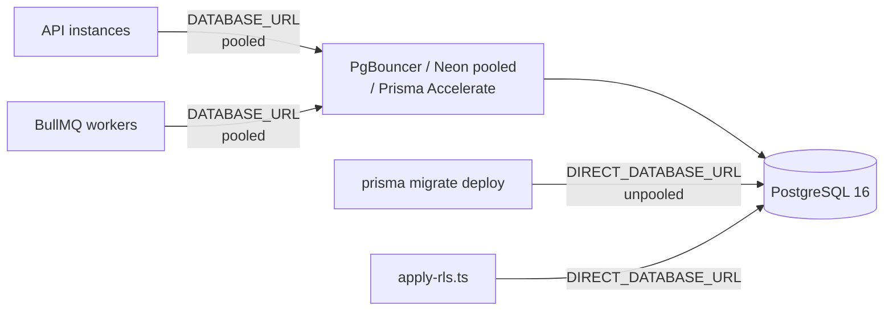
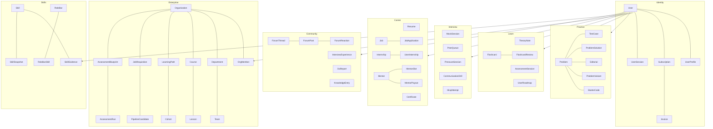
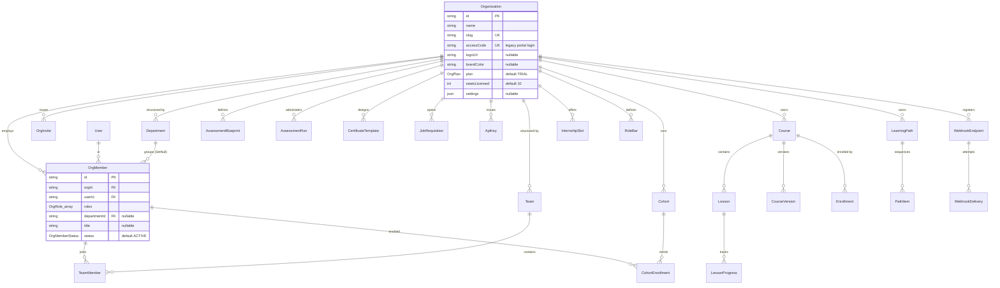
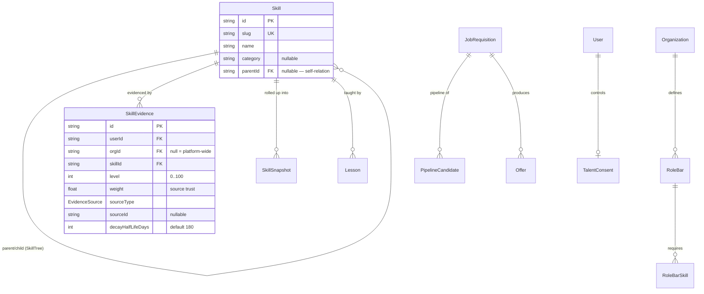
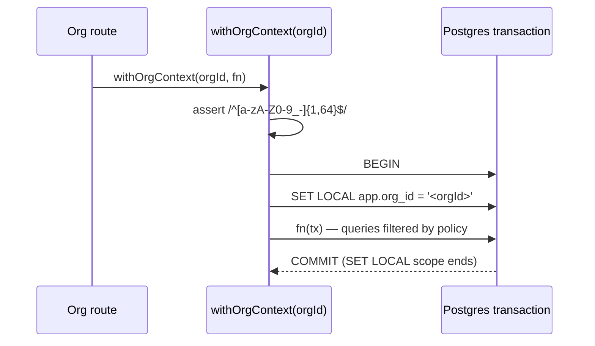
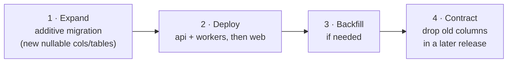

# Database

**Audience:** backend engineers, DBAs, DevOps.
**Related:** [SYSTEM_ARCHITECTURE](SYSTEM_ARCHITECTURE.md) · [BACKEND](BACKEND.md) · [SECURITY](SECURITY.md) · [DEPLOYMENT](DEPLOYMENT.md)

---

## Table of Contents

- [At a glance](#at-a-glance)
- [Connection architecture](#connection-architecture)
- [Domain map](#domain-map)
- [ER diagram — core platform](#er-diagram--core-platform)
- [ER diagram — enterprise tenancy](#er-diagram--enterprise-tenancy)
- [ER diagram — skills & hiring](#er-diagram--skills--hiring)
- [Model catalogue](#model-catalogue)
- [Enums](#enums)
- [Indexes](#indexes)
- [Constraints & invariants](#constraints--invariants)
- [Cascade rules](#cascade-rules)
- [Row-Level Security](#row-level-security)
- [Migration strategy](#migration-strategy)
- [Seeding](#seeding)

---

## At a glance

| Fact | Value |
| --- | --- |
| Engine | PostgreSQL 16 |
| ORM | Prisma **5.22** (`prisma-client-js`) |
| Schema | `packages/db/prisma/schema.prisma` — 2,025 lines |
| Models | **87** |
| Enums | **47** |
| `@@index` | **87** |
| `@@unique` | **22** |
| `onDelete: Cascade` | **82** |
| Client output | `packages/db/src/generated/client` |
| Binary targets | `native`, `linux-musl-openssl-3.0.x` (Alpine containers) |
| Naming | `camelCase` in Prisma → `snake_case` tables via `@@map` |
| IDs | `cuid()` everywhere |

> [!NOTE]
> The schema header says *"Phase 1 schema. 15 core tables"*. The schema has since grown to 87 models. The header comment is historical — trust the schema, not the header.

---

## Connection architecture

```prisma
datasource db {
  provider  = "postgresql"
  url       = env("DATABASE_URL")        // pooled — runtime
  directUrl = env("DIRECT_DATABASE_URL") // unpooled — migrations/DDL
}
```



> [!WARNING]
> Transaction pooling **cannot run DDL**. Migrations must use `DIRECT_DATABASE_URL`. If it is unset Prisma falls back to `DATABASE_URL` — fine on single-node local, wrong behind a pooler.

### Client singleton

`packages/db/src/index.ts` guards against dev hot-reload connection storms:

```ts
export const prisma: PrismaClient =
  globalThis.__eyf_prisma ??
  new PrismaClient({
    log: process.env.NODE_ENV === "production"
      ? ["error", "warn"]
      : ["query", "error", "warn"],
  });

if (process.env.NODE_ENV !== "production") globalThis.__eyf_prisma = prisma;

export * from "./generated/client";
```

> [!TIP]
> Always import `prisma` from `@eyf/db`. Never construct `new PrismaClient()` in app code — you will exhaust the pool.

---

## Domain map



---

## ER diagram — core platform

```mermaid
erDiagram
    User ||--o| UserProfile : has
    User ||--o| Subscription : has
    Subscription ||--o{ Invoice : bills
    User ||--o{ UserSession : "≤3 concurrent"
    User ||--o{ ProblemSolution : submits
    User ||--o{ UserRoadmap : follows
    User ||--o{ DailyStreak : maintains
    User ||--o{ AssessmentSession : takes
    User ||--o{ CognitiveSession : plays
    User ||--o{ MockSession : "candidate/peer"
    User ||--o| Mentor : "may be"
    User ||--o{ Certificate : earns
    User ||--o{ Resume : writes
    User ||--o{ UserBadge : collects
    User ||--o{ JobApplication : applies
    User ||--o| TalentConsent : grants
    User ||--o{ OrgMember : "belongs to"

    Problem ||--o{ TestCase : "graded by"
    Problem ||--o{ StarterCode : "seeded with"
    Problem ||--o{ ProblemSolution : receives
    Problem ||--o| Editorial : explains
    Problem ||--o{ ProblemVariant : mutates
    Problem ||--o{ PressureSession : "used in"

    User {
        string id PK
        string clerkId UK
        string email UK
        string phone UK "nullable"
        string name
        string college "nullable"
        int graduationYear "nullable"
        string targetRole "nullable"
        Persona persona "nullable"
        Role role "default STUDENT_FREE"
        datetime emailVerifiedAt "nullable"
        datetime deletedAt "nullable — soft delete"
    }

    Subscription {
        string id PK
        string userId UK
        PlanTier plan "default FREE"
        SubscriptionStatus status "default ACTIVE"
        string razorpaySubId UK "nullable"
        int amountInr "paisa"
        int intervalMonths
        datetime lastEventAt "out-of-order webhook guard"
    }

    ProblemSolution {
        string id PK
        string problemId FK
        string userId FK
        Language language
        string code
        Verdict verdict "default PENDING"
        int runtimeMs "nullable"
        int passedTests
        int totalTests
        string judge0Token "nullable"
    }

    Problem {
        string id PK
        string slug UK
        Difficulty difficulty
        string_array topics
        string_array patterns
        string_array companies
        boolean premium
        int timeLimitMs "default 2000"
        int memoryLimitKb "default 262144"
    }
```



> [!TIP]
> `Subscription.lastEventAt` stores the `created_at` of the last applied webhook event. Razorpay can deliver out of order; the handler compares timestamps so a stale event cannot downgrade an active plan. Replicate this pattern for any new webhook-driven state.

---

## ER diagram — enterprise tenancy



**`OrgMember` carries `roles: OrgRole[]`** — a member may hold several roles at once; effective authority is the union of their grants (see `packages/types/src/org-permissions.ts`).

Unique: `@@unique([orgId, userId])` — one membership per user per org.
Index: `@@index([orgId, departmentId])` — the common department-scoped query.

---

## ER diagram — skills & hiring



The skill ledger is the evidence graph behind B2B talent search:

| Field | Meaning |
| --- | --- |
| `level` | What was demonstrated *on this occasion* (0–100) |
| `weight` | Trust in the source — a lesson completion weighs less than judged code |
| `decayHalfLifeDays` | Evidence decays (default 180 days), so stale skill claims fade |
| `orgId = null` | Earned through B2C platform activity; non-null = earned inside a tenant |

Roll-up logic lives in `packages/types/src/skill-ledger.ts` (unit-tested) and `apps/api/src/lib/skill-ledger.ts`.

---

## Model catalogue

<details>
<summary><strong>All 87 models by domain</strong></summary>

| Domain | Models |
| --- | --- |
| **Identity** | `User`, `UserProfile`, `UserSession`, `Subscription`, `Invoice` |
| **Practice** | `Problem`, `StarterCode`, `TestCase`, `ProblemSolution`, `Editorial`, `ProblemVariant`, `CognitiveSession`, `PressureSession` |
| **Learn** | `TheoryNote`, `Flashcard`, `FlashcardReview`, `AssessmentSession`, `UserRoadmap`, `McqAttempt`, `KnowledgeEntry` |
| **Content banks** | `McqBankQuestion`, `AssessmentBankQuestion`, `CommunicationPromptBank`, `CompanySimBlueprint` |
| **Interview** | `MockSession`, `PeerQueue`, `CommunicationDrill`, `ProjectPrep`, `OaReport`, `InterviewExperience` |
| **Career** | `Resume`, `ProjectIdea`, `UserProject`, `Job`, `JobApplication`, `CareerTrack`, `UserTrack`, `Internship`, `UserInternship`, `Mentor`, `MentorSlot`, `MentorPayout`, `Certificate`, `CertificateTemplate` |
| **Community** | `ForumThread`, `ForumPost`, `ForumReaction` |
| **Gamification** | `Badge`, `UserBadge`, `DailyStreak`, `MissionDay`, `ScoreShare` |
| **Platform** | `AuditLog`, `PushToken`, `WebhookEvent` |
| **Org core** | `Organization`, `OrgMember`, `Department`, `Team`, `TeamMember`, `OrgInvite`, `UsageCounter`, `ApiKey`, `WebhookEndpoint`, `WebhookDelivery` |
| **Org LMS** | `Course`, `CourseVersion`, `Lesson`, `Enrollment`, `LessonProgress`, `LearningPath`, `PathItem`, `Cohort`, `CohortEnrollment`, `InternshipSlot` |
| **Org assessment** | `AssessmentBlueprint`, `AssessmentRun`, `AssessmentAttempt` |
| **Skills** | `Skill`, `SkillEvidence`, `SkillSnapshot`, `RoleBar`, `RoleBarSkill` |
| **Hiring** | `TalentConsent`, `JobRequisition`, `Offer`, `PipelineCandidate` |

</details>

---

## Enums

47 enums. The behaviourally significant ones:

| Enum | Values | Used by |
| --- | --- | --- |
| `Role` | `GUEST`, `STUDENT_FREE`, `STUDENT_BASIC`, `STUDENT_PRO`, `STUDENT_ELITE`, `MENTOR`, `MODERATOR`, `CONTENT_CREATOR`, `ADMIN` | `User.role` |
| `Persona` | `STUDENT`, `SWITCHER`, `DEVELOPER` | Journey tailoring |
| `PlanTier` | `FREE`, `BASIC`, `PRO`, `ELITE` | `Subscription.plan` |
| `SubscriptionStatus` | Active/cancelled/etc. | `Subscription.status` |
| `Verdict` | Includes `PENDING` (default) | `ProblemSolution.verdict` |
| `Difficulty`, `Language` | Problem/judge metadata | Practice |
| `OrgRole` | `OWNER`, `ADMIN`, `HR`, `RECRUITER`, `LND`, `ENG_MANAGER`, `INSTRUCTOR`, `MENTOR`, `REVIEWER`, `MEMBER`, `INTERN` | `OrgMember.roles[]` |
| `OrgPlan` | `TRIAL` (default), … | `Organization.plan` |
| `OrgMemberStatus` | `ACTIVE` (default), … | `OrgMember.status` |
| `CourseStatus`, `LessonType` | LMS state machine | `Course`, `Lesson` |
| `PipelineStage`, `RequisitionStatus`, `OfferStatus`, `CandidateSource` | Hiring state machines | Hiring |
| `EvidenceSource` | Provenance of skill evidence | `SkillEvidence` |
| `TalentScope` | Consent breadth | `TalentConsent` |
| `AttemptStatus`, `AssessmentPurpose` | Org assessment | `AssessmentRun`, `AssessmentAttempt` |

> [!TIP]
> `Role` (platform) and `OrgRole` (tenant) are **different axes**. A user may be `STUDENT_FREE` on the platform and `OWNER` inside an organization. Never infer one from the other.

---

## Indexes

87 indexes. Representative patterns:

| Model | Index | Serves |
| --- | --- | --- |
| `User` | `@@index([role])`, `@@index([college])` | Admin filters, campus analytics |
| `ProblemSolution` | `@@index([userId, submittedAt])` | "My submissions", newest first |
| `ProblemSolution` | `@@index([problemId, verdict])` | Acceptance-rate rollups |
| `Problem` | `@@index([difficulty])`, `@@index([patterns])`, `@@index([companies])` | Faceted browse (GIN-friendly array columns) |
| `Subscription` | `@@index([plan, status])` | Billing dashboards |
| `OrgMember` | `@@index([orgId, departmentId])` | Department-scoped ABAC queries |
| `SkillEvidence` | `@@index([userId, skillId])`, `@@index([orgId, skillId])` | Ledger roll-up per user and per tenant |

> [!TIP]
> Composite indexes lead with the tenant/owner column (`userId`, `orgId`). Keep that convention: every org query filters `orgId` first, so a leading `orgId` keeps the index usable.

---

## Constraints & invariants

### Unique constraints (22)

| Model | Constraint | Meaning |
| --- | --- | --- |
| `User` | `clerkId`, `email`, `phone` | Identity keys — `phone` unique **and** nullable |
| `Organization` | `slug`, `accessCode` | Tenant lookup + legacy portal login |
| `Subscription` | `userId`, `razorpaySubId` | One subscription per user; idempotent webhooks |
| `OrgMember` | `@@unique([orgId, userId])` | One membership per user per org |
| `Problem`, `Skill` | `slug` | Stable public identifiers |

### Application-level invariants

Enforced in code, **not** by the database:

| Invariant | Where | Failure |
| --- | --- | --- |
| An org must keep ≥1 `OWNER` | `routes/orgs.ts` | `400 LAST_OWNER` |
| Invites cannot exceed `seatsLicensed` | `routes/orgs.ts` | 400 |
| Published courses are not directly editable | `routes/org-learn.ts` | `409 NOT_EDITABLE` |
| Two-person publish (author ≠ publisher) | `routes/org-learn.ts` | 403 |
| ≤3 concurrent sessions per user | `routes/auth.ts` (`MAX_SESSIONS`) | Oldest session evicted |
| RLS `ORG_TABLES` may only list tables with a literal `orgId` column | `scripts/apply-rls.ts` | Every write denied if violated |

> [!WARNING]
> The RLS invariant is load-bearing. `org_offers` is deliberately **excluded** from `ORG_TABLES` because it has no `orgId` column (isolated transitively via `reqId → JobRequisition`). Adding it would make the policy reference a non-existent column and deny every write on that table.

---

## Cascade rules

82 `onDelete: Cascade` relations. The dominant rule: **deleting a `User` or an `Organization` removes everything they own.**

```mermaid
flowchart TD
    U[User deleted] --> A[UserProfile]
    U --> B[Subscription → Invoice]
    U --> C[UserSession]
    U --> D[ProblemSolution]
    U --> E[Resume, UserBadge, Certificate]
    U --> F[Forum threads/posts/reactions]
    U --> G[OrgMember]
    U --> H[SkillEvidence, TalentConsent]

    O[Organization deleted] --> P[OrgMember]
    O --> Q[Department, Team]
    O --> R[Course → Lesson → LessonProgress]
    O --> S[LearningPath → PathItem]
    O --> T[JobRequisition → PipelineCandidate, Offer]
    O --> V[ApiKey, WebhookEndpoint → WebhookDelivery]
```



`SetNull` is used where the child must survive its parent:

| Relation | Rule | Why |
| --- | --- | --- |
| `OrgMember.department` | `SetNull` | Deleting a department must not delete its people |
| `Skill.parent` (self-relation) | `SetNull` | Removing a parent skill must not delete the subtree |

### Soft delete

`User.deletedAt` exists for soft deletion (`POST /v1/me/delete`).

> [!WARNING]
> Soft delete is a **column, not a global filter**. Prisma has no automatic `deletedAt IS NULL` scope here, so queries must exclude soft-deleted users explicitly. Auditing every read path for this is outstanding — see [ROADMAP](ROADMAP.md).

---

## Row-Level Security

RLS is **layer 2** of tenant isolation. Applied by `packages/db/scripts/apply-rls.ts` (idempotent; run locally and on every deploy).

### Covered tables (17 + `organizations`)

`org_members`, `org_departments`, `org_teams`, `org_invites`, `org_usage_counters`, `org_learning_paths`, `org_cohorts`, `org_role_bars`, `org_assessment_blueprints`, `org_assessment_runs`, `org_certificate_templates`, `org_requisitions`, `org_api_keys`, `org_webhook_endpoints`, `lms_courses`, `internship_slots` — plus `organizations` itself (keyed on `id` rather than `orgId`).

### The policy

```sql
ALTER TABLE "org_members" ENABLE ROW LEVEL SECURITY;
ALTER TABLE "org_members" FORCE  ROW LEVEL SECURITY;
CREATE POLICY org_isolation ON "org_members"
  USING (current_setting('app.org_id', true) IS NULL
      OR current_setting('app.org_id', true) = ''
      OR "orgId" = current_setting('app.org_id', true));
```

An **escape-hatch** model:

| Context | `app.org_id` | Effect |
| --- | --- | --- |
| Org request via `withOrgContext()` | Set | Foreign-tenant rows invisible |
| Admin console, cron, B2C paths | Unset | Policy passes everything |

`FORCE` is enabled so the table owner is also subject to the policy.



> [!NOTE]
> `SET LOCAL` is transaction-scoped, so pooled connections never leak tenant context. The `orgId` is regex-validated before interpolation because GUC values cannot be parameterised — this is the one place `$executeRawUnsafe` is justified.

> [!WARNING]
> **RLS cannot be verified against the dev container.** `docker-compose.yml` provisions `POSTGRES_USER: eyf` as a **superuser**, and superusers bypass RLS unconditionally — even with `FORCE`. The `orgs.integration.test.ts` RLS test therefore fails locally as a **false negative**. The policy itself is correct: verified by querying as a non-superuser, which correctly saw only its own tenant's rows. Fix: give the test suite a dedicated non-superuser role. See [TESTING](TESTING.md) and [CODE_CLEANUP_REPORT](../CODE_CLEANUP_REPORT.md).

---

## Migration strategy

> [!NOTE]
> The root `README.md` states *"`db push` workflow, no migrations dir"*. This is **out of date**: CI and CD both run `prisma migrate deploy`, which requires a migrations directory. Treat **migrations as the contract** — as the schema header itself says.

| Environment | Command | Connection |
| --- | --- | --- |
| Local dev | `pnpm db:migrate` → `prisma migrate dev` | `DIRECT_DATABASE_URL` |
| CI | `prisma migrate deploy` + `db:rls` | Service container |
| Production | `prisma migrate deploy` in the `migrate` CD job, **before** images deploy | `DIRECT_DATABASE_URL` secret |

### Expand/contract

`cd.yml` names its migration job **"Run DB migrations (expand phase)"** and deploys `api + workers first (backward-compatible), then web`.



> [!WARNING]
> Never combine expand and contract in one release. The migration runs **before** the new code is live, so any destructive change breaks the still-running old version. Keep additions backward-compatible, exactly as the schema header instructs.

### Post-migration step

RLS is **not** part of Prisma migrations. `pnpm --filter @eyf/db db:rls` must run after `migrate deploy` on every deploy (CI does this; production must too — see [DEPLOYMENT](DEPLOYMENT.md)).

### Commands

| Command | Action |
| --- | --- |
| `pnpm db:generate` | Generate the client |
| `pnpm db:migrate` | Create + apply a dev migration |
| `pnpm --filter @eyf/db prisma:deploy` | Apply pending migrations |
| `pnpm --filter @eyf/db prisma:status` | Show migration state |
| `pnpm --filter @eyf/db prisma:resolve` | Resolve a failed migration |
| `pnpm --filter @eyf/db db:rls` | Apply RLS policies |
| `pnpm db:seed` | Seed dev data |
| `pnpm db:studio` | Prisma Studio |

---

## Seeding

`packages/db/prisma/seed.ts` (285 lines) — run with `pnpm db:seed`. Seeds dev users usable with `POST /v1/auth/dev-login`.

> [!WARNING]
> Integration tests create users with `@test.eyf` emails and **do not always clean up**. Fixture rows accumulate across runs. The suite already sets `fileParallelism: false` because of shared-fixture races.

---

**Next:** [BACKEND.md](BACKEND.md) · [SECURITY.md](SECURITY.md) · [DEPLOYMENT.md](DEPLOYMENT.md)
