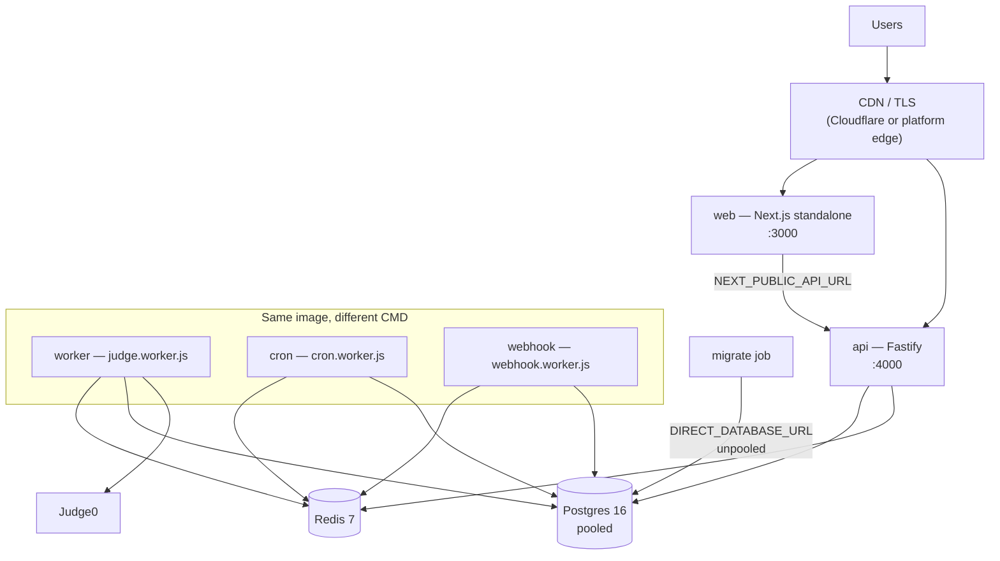
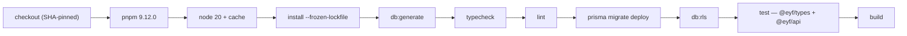
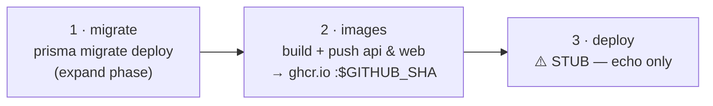
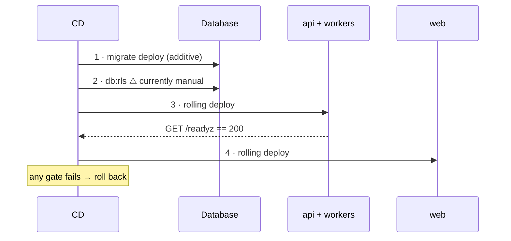
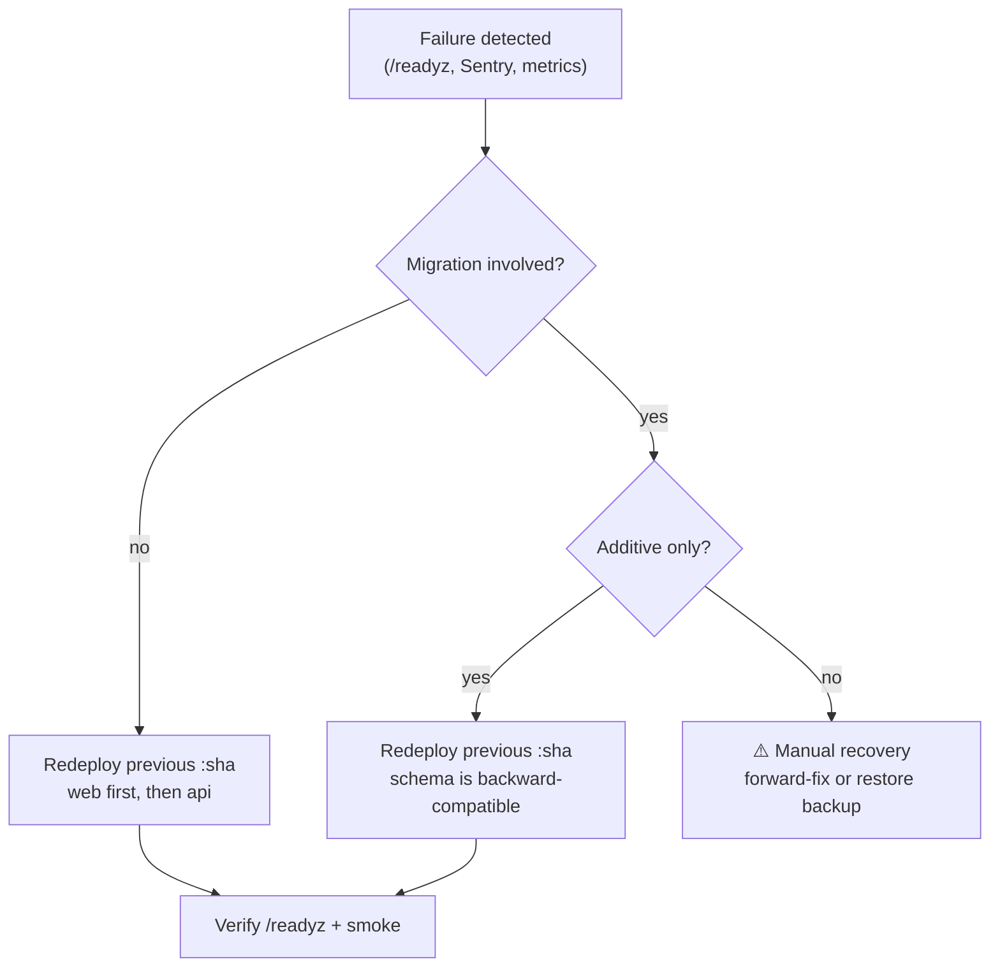

# Deployment

**Audience:** DevOps, backend engineers.
**Related:** [DEVOPS](DEVOPS.md) · [GO-LIVE](GO-LIVE.md) · [OPERATIONS](OPERATIONS.md) · [ENVIRONMENT_VARIABLES](ENVIRONMENT_VARIABLES.md) · [SECURITY](SECURITY.md)

---

## Table of Contents

- [Environments](#environments)
- [Topology](#topology)
- [Local development](#local-development)
- [Docker images](#docker-images)
- [docker-compose (production)](#docker-compose-production)
- [CI pipeline](#ci-pipeline)
- [CD pipeline](#cd-pipeline)
- [Deploy order](#deploy-order)
- [Database migrations](#database-migrations)
- [Platform notes](#platform-notes)
- [SSL / TLS](#ssl--tls)
- [Environment variables](#environment-variables)
- [Production checklist](#production-checklist)
- [Rollback strategy](#rollback-strategy)
- [Monitoring](#monitoring)

---

## Environments

| Environment | Web | API | Database | Notes |
| --- | --- | --- | --- | --- |
| **Local** | `:3000` | `:4000` | Docker Postgres 16 + Redis 7 | Runs with zero external keys |
| **CI** | Build only | Vitest | Service containers | `ci.yml` |
| **Staging** | — | — | — | **Needs implementation** — no staging config in-repo |
| **Production** | Vercel (per README) | Railway (per README) | Managed Postgres + Redis | Deploy step is a **stub** — see [CD pipeline](#cd-pipeline) |

**Production URL: Needs implementation** — no production hostname is configured in the repository.

> [!WARNING]
> The README describes *"GitHub Actions → Vercel (web) + Railway (api)"*, but `cd.yml`'s deploy job only **echoes instructions**. No platform integration is wired. Publishing images to GHCR works; promoting them does not.

---

## Topology



**Five processes** total: `api`, `worker`, `cron`, `webhook`, `web`.

> [!TIP]
> `api`, `worker`, `cron`, and `webhook` all run the **same image** — only the `CMD` differs. Build once, deploy four ways.

---

## Local development

```bash
pnpm install
cp .env.example .env

pnpm docker:up                                   # Postgres 16 + Redis 7
pnpm db:generate && pnpm db:migrate && pnpm db:seed
pnpm --filter @eyf/db db:rls                     # RLS policies

pnpm dev                                         # web :3000 + api :4000
```

Optional workers, each in its own terminal:

```bash
pnpm --filter @eyf/api dev:worker
pnpm --filter @eyf/api dev:cron
```

Judge0 (optional):

```bash
docker compose --profile judge up -d
```

> [!WARNING]
> **Port 5432 conflict.** If a local Postgres (e.g. Homebrew `postgresql@16`) is running, it binds `127.0.0.1:5432` while Docker binds the wildcard `*:5432`. The **more specific bind wins**, so `localhost:5432` silently reaches the *local* server, not the container — migrations and tests then hit the wrong database with confusing errors (`permission denied for schema public`).
>
> Diagnose:
> ```bash
> lsof -nP -iTCP:5432 -sTCP:LISTEN
> psql "$DATABASE_URL" -c "SELECT version();"   # "(Homebrew)" ⇒ wrong server
> ```
> Fix: stop the local service (`brew services stop postgresql@16`) or map the container to `5433`.

> [!WARNING]
> **Dual-`.env` gotcha.** The API loads `apps/api/.env` (via `dotenv/config` in `env.ts`), **not** the root `.env`. `packages/db/.env` is a third copy. Editing only the root file will not change API behaviour.

---

## Docker images

Both Dockerfiles are multi-stage.

### `apps/api/Dockerfile`

```
base   node:20-alpine + corepack (pnpm)
deps   copy manifests only → pnpm install --frozen-lockfile (cache mount)
build  copy source → prisma:generate → build
deploy pruned, production-only bundle of @eyf/api
```

| Decision | Why |
| --- | --- |
| Manifests copied before source | Layer cache survives source edits |
| `--mount=type=cache,id=pnpm` | Reuses the pnpm store between builds |
| `binaryTargets = ["native", "linux-musl-openssl-3.0.x"]` | Prisma engine must match Alpine musl |
| Shared image for workers | `CMD` selects the process |

> [!WARNING]
> If you change the base image away from Alpine, update `binaryTargets` in `schema.prisma` or Prisma will fail at runtime with a missing query engine.

### `apps/web/Dockerfile`

Builds the Next.js `standalone` output.

> [!WARNING]
> `NEXT_PUBLIC_*` values are **inlined at build time**, so they are Docker **build args**, not runtime env. Changing `NEXT_PUBLIC_API_URL` requires a **rebuild** — restarting the container will not pick it up.

---

## docker-compose (production)

```bash
docker compose -f docker-compose.prod.yml up -d --build
```

| Service | Image | Command | Health |
| --- | --- | --- | --- |
| `api` | api | default | `fetch(/readyz)` every 30s |
| `worker` | api | `node dist/jobs/judge.worker.js` | — |
| `cron` | api | `node dist/jobs/cron.worker.js` | — |
| `webhook` | api | `node dist/jobs/webhook.worker.js` | — |
| `web` | web | default | — |
| `postgres` | `postgres:16-alpine` | — | `pg_isready` |
| `redis` | `redis:7-alpine` | `--appendonly yes` | `redis-cli ping` |

> [!NOTE]
> The file's own header: *"Datastores here are for a single-host / staging deploy; in real production use managed Postgres (pooled) + managed Redis and drop the postgres/redis services."*

`POSTGRES_PASSWORD` uses `${POSTGRES_PASSWORD:?set POSTGRES_PASSWORD}` — compose **refuses to start** without it. Good fail-closed design.

> [!WARNING]
> Redis persistence is `--appendonly yes` with a named volume. If Redis is wiped, in-flight judge jobs and rate-limit counters are lost. Rate limits self-heal; queued submissions do not.

---

## CI pipeline

`.github/workflows/ci.yml` — on push/PR to `master`/`main`, 15-min timeout, concurrency-cancelled.



Service containers: `postgres:16` (`eyf:eyf`) and `redis:7`, both health-gated.

| Property | Value |
| --- | --- |
| Migration step | `prisma migrate deploy` — *"same path as production"* |
| RLS step | `db:rls` — *"prod parity"* |
| Test secrets | Throwaway 32-char CI-only JWT secrets |
| Build env | Placeholder Clerk keys so the Next build succeeds |
| Action pinning | ✅ SHA-pinned |

> [!WARNING]
> CI's Postgres uses the **superuser** `eyf`, so the RLS isolation test is a **false negative in CI too** — superusers bypass RLS unconditionally. See [TESTING](TESTING.md).

Other workflows: `security.yml` (CodeQL, Semgrep, gitleaks, audit), `sonar.yml`, `lighthouse.yml`, `e2e.yml`.

---

## CD pipeline

`.github/workflows/cd.yml` — on push to `main` or manual dispatch. `cancel-in-progress: false` (never cancel a deploy mid-flight).



| Job | Does |
| --- | --- |
| `migrate` | `prisma migrate deploy` with `DATABASE_URL` + `DIRECT_DATABASE_URL` secrets |
| `images` | Matrix build of `api` + `web`, pushed to `ghcr.io/<repo>/<name>:<sha>`, GHA cache |
| `deploy` | **Echoes instructions only** |

The stub's own text:

```
Trigger your platform's rolling deploy of the :$GITHUB_SHA images here.
Deploy order: api + workers first (backward-compatible), then web.
Gate promotion on GET /readyz == 200 before shifting traffic; roll back on failure.
```

> [!WARNING]
> **Deployment is not automated.** `cd.yml` builds and publishes images and runs migrations — but nothing promotes them. Wire the deploy job to your platform before relying on it.

> [!WARNING]
> The `migrate` job runs **before** images deploy. This is correct for expand/contract, but it means a destructive migration will break the still-running old version. Keep migrations additive.

> [!NOTE]
> `cd.yml` uses floating action tags (`actions/checkout@v4`) while `ci.yml` SHA-pins. CD holds deploy secrets — it deserves stricter pinning, not looser.

> [!WARNING]
> **`db:rls` is not part of CD.** CI runs it; the CD `migrate` job does not. RLS policies must be applied after every production migration or new org tables ship without isolation. This is a gap — see [ROADMAP](ROADMAP.md).

---

## Deploy order



API and workers first (backward-compatible), then web.

---

## Database migrations

| Step | Command | Connection |
| --- | --- | --- |
| Apply | `pnpm --filter @eyf/db exec prisma migrate deploy` | `DIRECT_DATABASE_URL` |
| RLS | `pnpm --filter @eyf/db db:rls` | `DIRECT_DATABASE_URL` |
| Status | `prisma:status` | — |
| Recover | `prisma:resolve` | — |

> [!WARNING]
> Migrations require the **unpooled** `DIRECT_DATABASE_URL`. Transaction pooling cannot run DDL. See [DATABASE](DATABASE.md).

---

## Platform notes

### Vercel (web)

| Setting | Value |
| --- | --- |
| Root | `apps/web` |
| Build | Turborepo-aware |
| Required build-time env | `NEXT_PUBLIC_API_URL`, `NEXT_PUBLIC_APP_URL`, `NEXT_PUBLIC_CLERK_PUBLISHABLE_KEY`, `NEXT_PUBLIC_POSTHOG_*` |

Alternatively deploy the `web` container (`output: "standalone"`).

### Railway (api)

| Setting | Value |
| --- | --- |
| Image | `ghcr.io/<repo>/api:<sha>` |
| Health | `/readyz` |
| Processes | Deploy `worker`, `cron`, `webhook` as separate services with their own `CMD` |

> [!WARNING]
> Deploying only `api` leaves submissions unjudged, streak alerts unsent, and org webhooks undelivered. All four processes are required.

### AWS / NGINX / Cloudflare

**Not implemented** — no NGINX config, ECS task definition, or Cloudflare config exists in-repo. `infra/terraform/` contains `main.tf`, `variables.tf`, `outputs.tf`; review before assuming coverage.

Whatever sits in front, set `TRUST_PROXY_HOPS` to the **exact** number of proxies.

---

## SSL / TLS

TLS terminates at the platform edge — **not implemented in-repo**.

The app assumes TLS:

| Signal | Value |
| --- | --- |
| API HSTS | `max-age=63072000; includeSubDomains; preload` |
| Web HSTS | same |
| CSP | `upgrade-insecure-requests` in production |

> [!WARNING]
> HSTS is **2 years, includeSubDomains, preload**. Once a browser sees it — or the domain enters the preload list — HTTP is refused for every subdomain for two years. Ensure *every* subdomain can serve TLS before shipping.

---

## Environment variables

Full table: [ENVIRONMENT_VARIABLES](ENVIRONMENT_VARIABLES.md).

| Class | Where | Note |
| --- | --- | --- |
| API runtime | Platform env | Zod-validated at boot; invalid = refuse to start |
| `NEXT_PUBLIC_*` | **Build args** | Inlined; changing requires a rebuild |
| CD secrets | GitHub Secrets | `DATABASE_URL`, `DIRECT_DATABASE_URL` |
| CD public vars | GitHub Variables | `NEXT_PUBLIC_*` |

---

## Production checklist

Also see [SECURITY](SECURITY.md#production-checklist) and [GO-LIVE](GO-LIVE.md).

### Before

- [ ] `NODE_ENV=production`
- [ ] `DEV_LOGIN_ENABLED` unset/`false`
- [ ] `JWT_ACCESS_SECRET` ≠ `JWT_REFRESH_SECRET`, both ≥32 chars
- [ ] `DATABASE_URL` pooled; `DIRECT_DATABASE_URL` unpooled
- [ ] App DB role is **not** a superuser (or RLS is bypassed)
- [ ] `API_CORS_ORIGINS` = real web origin(s)
- [ ] `TRUST_PROXY_HOPS` = real hop count
- [ ] `ADMIN_ACCESS_CODE` set
- [ ] `METRICS_TOKEN` set
- [ ] `SENTRY_DSN` + `RELEASE` set
- [ ] `BILLING_ENABLED` decided explicitly
- [ ] All four API processes scheduled

### During

- [ ] `migrate deploy` succeeded
- [ ] **`db:rls` applied**
- [ ] api + workers deployed, `/readyz` = 200
- [ ] web deployed

### After

- [ ] `GET /readyz` → 200
- [ ] `POST /v1/auth/dev-login` → 404
- [ ] `GET /metrics` without token → 401
- [ ] Security headers present
- [ ] A judge submission returns a verdict (workers alive)
- [ ] Sentry receiving events

---

## Rollback strategy

Images are tagged with the immutable commit SHA, so rollback is a redeploy of the previous tag.



| Scenario | Action |
| --- | --- |
| Bad app code, no migration | Redeploy previous SHA |
| Bad code, additive migration | Redeploy previous SHA — old code ignores new columns |
| Bad **destructive** migration | No automated path — forward-fix or restore |

> [!WARNING]
> **Prisma has no down-migrations here.** Rollback safety depends entirely on migrations being additive. This is why expand/contract is mandatory — a dropped column cannot be un-dropped by redeploying old code.

> [!NOTE]
> Rollback is **manual** because the deploy job is a stub. There is no automated health-gated promotion or auto-revert — **Needs implementation**.

---

## Monitoring

| Signal | Source |
| --- | --- |
| Liveness | `GET /livez` |
| Readiness | `GET /readyz` — Postgres + Redis |
| Metrics | `GET /metrics` — `httpRequests`, `httpDuration` by method/route/status |
| Errors | Sentry (`SENTRY_DSN`, `RELEASE`, `SENTRY_TRACES_SAMPLE_RATE` default 0.1) |
| Correlation | `x-request-id` on every response |
| Container health | compose healthchecks |
| Perf budgets | `lighthouserc.json` |

> [!TIP]
> Point the load balancer at `/livez` and deploy gates at `/readyz`. Using `/readyz` for liveness means a brief database blip restarts otherwise-healthy pods and turns a small incident into an outage.

Runbooks: [OPERATIONS](OPERATIONS.md). Scaling/backups: [DEVOPS](DEVOPS.md).

---

**Next:** [DEVOPS.md](DEVOPS.md) · [OPERATIONS.md](OPERATIONS.md) · [GO-LIVE.md](GO-LIVE.md)
