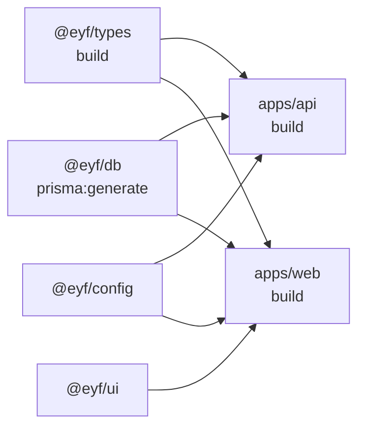
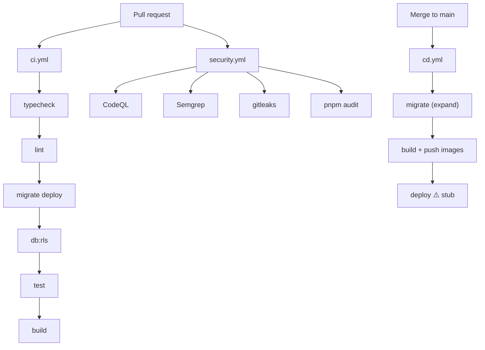
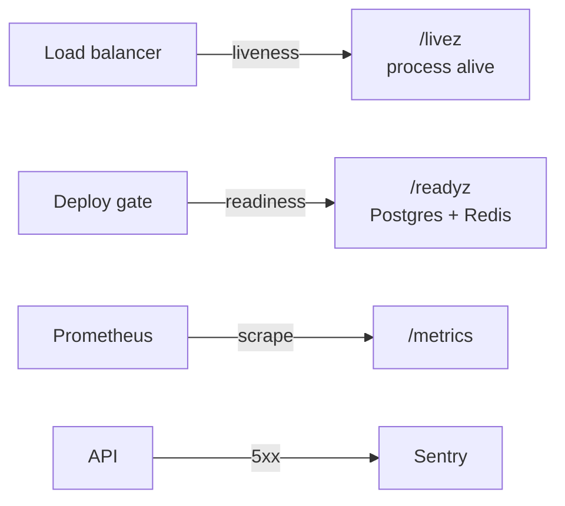
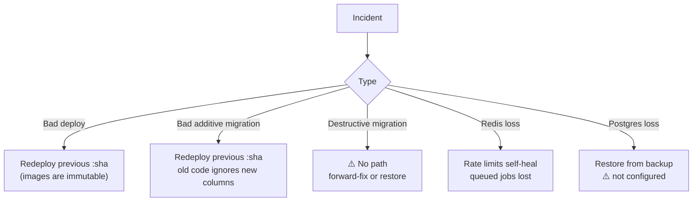
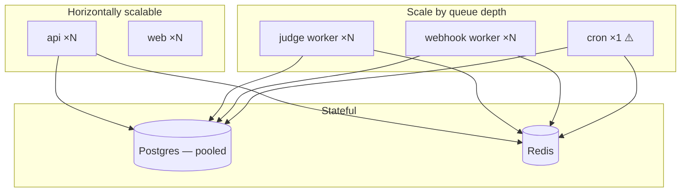

# DevOps

**Audience:** DevOps, SRE, platform engineers.
**Related:** [DEPLOYMENT](DEPLOYMENT.md) · [OPERATIONS](OPERATIONS.md) · [CONFIGURATION](CONFIGURATION.md) · [TESTING](TESTING.md)

---

## Table of Contents

- [Build process](#build-process)
- [CI/CD](#cicd)
- [Testing in CI](#testing-in-ci)
- [Monitoring](#monitoring)
- [Logging](#logging)
- [Metrics](#metrics)
- [Alerting](#alerting)
- [Backups](#backups)
- [Disaster recovery](#disaster-recovery)
- [Scaling](#scaling)
- [Caching](#caching)
- [Infrastructure](#infrastructure)
- [Load testing](#load-testing)
- [Gaps](#gaps)

---

## Build process

Turborepo orchestrates a dependency-ordered task graph.



`"dependsOn": ["^build"]` means *build my dependencies first*.

| Task | Cached | Outputs |
| --- | :-: | --- |
| `build` | ✅ | `.next/**` (minus cache), `dist/**` |
| `typecheck` | ✅ | — |
| `lint` | ✅ | — |
| `test` | ✅ | `coverage/**` |
| `dev` | ❌ | persistent |

```bash
pnpm build       # everything, in order
pnpm typecheck   # 6 packages
pnpm lint        # --max-warnings 0
```

> [!TIP]
> A warm cache reports `>>> FULL TURBO` and finishes in milliseconds. If a task you expect to be cached re-runs, check `globalEnv` in `turbo.json` — a changed variable listed there busts the cache by design.

> [!WARNING]
> Prisma client generation (`pnpm db:generate`) is **not** a Turbo task. CI runs it explicitly before typecheck. A fresh clone that skips it fails with missing types from `@eyf/db`.

### Build order in production

Images are built by `cd.yml` in a matrix (`api`, `web`), each multi-stage, tagged with the commit SHA and pushed to GHCR.

---

## CI/CD



### `ci.yml`

| Property | Value |
| --- | --- |
| Triggers | push/PR to `master`/`main` |
| Timeout | 15 min |
| Concurrency | `cancel-in-progress: true` |
| Services | `postgres:16` + `redis:7`, health-gated |
| Node/pnpm | 20 / 9.12.0, pnpm cache |
| Actions | **SHA-pinned** |

Steps: install (`--frozen-lockfile`) → `db:generate` → typecheck → lint → `prisma migrate deploy` → `db:rls` → test → build.

> [!TIP]
> CI applies migrations *"same path as production"* and RLS *"prod parity"* — the pipeline deliberately exercises the real production mechanisms rather than a shortcut like `db push`.

### `cd.yml`

| Job | Status |
| --- | --- |
| `migrate` | ✅ `prisma migrate deploy` with secrets |
| `images` | ✅ matrix build → `ghcr.io/<repo>/<name>:<sha>`, GHA cache |
| `deploy` | ⚠️ **echo-only stub** |

> [!WARNING]
> **`db:rls` runs in CI but not in CD.** Production migrations do not reapply RLS policies. New org tables can therefore ship without isolation. Add `pnpm --filter @eyf/db db:rls` to the `migrate` job.

### `security.yml`

Push/PR to `main` + weekly (Mon 06:00 UTC): CodeQL, Semgrep (`p/typescript p/nodejsscan p/owasp-top-ten p/secrets`), gitleaks (full history), `pnpm audit --prod --audit-level high || true`.

> [!WARNING]
> The audit ends in `|| true` — advisories report but never block.

---

## Testing in CI

`pnpm --filter @eyf/types test && pnpm --filter @eyf/api test` against the service containers.

> [!WARNING]
> CI's Postgres uses superuser `eyf`, so the RLS isolation test is a **false negative in CI** exactly as it is locally. CI has the same blind spot. See [TESTING](TESTING.md#the-rls-false-negative).

---

## Monitoring

| Signal | Endpoint | Use for |
| --- | --- | --- |
| Liveness | `/livez` | Load-balancer health, restart policy |
| Readiness | `/readyz` | Deploy gate, traffic shifting |
| Shallow | `/health`, `/v1/health` | Legacy uptime pingers |
| Metrics | `/metrics` | Prometheus scrape |



> [!TIP]
> **Never point liveness at `/readyz`.** A transient database blip would restart healthy pods and escalate a minor incident into an outage. `/livez` touches no dependency — that is the whole point of having both.

---

## Logging

| Property | Value |
| --- | --- |
| Library | Pino |
| Format | JSON (production); `pino-pretty` in development only |
| Level | `API_LOG_LEVEL` (default `info`) |
| Request logging | Enabled |
| Correlation | `x-request-id` — inbound reused, else UUID; echoed on every response |

> [!TIP]
> `genReqId` **reuses an inbound `x-request-id`** from the edge. Set it at your CDN/LB and one id traces a request across the edge, API, logs, and Sentry.

Log aggregation/shipping: **Needs implementation** — no Loki/ELK/CloudWatch config in-repo.

---

## Metrics

`apps/api/src/lib/observability.ts` exposes a Prometheus registry:

| Metric | Type | Labels |
| --- | --- | --- |
| `httpRequests` | Counter | `method`, `route`, `status` |
| `httpDuration` | Histogram (seconds) | `method`, `route`, `status` |

```ts
const route = (req.routeOptions?.url ?? req.url.split("?")[0]) as string;
```

> [!TIP]
> The `route` label is the **pattern** (`/v1/problems/:slug`), not the concrete path. Labelling with concrete paths would create unbounded cardinality and eventually take down Prometheus.

Secure the endpoint:

```
METRICS_TOKEN=<random>    # → /metrics requires Authorization: Bearer <token>
```

> [!WARNING]
> Unset `METRICS_TOKEN` = `/metrics` is world-readable. It exposes route inventory and traffic patterns. Set it, or restrict by network policy.

Dashboards/recording rules: **Needs implementation**.

---

## Alerting

**Needs implementation.** There is no alerting configuration in the repository.

Sentry (`SENTRY_DSN`) captures 5xx with `{ reqId, url, method }` and supports `RELEASE` for regression attribution, but alert routing (PagerDuty/Slack/on-call) is not configured.

Suggested first alerts, using signals that already exist:

| Alert | Source |
| --- | --- |
| `/readyz` failing >1 min | Health check |
| 5xx rate > 1% over 5 min | `httpRequests{status=~"5.."}` |
| p99 latency > 2s | `httpDuration` |
| Judge queue depth growing | BullMQ |
| Sentry new-issue spike | Sentry |

---

## Backups

**Needs implementation.** No backup automation, retention policy, or restore runbook exists in-repo.

| Store | Contains | Backup |
| --- | --- | --- |
| PostgreSQL | All business data | Provider-managed (assumed) — **not configured here** |
| Redis | Queues, rate-limit counters | `--appendonly yes` + named volume (compose only) |
| R2 | Resumes, certificates | Provider durability |

> [!WARNING]
> Redis is **not** purely ephemeral. Rate-limit counters self-heal, but **in-flight judge jobs live only in Redis**. Losing Redis loses queued submissions. Treat it as semi-durable.

Minimum recommended: automated daily PITR-capable Postgres backups + a **tested** restore procedure. An untested backup is not a backup.

---

## Disaster recovery

**No documented RTO/RPO — Needs implementation.**

What the codebase does support:



| Property | Status |
| --- | --- |
| Immutable image tags | ✅ commit SHA |
| Down-migrations | ❌ Prisma has none — rely on expand/contract |
| Automated rollback | ❌ deploy job is a stub |
| Backup restore | ❌ not configured |
| Multi-region | ❌ not implemented |

---

## Scaling



| Component | Scaling | Constraint |
| --- | --- | --- |
| `api` | Horizontal | Stateless; rate limits stay correct because counters are in shared Redis |
| `web` | Horizontal | Stateless |
| `judge` worker | Horizontal | Bounded by Judge0 capacity |
| `webhook` worker | Horizontal | Bounded by customer endpoints |
| `cron` | **Do not scale** | See below |
| Postgres | Vertical + pooling + read replicas | `DATABASE_URL` must be pooled |
| Redis | Vertical | Single shared instance |

> [!TIP]
> Rate limiting scales correctly **only** because the limiter uses shared Redis. With an in-memory store the effective limit would multiply by pod count and reset on every deploy. This is why the Redis store is a correctness requirement, not an optimisation.

> [!WARNING]
> **Run exactly one `cron` process.** Jobs are registered with BullMQ's `upsertJobScheduler`, which is idempotent for *registration*, but multiple cron containers are unnecessary and risk duplicate scheduling behaviour. Scale `judge`/`webhook` workers instead.

### Connection budget

Each API instance and each worker holds a Prisma pool. `N × pool_size` must stay under the pooler's limit — this is precisely why `DATABASE_URL` points at PgBouncer/Neon-pooled and migrations use `DIRECT_DATABASE_URL`.

---

## Caching

| Layer | Mechanism | TTL |
| --- | --- | --- |
| Turbo build cache | Local + GHA | Content-hashed |
| Docker layer cache | `cache-from/to: type=gha` | GHA-managed |
| pnpm store | `--mount=type=cache` | Build-time |
| Rate limits | Redis `eyf-rl:` | 1 min |
| SWR client cache | In-memory | 15s dedupe |
| HTTP response cache | **Not implemented** | — |

> [!NOTE]
> There is **no CDN/response caching on API reads**. Public, read-heavy endpoints (`/v1/problems`, `/v1/jobs`) hit Postgres on every request. Adding `Cache-Control` to public GETs is the cheapest available scaling win — see [PERFORMANCE](PERFORMANCE.md).

---

## Infrastructure

`infra/terraform/` — `main.tf`, `variables.tf`, `outputs.tf`.

> [!NOTE]
> Review these before assuming coverage; the README describes Vercel (web) + Railway (api), which are typically configured outside Terraform. No NGINX, ECS task definition, or Cloudflare config exists in-repo.

---

## Load testing

```bash
BASE_URL=https://staging-api.eyf.in k6 run load/k6-smoke.js
```

> [!NOTE]
> Static analysis flags `load/k6-smoke.js` as an orphaned file. It is **not** dead — it is executed by the external `k6` binary, as its own header documents.

---

## Gaps

Ranked by operational risk:

| # | Gap | Impact |
| --- | --- | --- |
| 1 | **Deploy job is a stub** | No automated deploy, no health-gated promotion, no auto-rollback |
| 2 | **`db:rls` missing from CD** | Org tables can ship without tenant isolation |
| 3 | **No backups configured** | Data loss is unrecoverable |
| 4 | **No alerting** | Failures are discovered by users |
| 5 | **RLS test false negative in CI** | Isolation regressions would not be caught |
| 6 | No log aggregation | Debugging across instances is manual |
| 7 | `pnpm audit \|\| true` | Advisories never block |
| 8 | `cd.yml` not SHA-pinned | Supply-chain exposure on the secret-holding workflow |
| 9 | No staging environment | Production is the first real deploy |
| 10 | No documented RTO/RPO | Recovery expectations undefined |

---

**Next:** [DEPLOYMENT.md](DEPLOYMENT.md) · [OPERATIONS.md](OPERATIONS.md) · [TROUBLESHOOTING.md](TROUBLESHOOTING.md)
