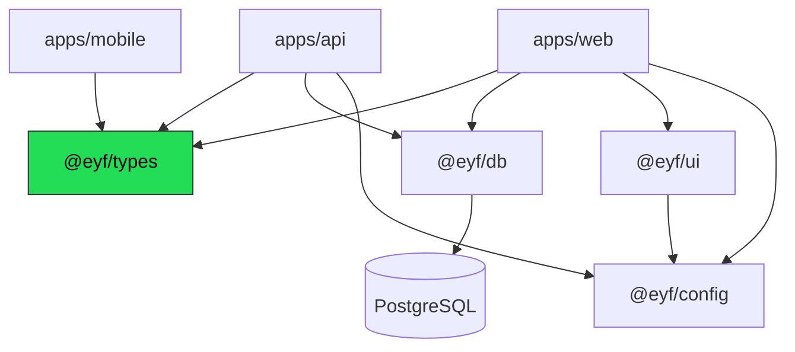

# Folder Structure

**Audience:** engineers, new joiners.
**Related:** [SYSTEM_ARCHITECTURE](SYSTEM_ARCHITECTURE.md) · [CODEBASE_GUIDE](CODEBASE_GUIDE.md)

---

## Table of Contents

- [Top level](#top-level)
- [Dependency graph](#dependency-graph)
- [apps/web](#appsweb)
- [apps/api](#appsapi)
- [apps/mobile](#appsmobile)
- [packages/db](#packagesdb)
- [packages/types](#packagestypes)
- [packages/ui](#packagesui)
- [packages/config](#packagesconfig)
- [Supporting directories](#supporting-directories)
- [File naming conventions](#file-naming-conventions)

---

## Top level

```
EYF/
├── apps/
│   ├── web/          Next.js 14 — student app, admin back-office, org portal
│   ├── api/          Fastify 5 — REST API under /v1 + BullMQ workers
│   └── mobile/       Expo SDK 52 — daily challenge, flashcards, streak
├── packages/
│   ├── db/           Prisma schema, generated client, seed, RLS script
│   ├── types/        Shared types + pure logic (readiness, plans, permissions)
│   ├── ui/           Shared React primitives
│   └── config/       Shared ESLint / Tailwind / TS bases
├── docs/             This documentation set + operational docs
├── specs/            Founding product specs (source of truth for intent)
├── infra/terraform/  Infrastructure as code
├── load/             k6 load scripts
├── .github/workflows/ CI, CD, security, sonar, lighthouse, e2e
├── docker-compose.yml       Local Postgres 16 + Redis 7 (+ Judge0 profile)
├── docker-compose.prod.yml  Production compose
├── turbo.json               Task graph
├── tsconfig.base.json       Shared TS config
├── .eslintrc.json           Root ESLint
├── lighthouserc.json        Lighthouse CI budgets
├── sonar-project.properties SonarQube config
└── pnpm-workspace.yaml      Workspaces: apps/*, packages/*
```

| Directory | Purpose | Owner |
| --- | --- | --- |
| `apps/` | Deployable applications | Feature teams |
| `packages/` | Shared libraries — no app may duplicate their logic | Platform |
| `docs/` | Documentation | All |
| `specs/` | Product specs; code comments cite them (e.g. "PRD §25", "Doc 11") | Product |
| `infra/` | Terraform | DevOps |
| `load/` | Performance scripts | DevOps/QA |

---

## Dependency graph



> [!NOTE]
> **No circular dependencies exist** — verified with `madge --circular` across `apps/web` and `apps/api`. Packages never import from apps. `@eyf/types` depends on nothing internal, which is what lets both web and API share it.

---

## apps/web

Next.js 14 App Router. **20,239 LOC** (post-cleanup).

```
apps/web/
├── app/
│   ├── (app)/        Student application — auth-protected
│   ├── (admin)/      Staff back-office
│   ├── (auth)/       sign-in, sign-up
│   ├── org/          Employer / LMS portal
│   ├── about/ contact/ pricing/ privacy/ refund/ security/ terms/
│   ├── score/ verify/ welcome/
│   ├── layout.tsx    Root layout
│   ├── page.tsx      Landing page
│   ├── error.tsx     Route error boundary
│   ├── not-found.tsx 404
│   └── globals.css   Tailwind + CSS custom properties (theming)
├── components/       ~50 shared components
│   ├── brand/        (removed — was dead; see cleanup report)
│   ├── landing/      Landing sections
│   ├── protection/   Content-protection deterrents
│   └── viz/          Data visualisations (graph3d, recursion3d)
├── lib/              Client utilities + hooks
├── e2e/              Playwright specs
├── public/           Static assets
├── middleware.ts     Clerk route protection
├── next.config.mjs   CSP + security headers + standalone output
├── tailwind.config.ts
├── playwright.config.ts
└── Dockerfile
```

### `app/(app)/` — student application

40 sections: `ask` `assessment` `billing` `certificates` `code-dna` `communication` `companies` `dashboard` `experiences` `forum` `fun` `games` `internships` `jobs` `leaderboard` `learn` `mcq` `mentors` `mocks` `oa` `offer` `orgs` `peer-mocks` `pipeline` `pressure` `problems` `project-prep` `projects` `readiness` `resume` `roadmap` `settings` `skills` `subjects` `today` `tracks` `visualizer` `wrapped`.

Plus `layout.tsx`, `loading.tsx`, `error.tsx`.

### `app/(admin)/admin/content/` — content back-office

13 CRUD pages sharing two colocated modules:

| File | Responsibility |
| --- | --- |
| `_tabs.tsx` | `ContentTabs` — sub-nav shared by all content pages |
| `_field.tsx` | `Field` — labelled form-field wrapper (extracted from 13 duplicates) |

> [!TIP]
> The `_`-prefixed file convention marks colocated, non-route modules inside the App Router. Follow it when adding shared pieces scoped to one route group.

### `lib/` — client utilities

| File | Responsibility |
| --- | --- |
| `api.ts`, `use-api.ts` | Fetch wrapper + SWR hooks (`useApi`, `useApiAction`) |
| `auth.ts` | Client auth helpers (`EyfAuth`) |
| `readiness.ts` | Re-types the shared engine's `icon` to the web `IconName` union |
| `use-readiness.ts` | Readiness hook |
| `use-guidance.ts` | Ranked next actions |
| `comeback.ts` | Comeback-plan logic |
| `company-readiness.ts`, `company.ts` | Company-fit scoring |
| `score-memory.ts` | "Score moment" delta via localStorage |
| `nav.ts` | Navigation model (`NavItem`, `NavGroup`) |
| `persona.ts` | Persona journeys |
| `offer.ts`, `peer-rtc.ts`, `use-recorder.ts`, `use-role.ts`, `use-is-reduced.ts`, `fonts.ts`, `analytics.ts` | Supporting concerns |

### Key components

| Component | Notes |
| --- | --- |
| `app-shell.tsx`, `app-sidebar.tsx`, `nav.tsx` | Application chrome |
| `AntigravityBackground.tsx` | WebGL ring — loaded via `next/dynamic` from `landing/ring-backdrop.tsx` |
| `motion.tsx` | `Reveal` motion primitive (reduced-motion safe) |
| `theme.tsx` | Light/dark theming |
| `command-palette.tsx` | ⌘K palette |
| `icons.tsx` | `Icons` map + `IconName` union |

---

## apps/api

Fastify 5. **14,368 LOC** (post-cleanup).

```
apps/api/src/
├── server.ts       Process entry — binds API_HOST:API_PORT
├── app.ts          buildApp() — plugin composition, health, metrics
├── env.ts          Zod-validated environment contract
├── augment.d.ts    Fastify type augmentation (session, orgCtx, decorators)
├── routes/         61 modules → 328 endpoints
├── services/       36 domain/integration services
├── lib/            30 infrastructure utilities
├── middleware/     auth · error · org · permissions
└── jobs/           queue · scheduler · judge/cron/webhook workers
```

### `routes/`

`index.ts` is the single registration point mapping module → prefix. Routes are thin: parse with Zod → call a service or Prisma → return the envelope.

| Group | Modules |
| --- | --- |
| Student | `problems` `submissions` `assessment` `roadmap` `subjects` `mcq` `communication` `mocks` `peer` `pressure` `cognitive` `code-dna` `resume` `projects` `project-prep` `jobs` `internships` `mentors` `tracks` `certificates` `gamification` `missions` `leaderboard` `forum` `experiences` `oa` `companies` `skill-graph` `guidance` `score` `wrapped` `fun` `ask` `push` `me` `auth` `billing` |
| Staff | `admin` `admin-gate` `admin-users` `admin-payments` `admin-audit` `admin-content*` (6 modules) `editorial` |
| Enterprise | `orgs` `org` `org-learn` `org-paths` `org-skills` `org-assess` `org-certificates` `org-hire` `org-settings` `org-ai` `talent` |

### `services/`

36 modules. Integration adapters (`clerk` `razorpay` `judge0` `anthropic` `whisper` `push` `email` `pdf`) and domain logic (`assessment` `ats` `code-dna` `communication` `daily` `gamification` `guidance` `mcq` `missions` `offer-letter` `payouts` `peer-matching` `peer-signal` `pressure` `project-prep` `roadmap-generator` `roast` `skill-graph` `srs` `strategist` `wrapped` `ai-mock`).

> [!NOTE]
> `clerk-key.ts` is deliberately split from `clerk.ts` so key detection is unit-testable without importing env + prisma + the Clerk SDK.

### `lib/`

| File | Responsibility |
| --- | --- |
| `redis.ts` | Shared ioredis connection |
| `health.ts` | `checkReadiness()` for `/readyz` |
| `observability.ts` | Sentry init, Prometheus registry, `httpRequests`, `httpDuration` |
| `org-scoped.ts` | `orgDb()` (⚠️ unused) + `withOrgContext()` RLS helper |
| `org-token.ts` | Org portal token mint/verify + `isOrgToken()` |
| `api-keys.ts` | Org API-key hashing/verification |
| `rate-limits.ts` | Per-route overrides (`ORG_VERIFY_RATE_LIMIT` = 5/min) |
| `subscription.ts` | `resolveActivePlan()` |
| `usage.ts` | Usage counters, `AI_CREDITS_CAP` |
| `audit.ts` | `recordAudit()` → `AuditLog` |
| `ssrf.ts` | Outbound URL guard for org webhooks |
| `webhooks.ts` | Signature helpers |
| `*-bank.ts` / `*-source.ts` | Legacy hardcoded content banks + DB-first sources |
| `judge-retry.ts`, `mock-feedback.ts`, `skill-ledger.ts`, `org-certificates.ts` | Domain helpers |

> [!TIP]
> **`*-source.ts` supersedes `*-bank.ts`.** Sources are DB-first with the bank as fallback, so a fresh install works and in-flight sessions survive a bank→DB cutover. New code should call the `*Source` functions.

### `middleware/`

| File | Exports |
| --- | --- |
| `auth.ts` | `authPlugin` → `requireAuth`, `requirePlan`, `requireRole` |
| `permissions.ts` | `requirePermission(cap)`, `hasValidAdminGate()` |
| `org.ts` | Org context resolution → `req.orgCtx` |
| `error.ts` | `errorHandler` — Zod → 400, pre-shaped errors pass through |

---

## apps/mobile

Expo SDK 52 + expo-router. Consumes `@eyf/types` only. `typecheck` no-ops with a friendly message when `react-native` is not installed.

---

## packages/db

```
packages/db/
├── prisma/
│   ├── schema.prisma   2,025 lines — 87 models, 47 enums
│   └── seed.ts         285 lines
├── scripts/apply-rls.ts  RLS policies (17 org tables + organizations)
└── src/
    ├── index.ts        Prisma singleton + re-export of generated client
    ├── enums.ts        Enum re-exports (subpath: @eyf/db/enums)
    └── generated/      Generated client — never edit, never review
```

> [!WARNING]
> `src/generated/` is generated output. It accounts for the bulk of the package's ~153k LOC and every `: any` in the repo. Exclude it from review, coverage, and lint.

---

## packages/types

The most important package: pure, dependency-free, shared by web + API + mobile.

| File | Responsibility | Tests |
| --- | --- | --- |
| `index.ts` | `ApiResponse` envelope, `Plan`, `SessionUser`, `RATE_LIMIT_PER_MIN`, `SUBMISSION_LIMITS`, `meetsPlan()` | `index.test.ts` |
| `readiness.ts` | `computeReadiness()`, `rankActions()` — the readiness engine | `readiness.test.ts` |
| `permissions.ts` | Staff RBAC: 7 capabilities × 3 roles | — |
| `org-permissions.ts` | Org RBAC/ABAC: 21 capabilities × 11 roles × 5 scopes | `org-permissions.test.ts` |
| `skill-ledger.ts` | Skill evidence → level | `skill-ledger.test.ts` |
| `webrtc.ts` | Peer-mock signalling types | `webrtc.test.ts` |

---

## packages/ui

Design-system primitives (~397 LOC): `badge` `button` `card` `cn` `empty-state` `metric` `page-header` `skeleton` + `index.ts`.

`cn.ts` wraps `clsx`; the package correctly declares its own `clsx` dependency.

> [!TIP]
> If a component is used by more than one app, it belongs here. If it is used by one route group, colocate it with a `_` prefix.

---

## packages/config

Shared ESLint config, Tailwind preset, and TS base — consumed by every app/package.

---

## Supporting directories

| Directory | Contents |
| --- | --- |
| `.github/workflows/` | `ci.yml`, `cd.yml`, `security.yml`, `sonar.yml`, `lighthouse.yml`, `e2e.yml` |
| `infra/terraform/` | `main.tf`, `variables.tf`, `outputs.tf` |
| `load/` | `k6-smoke.js` — run via `BASE_URL=… k6 run load/k6-smoke.js` |
| `specs/` | `EYF_Master_Docs_Final.md`, `EYF_Enterprise_Learning_Platform_PRD.md`, `EYF_Complete_SaaS_Build_Guide.md` |

---

## File naming conventions

| Pattern | Meaning | Example |
| --- | --- | --- |
| `kebab-case.ts` | Default for all modules | `org-scoped.ts` |
| `PascalCase.tsx` | Rare — legacy component naming | `AntigravityBackground.tsx` |
| `_name.tsx` | Colocated non-route module (App Router) | `_tabs.tsx`, `_field.tsx` |
| `*.test.ts` | Unit test, colocated with source | `srs.test.ts` |
| `*.integration.test.ts` | Requires a real database | `orgs.integration.test.ts` |
| `*-bank.ts` | Legacy hardcoded content | `mcq-bank.ts` |
| `*-source.ts` | DB-first source (supersedes bank) | `mcq-source.ts` |
| `(group)/` | App Router route group, not a URL segment | `(app)`, `(admin)` |

> [!NOTE]
> `PascalCase.tsx` is the minority convention and should not be extended — prefer kebab-case for new components.

---

**Next:** [CODEBASE_GUIDE.md](CODEBASE_GUIDE.md) · [BACKEND.md](BACKEND.md) · [FRONTEND.md](FRONTEND.md)
