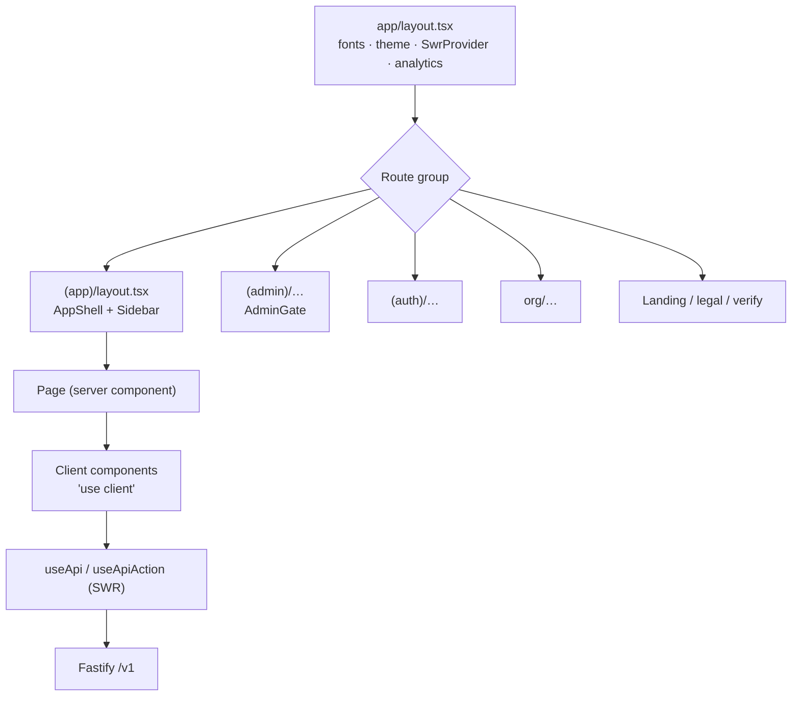

# Frontend

**Audience:** frontend engineers.
**Related:** [DESIGN](DESIGN.md) · [ACCESSIBILITY](ACCESSIBILITY.md) · [PERFORMANCE](PERFORMANCE.md) · [FOLDER_STRUCTURE](FOLDER_STRUCTURE.md)

---

## Table of Contents

- [Overview](#overview)
- [Architecture](#architecture)
- [Routing](#routing)
- [Layouts](#layouts)
- [Rendering strategy](#rendering-strategy)
- [Data fetching](#data-fetching)
- [State management](#state-management)
- [Component system](#component-system)
- [Hooks](#hooks)
- [Forms & validation](#forms--validation)
- [Theming](#theming)
- [Motion](#motion)
- [Performance](#performance)
- [Accessibility](#accessibility)
- [Responsive design](#responsive-design)
- [Adding a page](#adding-a-page)

---

## Overview

| Property | Value |
| --- | --- |
| Framework | Next.js 14 (App Router) |
| UI | React 18 |
| Styling | Tailwind CSS + CSS custom properties |
| Motion | Framer Motion |
| Data | SWR |
| Auth | `@clerk/nextjs` |
| Editor | `@monaco-editor/react` |
| 3D | `three` + `@react-three/fiber` |
| Scroll | `lenis` |
| Toasts | `sonner` |
| Analytics | `posthog-js` |
| Fonts | `geist` + Bricolage (via `next/font`) |
| Output | `standalone` (Docker) |
| Size | ~20,200 LOC |

---

## Architecture

```
apps/web/
├── app/
│   ├── (app)/       Student app — 40 sections
│   ├── (admin)/     Staff back-office
│   ├── (auth)/      sign-in / sign-up
│   ├── org/         Employer / LMS portal
│   ├── page.tsx     Landing
│   ├── layout.tsx   Root layout
│   ├── error.tsx    Error boundary
│   ├── not-found.tsx
│   └── globals.css  Tailwind + design tokens
├── components/      ~50 shared components
├── lib/             Client utilities + hooks
├── e2e/             Playwright
├── middleware.ts    Clerk route protection
└── next.config.mjs  CSP, headers, standalone
```



---

## Routing

App Router with **route groups** — `(app)`, `(admin)`, `(auth)` organise files without adding URL segments.

| Group | URL | Purpose |
| --- | --- | --- |
| `(app)/dashboard` | `/dashboard` | Student app |
| `(admin)/admin/content/mcq` | `/admin/content/mcq` | Staff CRUD |
| `(auth)/sign-in/[[...sign-in]]` | `/sign-in/*` | Clerk catch-all |
| `org/` | `/org` | Employer portal |
| `page.tsx` | `/` | Landing |

### Protection

`apps/web/middleware.ts` protects ~25 prefixes with `createRouteMatcher`:

```ts
export default HAS_REAL_CLERK
  ? clerkMiddleware(async (auth, req) => { if (isAppRoute(req)) await auth.protect(); })
  : () => NextResponse.next();
```

> [!WARNING]
> When the Clerk publishable key is a placeholder, `clerkMiddleware` is **not used at all** — it 404s app routes when it cannot reach a fake Clerk host. The vanilla passthrough is what lets developers explore the app with no keys. Do not "simplify" this branch away.

The matcher excludes `_next` and static asset extensions, and explicitly includes `/(api|trpc)(.*)` and `/__clerk/:path*`.

---

## Layouts

| Layout | Provides |
| --- | --- |
| `app/layout.tsx` | Root — fonts, theme, `SwrProvider`, analytics, toasts |
| `app/(app)/layout.tsx` | `AppShell` — sidebar, nav, command palette |
| `app/(app)/loading.tsx` | Route-group loading UI |
| `app/(app)/error.tsx` | Route-group error boundary |

Chrome components: `app-shell.tsx`, `app-sidebar.tsx` (collapsible), `nav.tsx`, `nav-auth.tsx`, `command-palette.tsx` (⌘K), `footer.tsx`.

---

## Rendering strategy

| Mode | Used for |
| --- | --- |
| Server components (default) | Pages that only compose |
| Client components (`"use client"`) | Anything with hooks, SWR, or interactivity |
| `next/dynamic` + `ssr: false` | WebGL, Monaco — browser-only |

The production build emits **95 routes**, statically prerendering (`○`) marketing/static pages and rendering dynamically (`ƒ`) parameterised ones.

```ts
// components/landing/ring-backdrop.tsx
const AntigravityBackground = dynamic(() => import("@/components/AntigravityBackground"), { ssr: false });
```

> [!TIP]
> Three.js and Monaco **must** be dynamically imported with `ssr: false`. They touch `window`/`document` and will break the server render otherwise. This is also what keeps them out of the initial bundle.

---

## Data fetching

All client data goes through SWR via two hooks in `apps/web/lib/use-api.ts`.

### `useApi<T>(path, options?)` — reads

```ts
const { data, error, isLoading } = useApi<Readiness>("/guidance/me");
```

Its retry policy is the most important detail in the file:

```ts
shouldRetryOnError: (err) =>
  !(err instanceof ApiClientError && [400, 402, 403, 404].includes(err.status)),
```

| Status | Retry? | Why |
| --- | :-: | --- |
| 400, 402, 403, 404 | ❌ | Terminal — the response will not change; retrying wastes 5 round-trips and pins the component in a loading state |
| **401** | ✅ | **Transient** — auth can become available after a token refresh |
| 5xx / network | ✅ | Transient |

> [!TIP]
> The 401-stays-retryable rule is subtle and deliberate. Treating 401 as terminal would break the refresh flow: a component mounting mid-refresh would fail permanently instead of recovering.

### `useApiAction()` — mutations

Maps failures to human messages via `actionMessage()`:

| Condition | Message |
| --- | --- |
| `AI_UNAVAILABLE` | "This AI feature isn't configured yet." |
| 402 / `PLAN_REQUIRED` | "Upgrade your plan to use this." |
| 401 / 403 | "You're not allowed to do that." |
| ≥500 | "Something went wrong on our end. Try again." |
| `TypeError` | "Network error — check your connection." |

> [!NOTE]
> `AI_UNAVAILABLE` exists because AI features no-op without `ANTHROPIC_API_KEY`. The UI explains the gap rather than showing a generic error — this is the "runs without keys" principle surfaced in the UX.

### Global SWR config (`components/swr-provider.tsx`)

| Setting | Value | Rationale (from the file) |
| --- | --- | --- |
| `keepPreviousData` | on | Navigating between filters shows last data instead of flashing skeletons |
| `dedupingInterval` | 15s | Five components asking for `/me` share one request |
| `revalidateOnFocus` | off | Alt-tabbing back doesn't jank the UI with refetch waterfalls |
| localStorage persistence | **deliberately none** | Responses are per-user (scores, resumes, payments) and the content-protection posture treats shared machines as hostile |

---

## State management

**There is no global state library** — no Redux, Zustand, or Jotai.

| Kind of state | Mechanism |
| --- | --- |
| Server state | SWR cache |
| Local UI state | `useState` |
| Cross-cutting | React context (`theme.tsx`, `swr-provider.tsx`, `analytics-provider.tsx`) |
| URL state | Route params / search params |
| Device memory | `localStorage` via `lib/score-memory.ts` |

> [!TIP]
> SWR *is* the state manager. Before adding a store, ask whether the state is really server state — it usually is.

`score-memory.ts` shows the one place a **module singleton** is correct:

```ts
// The "from" anchor is captured ONCE per JS session (module singleton) —
// React strict-mode double-mounts and dashboard↔readiness navigation would
// otherwise consume the delta before anyone saw it.
let anchor: number | null | undefined;
```

---

## Component system

Three tiers:

| Tier | Location | Rule |
| --- | --- | --- |
| Design system | `@eyf/ui` | Used by >1 app — `Button`, `Card`, `Badge`, `EmptyState`, `Metric`, `PageHeader`, `Skeleton`, `cn` |
| App-shared | `apps/web/components/` | Used across route groups |
| Colocated | `app/**/_name.tsx` | Scoped to one route group |

`_`-prefixed files are the App Router convention for colocated non-route modules:

| File | Scope |
| --- | --- |
| `app/(admin)/admin/content/_tabs.tsx` | `ContentTabs` sub-nav |
| `app/(admin)/admin/content/_field.tsx` | `Field` form wrapper (shared by 13 pages) |

> [!WARNING]
> Five other pages (`mocks`, `roadmap`, `settings`, `org`, `mentors/apply`) define their **own** `Field` with different markup. They share a name, not an implementation — do not consolidate them without a design decision. See [CODE_CLEANUP_REPORT](../CODE_CLEANUP_REPORT.md).

### Notable components

| Component | Notes |
| --- | --- |
| `AntigravityBackground.tsx` | WebGL ring; dynamic, `ssr: false` |
| `icons.tsx` | `Icons` map + the `IconName` union used across the app |
| `motion.tsx` | `Reveal` — reduced-motion-safe entrance |
| `command-palette.tsx` | ⌘K navigation |
| `admin-gate.tsx`, `staff-link.tsx` | Capability-gated admin surfaces |
| `protection/` | Watermarking + sharing deterrents |
| `viz/` | `graph3d`, `recursion3d` |

---

## Hooks

`apps/web/lib/`:

| Hook | Purpose |
| --- | --- |
| `useApi`, `useApiAction` | SWR read/write |
| `useReadiness` | Placement Readiness score |
| `useGuidance` | Ranked next actions |
| `useEyfAuth` | Token access |
| `useRole` | Current role for UI gating |
| `useRecorder` | Audio capture (mocks, drills) |
| `useIsReduced` | `prefers-reduced-motion` |

### The boundary re-type

`lib/readiness.ts` is a deliberate, minimal adapter:

```ts
// The engine emits IconName-valued strings; the cast is safe at this boundary.
export const computeReadiness = computeReadinessShared as (i: ReadinessInput) => Readiness;
```

The shared engine in `@eyf/types` types `icon` as `string`; the web narrows it to its `IconName` union. **No behaviour lives in this file** — one implementation, re-typed at the edge.

---

## Forms & validation

**There is no form library** — no React Hook Form or Formik. Forms are controlled `useState` + the shared `Field` wrapper, validated server-side by Zod.

```tsx
<Field label="Title" hint="shown to students">
  <Input value={form.title} onChange={(e) => setForm({ ...form, title: e.target.value })} />
</Field>
```

> [!NOTE]
> Client-side validation is minimal by design — Zod on the API is the authority, and its `400 VALIDATION_ERROR` includes `details.fieldErrors`. The trade-off is fewer inline hints; the benefit is exactly one validation implementation.

---

## Theming

Light/dark via CSS custom properties in `globals.css` + `components/theme.tsx`. Tokens are consumed through Tailwind classes (`text-text-3`, `border-border`, `bg-[rgb(var(--lp-paper))]`).

Rules and token names: [DESIGN](DESIGN.md).

> [!TIP]
> Never hardcode a hex value in a component. Use a token so both themes stay correct.

---

## Motion

Framer Motion, with reduced-motion respected at the primitive:

```tsx
export function Reveal({ children, delay = 0, y = 16, className }) {
  const reduce = useReducedMotion();
  return (
    <motion.div
      initial={reduce ? false : { opacity: 0, y }}
      whileInView={{ opacity: 1, y: 0 }}
      viewport={{ once: true, margin: "-80px" }}
      transition={{ duration: 0.6, delay, ease: [0.16, 1, 0.3, 1] }}
    >{children}</motion.div>
  );
}
```

The file's own brief: *"premium craft, not cinema. Fast (300–600ms), once, reduced-motion safe … make the app feel alive without slowing down a daily-use tool."*

> [!TIP]
> `initial={reduce ? false : …}` disables the animation entirely rather than shortening it — the correct reduced-motion behaviour. Copy this pattern in new motion components.

---

## Performance

| Technique | Implementation |
| --- | --- |
| Code splitting | `next/dynamic` for Three.js + Monaco |
| Request dedup | SWR `dedupingInterval: 15s` |
| No refetch storms | `revalidateOnFocus: false` |
| Perceived speed | `keepPreviousData` |
| Fonts | `next/font` (`geist`, Bricolage) — no layout shift |
| Images | AVIF/WebP via `next/image` |
| Bundle analysis | `ANALYZE=true pnpm --filter @eyf/web build` |
| Budgets | `lighthouserc.json` in CI |

Detail: [PERFORMANCE](PERFORMANCE.md).

---

## Accessibility

| Control | Implementation |
| --- | --- |
| Reduced motion | `useReducedMotion()` + `useIsReduced` |
| Semantic labels | `Field` renders a real `<label>` wrapping its control |
| Permissions | camera/mic only to self |
| Keyboard | ⌘K palette; native controls throughout |

Detail: [ACCESSIBILITY](ACCESSIBILITY.md).

---

## Responsive design

Tailwind breakpoints from the shared preset (`@eyf/config`). The sidebar is collapsible; landing sections are fluid.

> [!NOTE]
> There is no documented device test matrix — **Needs implementation**.

---

## Adding a page

1. **Create the route**

```tsx
// apps/web/app/(app)/widgets/page.tsx
"use client";
import { Card, EmptyState, SkeletonRows } from "@eyf/ui";
import { useApi } from "@/lib/use-api";
import { Icons } from "@/components/icons";

type Widget = { id: string; name: string };

export default function Page() {
  const { data, isLoading } = useApi<Widget[]>("/widgets");
  if (isLoading) return <SkeletonRows />;
  if (!data?.length) {
    return <EmptyState icon={<Icons.doc width={28} height={28} />} title="No widgets yet" description="Create your first widget." />;
  }
  return <div className="space-y-2">{data.map((w) => <Card key={w.id}>{w.name}</Card>)}</div>;
}
```

2. **Protect it** — add the prefix to `isAppRoute` in `middleware.ts`.
3. **Navigate to it** — add an entry in `lib/nav.ts`.

### Checklist

- [ ] `"use client"` only if the component needs hooks
- [ ] `useApi`, never bare `fetch`
- [ ] Loading (`SkeletonRows`) **and** empty (`EmptyState`) states
- [ ] Design tokens, not hex values
- [ ] Reduced-motion respected
- [ ] Route added to `middleware.ts` if it needs auth
- [ ] `pnpm lint` clean (`--max-warnings 0`)

---

**Next:** [DESIGN.md](DESIGN.md) · [ACCESSIBILITY.md](ACCESSIBILITY.md) · [PERFORMANCE.md](PERFORMANCE.md)
