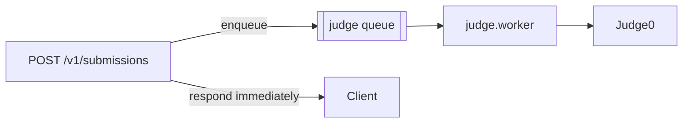

# Performance

**Audience:** frontend/backend engineers, DevOps.
**Related:** [FRONTEND](FRONTEND.md) · [DATABASE](DATABASE.md) · [DEVOPS](DEVOPS.md) · [CONFIGURATION](CONFIGURATION.md)

---

## Table of Contents

- [Budgets](#budgets)
- [Frontend — code splitting](#frontend--code-splitting)
- [Frontend — data fetching](#frontend--data-fetching)
- [Frontend — fonts](#frontend--fonts)
- [Frontend — images](#frontend--images)
- [Frontend — motion](#frontend--motion)
- [Bundle optimization](#bundle-optimization)
- [Backend — rendering & payloads](#backend--rendering--payloads)
- [Database optimization](#database-optimization)
- [Query optimization](#query-optimization)
- [Caching](#caching)
- [Compression](#compression)
- [Background work](#background-work)
- [Measuring](#measuring)
- [Known concerns](#known-concerns)

---

## Budgets

`lighthouserc.json` runs in CI:

| Category | Level | Min score |
| --- | --- | --- |
| Accessibility | **error** | 0.90 |
| Performance | warn | 0.60 |
| Best practices | warn | 0.80 |
| SEO | warn | 0.90 |

> [!NOTE]
> Performance is a **warning**, not a gate — and the floor (0.60) is modest. Only accessibility blocks. Coverage is also narrow: desktop preset, `numberOfRuns: 1`, **landing page only**. Mobile and authenticated app routes are unmeasured.

---

## Frontend — code splitting

Browser-only, heavyweight libraries are dynamically imported with `ssr: false`:

```tsx
const AntigravityBackground = dynamic(() => import("@/components/AntigravityBackground"), { ssr: false });
```

| Library | Why split |
| --- | --- |
| `three` + `@react-three/fiber` | WebGL; hundreds of KB; touches `window` |
| `@monaco-editor/react` | The code editor; very large |

Inside components, Three.js is imported lazily at use time:

```ts
const THREE = await import("three");
```

> [!TIP]
> `ssr: false` is not only about correctness (these libraries touch `window`/`document`) — it is what keeps them out of the initial bundle. Any new browser-only dependency should follow this pattern.

Route-level splitting is automatic: the App Router code-splits per route, and the build emits **95 routes**, statically prerendering (`○`) marketing pages and rendering (`ƒ`) parameterised ones.

---

## Frontend — data fetching

SWR is tuned globally in `components/swr-provider.tsx`:

| Setting | Value | Effect |
| --- | --- | --- |
| `dedupingInterval` | **15s** | Five components requesting `/me` within a screen share one request |
| `revalidateOnFocus` | **off** | Alt-tabbing back doesn't trigger refetch waterfalls |
| `keepPreviousData` | **on** | Filter changes show last data instead of flashing skeletons |
| localStorage persistence | **none** | Deliberate — see below |

> [!NOTE]
> No localStorage persistence is a **security decision, not an oversight**: cached responses are per-user (scores, resumes, payments) and the content-protection posture treats shared machines as hostile. The in-memory cache already survives client-side navigation, *"which is where the perceived speed lives."*

Retry policy avoids wasted round-trips:

```ts
shouldRetryOnError: (err) => !(err instanceof ApiClientError && [400, 402, 403, 404].includes(err.status)),
```

> [!TIP]
> Retrying a terminal 404 five times wastes five round-trips **and pins the component in a loading state** — the comment cites a real bug ("the 'no editorial yet' 404 that used to hang forever"). 401 stays retryable because a token refresh can make it succeed.

---

## Frontend — fonts

`next/font` with `geist` and Bricolage. Fonts are self-hosted and subset at build time — no external request, no FOUT, **no layout shift** (a large share of a typical CLS score).

---

## Frontend — images

```js
images: {
  formats: ["image/avif", "image/webp"],
  remotePatterns: [
    { protocol: "https", hostname: "**.r2.cloudflarestorage.com" },
    { protocol: "https", hostname: "cdn.eyf.in" },
  ],
}
```

AVIF/WebP with automatic fallback; assets served from R2/CDN.

---

## Frontend — motion

The motion brief (`components/motion.tsx`): *"premium craft, not cinema. Fast (300-600ms), once, reduced-motion safe … make the app feel alive without slowing down a daily-use tool."*

| Control | Value |
| --- | --- |
| Duration | 300–600ms |
| `viewport` | `{ once: true, margin: "-80px" }` |
| Reduced motion | `initial={reduce ? false : …}` — disabled entirely |

> [!TIP]
> `once: true` matters for performance, not just taste: without it, `whileInView` re-triggers on every scroll pass, animating continuously.

`lenis` provides smooth scrolling on the landing page only.

---

## Bundle optimization

```bash
ANALYZE=true pnpm --filter @eyf/web build
```

| Technique | Implementation |
| --- | --- |
| Analyzer | `@next/bundle-analyzer`, opt-in |
| Standalone output | `output: "standalone"` — minimal server bundle |
| Tree shaking | ESM throughout |
| Transpiled workspace pkgs | `transpilePackages: ["@eyf/ui", "@eyf/types"]` |
| Dead code removed | 1,116 lines of orphaned landing components deleted ([cleanup report](../CODE_CLEANUP_REPORT.md)) |

> [!NOTE]
> `three` remains in the dependency tree — it is still used by the live `AntigravityBackground` and `viz/` components. It is dynamically imported, so it is not in the initial bundle.

---

## Backend — rendering & payloads

| Control | Value |
| --- | --- |
| Body limit | 1 MB (`bodyLimit: 1_048_576`) |
| `select` projections | Used on hot paths |
| Logging | JSON in production; `pino-pretty` only in dev |
| `poweredByHeader` | Disabled |

Handlers project narrowly rather than returning whole rows:

```ts
const courses = await prisma.course.findMany({
  where: { orgId: req.orgCtx!.orgId },
  select: { id: true, title: true, status: true, version: true, estMinutes: true,
            updatedAt: true, authorMemberId: true,
            _count: { select: { lessons: true, enrollments: true } } },
  orderBy: { updatedAt: "desc" },
});
```

> [!TIP]
> `_count` computes aggregates **in the database** instead of loading relations to count them in JS — the correct way to avoid an accidental N+1.

> [!WARNING]
> `pino-pretty` is a synchronous, formatting transport. It is enabled **only** when `NODE_ENV === "development"`. Never enable it in production — it would serialize and format on the request path.

---

## Database optimization

| Control | Detail |
| --- | --- |
| Indexes | **87** |
| Connection pooling | `DATABASE_URL` → PgBouncer/Neon-pooled |
| Migration connection | `DIRECT_DATABASE_URL` (unpooled) |
| Client singleton | `globalThis.__eyf_prisma` guards dev hot-reload |
| Query logging | `["query", "error", "warn"]` in dev; `["error", "warn"]` in production |

Composite indexes lead with the owner/tenant column:

| Index | Serves |
| --- | --- |
| `ProblemSolution @@index([userId, submittedAt])` | "My submissions", newest first |
| `ProblemSolution @@index([problemId, verdict])` | Acceptance-rate rollups |
| `OrgMember @@index([orgId, departmentId])` | Department-scoped ABAC queries |
| `SkillEvidence @@index([userId, skillId])` / `([orgId, skillId])` | Ledger roll-ups |
| `Problem @@index([patterns])` / `([companies])` | Array-column faceted browse |

> [!TIP]
> Leading with `orgId`/`userId` is what keeps these indexes usable — every tenant query filters on it first. Preserve the convention when adding indexes.

> [!WARNING]
> Production **must not** log queries. The client already gates on `NODE_ENV === "production"`; ensure `NODE_ENV` is actually set, or every query is serialized to the log.

---

## Query optimization

| Pattern | Where |
| --- | --- |
| `select` projections | Org list endpoints |
| `_count` aggregates | `org-learn.ts` |
| `$transaction` | `withOrgContext()` |
| Parallel independent reads | `Promise.all([...])` in `orgs.ts`, `org-skills.ts` |
| Throttled writes | `lastSeenAt` — at most once per 5 minutes |

The `lastSeenAt` throttle is a good illustration:

```ts
if (Date.now() - active.lastSeenAt.getTime() > 5 * 60 * 1000) {
  void prisma.userSession.update({ … }).catch(() => {});
}
```

> [!TIP]
> Without the throttle this would be **one write per authenticated request**. It is also fire-and-forget (`void` + `.catch`), so it never adds latency or fails a request. Copy this shape for any "last seen"/telemetry write.

---

## Caching

| Layer | Mechanism | TTL |
| --- | --- | --- |
| SWR client cache | In-memory | 15s dedupe |
| Rate-limit counters | Redis `eyf-rl:` | 1 min |
| Turbo build cache | Local + GHA | Content-hashed |
| Docker layers | `type=gha` | GHA-managed |
| pnpm store | Cache mount | Build-time |
| **HTTP response cache** | **Not implemented** | — |

> [!WARNING]
> **There is no response caching on the API.** Public, read-heavy endpoints — `GET /v1/problems`, `/v1/jobs`, `/v1/internships`, `/v1/forum/threads`, `/v1/gamification/badges` — hit Postgres on every request, including for anonymous traffic.
>
> Adding `Cache-Control` (or a CDN in front of public GETs) is the **cheapest available scaling win** and would remove the most load for the least work.

---

## Compression

**Not implemented at the application layer.** `@fastify/compress` is not registered, and Next.js compression is not explicitly configured.

> [!NOTE]
> Compression is typically handled by the platform edge (Vercel, Cloudflare, or an LB). Verify it is active in production — JSON payloads compress extremely well, and an uncompressed API is a common, invisible regression.

---

## Background work

Expensive work is moved off the request path:



| Setting | Value |
| --- | --- |
| `attempts` | 3 |
| `backoff` | exponential from 1s |
| `removeOnComplete` | 1h / 1000 jobs |
| `removeOnFail` | 24h |

> [!TIP]
> `removeOnComplete`/`removeOnFail` are a performance control: without them the Redis list grows unbounded and eventually degrades the instance shared by rate limiting.

Cron jobs run off-peak (21:00, 08:00, 07:00 IST).

---

## Measuring

| Tool | What |
| --- | --- |
| `/metrics` | `httpRequests` (counter), `httpDuration` (histogram) by method/route/status |
| Sentry | `SENTRY_TRACES_SAMPLE_RATE` (default 0.1) |
| Lighthouse CI | Landing page budgets |
| `ANALYZE=true` | Bundle composition |
| k6 | `BASE_URL=… k6 run load/k6-smoke.js` |
| Prisma query log | Dev only |

> [!TIP]
> The `route` metric label uses the **pattern** (`/v1/problems/:slug`), not the concrete URL — this keeps Prometheus cardinality bounded. Never label with raw paths.

---

## Known concerns

Ranked by impact:

| # | Concern | Detail |
| --- | --- | --- |
| 1 | **No API response caching** | Public reads hit Postgres every time; no `Cache-Control` |
| 2 | **Compression unverified** | Not registered in-app; must be confirmed at the edge |
| 3 | **Perf budget is a warning at 0.60** | Regressions do not block |
| 4 | **Lighthouse covers only the landing page, desktop, 1 run** | App routes and mobile unmeasured; single run is noisy |
| 5 | **Large route files** | `orgs/page.tsx` (787 lines), `dashboard` (393), `today` (375), `mcq` (351) — big client components |
| 6 | Soft delete not globally filtered | `User.deletedAt` is a column, not a scope; every read must exclude it |
| 7 | No read replicas | All reads hit the primary |
| 8 | `three` still shipped | Dynamically imported, but a heavy dependency for a few surfaces |

> [!NOTE]
> Concern #5 is a maintainability issue that becomes a performance one: a 787-line client component ships a large JS payload for a single route. Splitting `orgs/page.tsx` is the top structural refactor — see [ROADMAP](ROADMAP.md).

---

**Next:** [ACCESSIBILITY.md](ACCESSIBILITY.md) · [DEVOPS.md](DEVOPS.md) · [ROADMAP.md](ROADMAP.md)
