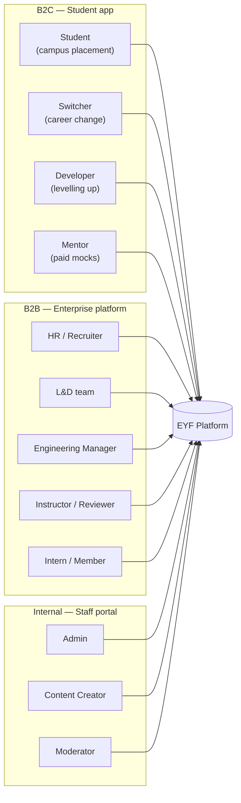
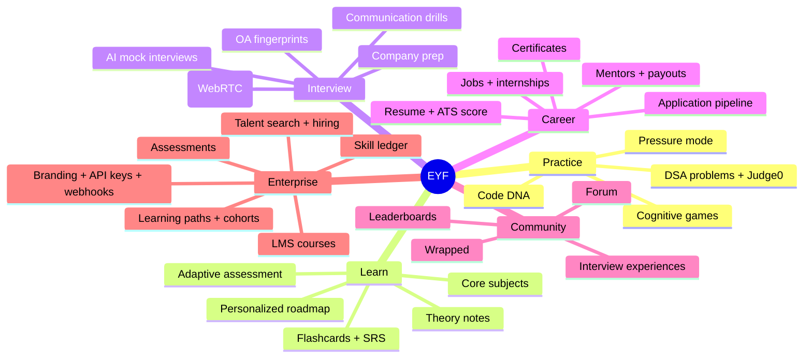
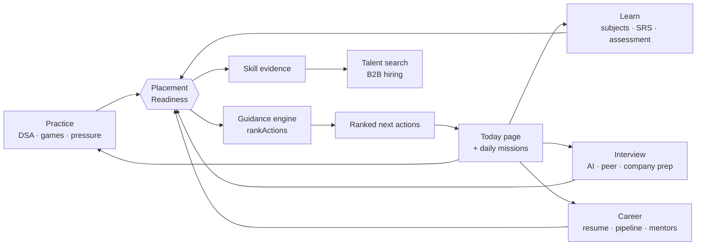

# Project Overview

**Audience:** everyone — engineers, product, leadership, investors.
**Related:** [SYSTEM_ARCHITECTURE](SYSTEM_ARCHITECTURE.md) · [ROADMAP](ROADMAP.md) · [STATUS](STATUS.md) · [PRODUCT-ROADMAP](PRODUCT-ROADMAP.md)

---

## Table of Contents

- [What EYF is](#what-eyf-is)
- [Why this project exists](#why-this-project-exists)
- [The business problem](#the-business-problem)
- [Target users](#target-users)
- [Product goals](#product-goals)
- [Major capabilities](#major-capabilities)
- [The two products](#the-two-products)
- [The integration thesis](#the-integration-thesis)
- [Business model](#business-model)
- [Future roadmap](#future-roadmap)
- [Non-goals](#non-goals)

---

## What EYF is

EYF ("Engineer Your Future") is a **placement operating system** for the Indian engineering market: a single platform that carries a student from their first data-structures concept to a signed offer letter.

It is delivered as two products inside one monorepo and one data model:

1. **Student app** — the integrated placement OS.
2. **B2B enterprise platform** — a white-label LMS + hiring/assessment suite for companies and colleges.

Both are backed by the same Fastify API (`apps/api`), the same PostgreSQL schema (`packages/db`), and the same shared logic package (`packages/types`).

---

## Why this project exists

Placement preparation in India is **fragmented across a dozen disconnected tools**. A typical candidate uses one site for DSA practice, another for aptitude, a spreadsheet for applications, YouTube for core-subject theory, a PDF for their resume, and an ad-hoc network for referrals and mock interviews.

Nothing connects. Because nothing connects:

- No tool can answer the only question that matters: **"Am I actually ready?"**
- Effort is misallocated — students over-practice what they enjoy (DSA) and under-practice what fails them (communication, core subjects, aptitude).
- Progress is invisible, so motivation collapses.

EYF's premise is that **integration is the product**. Every activity feeds one number — the **Placement Readiness score** — and that score drives what the platform asks the student to do next.

> [!NOTE]
> The readiness engine is a single pure implementation in `packages/types/src/readiness.ts`, shared by the web app (`apps/web/lib/readiness.ts`) and the API's guidance service (`apps/api/src/services/guidance.ts`). One definition of "ready", used everywhere.

---

## The business problem

| Problem | Who feels it | EYF's response |
| --- | --- | --- |
| Preparation is fragmented across many tools | Students | One platform; every signal feeds one readiness score |
| "Am I ready?" is unanswerable | Students | Placement Readiness score with a pillar breakdown |
| Effort goes to the wrong skills | Students | Ranked next-actions derived from the weakest pillar |
| Interview anxiety is untrained | Students | Pressure mode, AI mocks, peer mocks, composure tracking |
| Hiring signal is a résumé keyword match | Employers | Verified skill evidence + skill ledger + talent search |
| Campus/corporate L&D is disconnected from hiring | Colleges, companies | LMS + assessments + hiring pipeline in one tenant |
| Cheating/sharing devalues paid content | The business | Session caps, forensic watermarking, audit logging |

---

## Target users

### Personas in the data model

The `Persona` enum (`packages/db/prisma/schema.prisma`) tailors the journey: `STUDENT` · `SWITCHER` · `DEVELOPER`.

### Roles

| Surface | Roles | Defined in |
| --- | --- | --- |
| Student/platform | `GUEST`, `STUDENT_FREE`, `STUDENT_BASIC`, `STUDENT_PRO`, `STUDENT_ELITE`, `MENTOR` | `Role` enum + `SessionUser` in `packages/types/src/index.ts` |
| Staff portal | `ADMIN`, `CONTENT_CREATOR`, `MODERATOR` | `packages/types/src/permissions.ts` |
| Organization | `OWNER`, `ADMIN`, `HR`, `RECRUITER`, `LND`, `ENG_MANAGER`, `INSTRUCTOR`, `MENTOR`, `REVIEWER`, `MEMBER`, `INTERN` | `packages/types/src/org-permissions.ts` |

See [AUTHENTICATION](AUTHENTICATION.md) for how each role's authority is enforced.

---

## Product goals

| # | Goal | How the codebase pursues it |
| --- | --- | --- |
| 1 | Answer "am I ready?" with one number | `readiness.ts` — pure, shared, testable (46 tests in `@eyf/types`) |
| 2 | Direct effort to the weakest pillar | `rankActions()` → `services/guidance.ts` → `GET /v1/guidance/me` |
| 3 | Make progress visible daily | Streaks, missions, `GET /v1/missions/today`, `Today` page |
| 4 | Train performance under pressure | `pressure` routes + `PressureSession` + composure trend |
| 5 | Replace résumé keyword-matching with evidence | `Skill`, `SkillEvidence`, `SkillSnapshot`, `RoleBar` models |
| 6 | Serve B2B without a second codebase | Org tenancy in the same schema + `orgs/*` routes |
| 7 | Work with zero third-party keys | Every integration no-ops safely; auth falls back to dev-login |

> [!TIP]
> Goal 7 is a deliberate and unusually valuable property: `pnpm dev` gives a fully explorable product with no Clerk/Razorpay/Anthropic/Judge0 keys. See [THIRD_PARTY_SERVICES](THIRD_PARTY_SERVICES.md).

---

## Major capabilities

### Capability → code map

| Capability | Routes | Key services/models |
| --- | --- | --- |
| DSA practice | `/v1/problems`, `/v1/submissions` | `services/judge0.ts`, `Problem`, `TestCase`, `ProblemSolution` |
| Adaptive assessment | `/v1/assessment` | `services/assessment.ts`, `lib/assessment-source.ts` |
| Roadmap | `/v1/roadmap` | `services/roadmap-generator.ts`, `UserRoadmap` |
| Readiness + guidance | `/v1/guidance`, `/v1/score` | `packages/types/src/readiness.ts` |
| AI mocks | `/v1/mocks` | `services/ai-mock.ts`, `services/anthropic.ts`, `MockSession` |
| Peer mocks | `/v1/peer` | `services/peer-matching.ts`, `peer-signal.ts`, `PeerQueue` |
| Communication | `/v1/communication` | `services/communication.ts`, `services/whisper.ts` |
| Resume + ATS | `/v1/resume` | `services/ats.ts`, `services/pdf.ts`, `Resume` |
| Pressure mode | `/v1/pressure` | `services/pressure.ts`, `PressureSession` |
| Billing | `/v1/billing` | `services/razorpay.ts`, `Subscription`, `Invoice` |
| Mentors + payouts | `/v1/mentors` | `services/payouts.ts`, `Mentor`, `MentorPayout` |
| Enterprise LMS | `/v1/orgs/:orgId/courses`, `/paths` | `Course`, `Lesson`, `LearningPath`, `Cohort` |
| Enterprise hiring | `/v1/orgs/:orgId/requisitions`, `/talent` | `JobRequisition`, `PipelineCandidate`, `Offer` |
| Skill ledger | `/v1/orgs/:orgId/skills` | `packages/types/src/skill-ledger.ts`, `SkillEvidence` |
| Staff back-office | `/v1/admin/*` | `middleware/permissions.ts`, `AuditLog` |

Full endpoint reference: [API_DOCUMENTATION](API_DOCUMENTATION.md).

---

## The two products

### 1. Student app (B2C)

Plan tiers — `free`, `basic`, `pro`, `elite` (`packages/types/src/index.ts`):

| Plan | Rate limit (req/min) | Submissions/day |
| --- | --- | --- |
| `free` | 60 | 5 |
| `basic` | 180 | 20 |
| `pro` | 600 | Unlimited |
| `elite` | 1200 | Unlimited |

> [!WARNING]
> Paywalls are **globally disabled** unless `BILLING_ENABLED=true`. With it unset, `app.requirePlan(...)` returns early and every authenticated user gets full access (`apps/api/src/middleware/auth.ts:97`). This is intentional pre-launch — but it means plan gating is **off by default**.

### 2. Enterprise platform (B2B)

A multi-tenant LMS + assessment + hiring suite. Each tenant is an `Organization`; membership is an `OrgMember` carrying `OrgRole[]`.

Tenant isolation is designed as three layers (`apps/api/src/lib/org-scoped.ts`):

| Layer | Mechanism | Status |
| --- | --- | --- |
| 1 — Repository | `orgDb(orgId)` injects `orgId` into every query | ⚠️ **Defined but unused** — see [SECURITY](SECURITY.md) |
| 2 — Database | Postgres RLS via `withOrgContext()` + `app.org_id` GUC | Active on 17 tables |
| 3 — Tests | Cross-tenant integration suite | `orgs.integration.test.ts` |

---

## The integration thesis

The moat is that **every surface feeds one score**, and the score feeds back into what the product asks next.

A competitor can clone any single surface. The defensible asset is the **loop** plus the accumulated evidence graph feeding B2B hiring.

---

## Business model

| Line | Mechanism | Code |
| --- | --- | --- |
| Student subscriptions | Razorpay subscriptions, 4 tiers | `services/razorpay.ts`, `routes/billing.ts` |
| Mentor marketplace | Paid mock slots, platform fee, Razorpay Connect payouts | `services/payouts.ts` (`PLATFORM_FEE_PCT`) |
| B2B licensing | Per-tenant `OrgPlan` + `seatsLicensed` + `UsageCounter` | `Organization`, `routes/orgs.ts` |
| Elite internship access | Elite tier ties to `InternshipSlot` access | `routes/internships.ts` |

---

## Future roadmap

Detailed list: [ROADMAP](ROADMAP.md). Product-level truth: [PRODUCT-ROADMAP](PRODUCT-ROADMAP.md) and [STATUS](STATUS.md).

Highest-value near-term items, derived from the code:

1. **Adopt `orgDb()`** — layer 1 of tenant isolation is documented, mandated by an in-repo "CODE-REVIEW RULE", and never called. ([SECURITY](SECURITY.md))
2. **Fix the RLS test's DB role** — the isolation test cannot pass against a superuser dev container. ([TESTING](TESTING.md))
3. **Ship billing** — `BILLING_ENABLED` is off; the paywall is inert.
4. **Tighten CSP** — `script-src` still allows `'unsafe-inline'`/`'unsafe-eval'`; per-request nonces are the documented next step (`apps/web/next.config.mjs`).
5. **Prisma 5 → 7 migration.**
6. **Add `LICENSE`** — **Needs implementation**.

---

## Non-goals

Documented here so they are not mistaken for gaps:

- **Not a job board.** Jobs/internships exist to close the loop, not as the product.
- **Not a MOOC.** Learning content exists to move the readiness score.
- **Not a general ATS.** Hiring features are scoped to EYF's own talent graph.
- **Screenshot prevention on web.** Impossible on the web platform; mitigations are session caps + forensic watermarking. See [SECURITY](SECURITY.md).

---

**Next:** [SYSTEM_ARCHITECTURE.md](SYSTEM_ARCHITECTURE.md)
