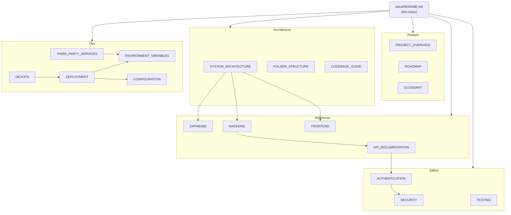

# EYF Documentation

> India's end-to-end placement operating system — from a first DSA concept to a first offer letter.

This is the documentation hub for the EYF monorepo. The [root README](../README.md) is the quick-start entry point; this directory is the reference manual.

> [!NOTE]
> This index covers **generated reference documentation** (this set) **and** the pre-existing **hand-written operational docs** (`STATUS`, `GO-LIVE`, `OPERATIONS`, `DESIGN`, `PRODUCT-ROADMAP`, `INTERACTIVE-LABS-VISION`). Both are authoritative; they are cross-linked rather than merged.

---

## Table of Contents

- [Start here](#start-here)
- [Reference documentation](#reference-documentation)
- [Existing operational docs](#existing-operational-docs)
- [Documentation map](#documentation-map)
- [Conventions used in these docs](#conventions-used-in-these-docs)
- [Project facts at a glance](#project-facts-at-a-glance)

---

## Start here

| If you are a… | Read, in order |
| --- | --- |
| **New developer** | [PROJECT_OVERVIEW](PROJECT_OVERVIEW.md) → [SYSTEM_ARCHITECTURE](SYSTEM_ARCHITECTURE.md) → [FOLDER_STRUCTURE](FOLDER_STRUCTURE.md) → [CODEBASE_GUIDE](CODEBASE_GUIDE.md) |
| **Frontend engineer** | [FRONTEND](FRONTEND.md) → [DESIGN](DESIGN.md) → [ACCESSIBILITY](ACCESSIBILITY.md) → [PERFORMANCE](PERFORMANCE.md) |
| **Backend engineer** | [BACKEND](BACKEND.md) → [API_DOCUMENTATION](API_DOCUMENTATION.md) → [DATABASE](DATABASE.md) |
| **DevOps engineer** | [DEPLOYMENT](DEPLOYMENT.md) → [DEVOPS](DEVOPS.md) → [OPERATIONS](OPERATIONS.md) → [GO-LIVE](GO-LIVE.md) |
| **Security engineer** | [SECURITY](SECURITY.md) → [AUTHENTICATION](AUTHENTICATION.md) → [THIRD_PARTY_SERVICES](THIRD_PARTY_SERVICES.md) |
| **QA engineer** | [TESTING](TESTING.md) → [TROUBLESHOOTING](TROUBLESHOOTING.md) |
| **Product manager** | [PROJECT_OVERVIEW](PROJECT_OVERVIEW.md) → [STATUS](STATUS.md) → [PRODUCT-ROADMAP](PRODUCT-ROADMAP.md) |
| **Investor / exec** | [PROJECT_OVERVIEW](PROJECT_OVERVIEW.md) (Business problem, Target users, Roadmap) |
| **Open-source contributor** | [CONTRIBUTING](CONTRIBUTING.md) → [CODEBASE_GUIDE](CODEBASE_GUIDE.md) → [TESTING](TESTING.md) |

---

## Reference documentation

### Product & architecture

| Doc | Contents |
| --- | --- |
| [PROJECT_OVERVIEW.md](PROJECT_OVERVIEW.md) | Why the project exists, business problem, target users, goals, capabilities, roadmap |
| [SYSTEM_ARCHITECTURE.md](SYSTEM_ARCHITECTURE.md) | Every layer: web, API, database, cache, queue, storage, auth, third parties + diagrams |
| [FOLDER_STRUCTURE.md](FOLDER_STRUCTURE.md) | Every folder: purpose, key files, responsibilities, dependencies |

### Engineering reference

| Doc | Contents |
| --- | --- |
| [API_DOCUMENTATION.md](API_DOCUMENTATION.md) | All 328 endpoints, conventions, errors, rate limits, permissions |
| [DATABASE.md](DATABASE.md) | ER diagram, 87 models, relationships, indexes, cascades, migration strategy |
| [BACKEND.md](BACKEND.md) | Fastify architecture, plugins, services, jobs, validation, errors, caching |
| [FRONTEND.md](FRONTEND.md) | Next.js App Router architecture, routes, components, hooks, data fetching |
| [CODEBASE_GUIDE.md](CODEBASE_GUIDE.md) | Conventions, patterns, how to extend the project |

### Operations

| Doc | Contents |
| --- | --- |
| [DEPLOYMENT.md](DEPLOYMENT.md) | Dev/staging/prod, Docker, CI/CD, rollback, monitoring |
| [DEVOPS.md](DEVOPS.md) | Build, CI, testing, metrics, backups, scaling, disaster recovery |
| [CONFIGURATION.md](CONFIGURATION.md) | Every config file explained |
| [ENVIRONMENT_VARIABLES.md](ENVIRONMENT_VARIABLES.md) | Every variable: purpose, required, default, security notes |
| [THIRD_PARTY_SERVICES.md](THIRD_PARTY_SERVICES.md) | Clerk, Razorpay, Judge0, Anthropic, OpenAI, Resend, R2, PostHog, Sentry |

### Quality & safety

| Doc | Contents |
| --- | --- |
| [SECURITY.md](SECURITY.md) | OWASP Top 10 mitigations, CSP, secrets, rate limiting, audit logs, checklist |
| [AUTHENTICATION.md](AUTHENTICATION.md) | Clerk + JWT flows, refresh, RBAC, org RBAC/ABAC, sequence diagrams |
| [TESTING.md](TESTING.md) | Strategy, unit/integration/E2E, coverage, fixtures |
| [PERFORMANCE.md](PERFORMANCE.md) | Code splitting, caching, bundle, image, query optimization |
| [ACCESSIBILITY.md](ACCESSIBILITY.md) | WCAG posture, keyboard, ARIA, contrast, reduced motion |

### Process

| Doc | Contents |
| --- | --- |
| [CONTRIBUTING.md](CONTRIBUTING.md) | Setup, branching, commits, PR process, review checklist |
| [TROUBLESHOOTING.md](TROUBLESHOOTING.md) | Common failures and fixes |
| [CHANGELOG.md](CHANGELOG.md) | Release history |
| [ROADMAP.md](ROADMAP.md) | Future features, technical debt, scaling |
| [GLOSSARY.md](GLOSSARY.md) | Every domain and technical term used in the codebase |

---

## Existing operational docs

These predate this reference set and remain the source of truth for their subjects.

| Doc | Contents |
| --- | --- |
| [STATUS.md](STATUS.md) | What is actually built, current state |
| [PRODUCT-ROADMAP.md](PRODUCT-ROADMAP.md) | Spec ↔ status per feature |
| [GO-LIVE.md](GO-LIVE.md) | Keys, deploy, security checklist |
| [OPERATIONS.md](OPERATIONS.md) | Runbooks |
| [DESIGN.md](DESIGN.md) | Design system rules + tokens |
| [INTERACTIVE-LABS-VISION.md](INTERACTIVE-LABS-VISION.md) | Forward-looking labs concept |
| [../specs/](../specs/) | Founding product specs (source of truth for product intent) |
| [../CODE_CLEANUP_REPORT.md](../CODE_CLEANUP_REPORT.md) | Most recent code-health audit + findings |

---

## Documentation map

---

## Conventions used in these docs

| Marker | Meaning |
| --- | --- |
| > [!NOTE] | Context worth knowing |
| > [!TIP] | Recommended practice |
| > [!WARNING] | Doing this wrong causes an outage, a leak, or data loss |
| **Not implemented** | The capability does not exist in the codebase |
| **Needs implementation** | Required for production but absent |

- File references use repo-relative paths (`apps/api/src/app.ts`) and, where useful, `path:line`.
- Every claim is traceable to a file. Where the codebase does not answer a question, the docs say so rather than guessing.

---

## Project facts at a glance

| Fact | Value | Source |
| --- | --- | --- |
| Monorepo tooling | Turborepo + pnpm `9.12.0`, Node `>=20.10.0` | `package.json` |
| Apps | `web` (Next.js 14), `api` (Fastify 5), `mobile` (Expo SDK 52) | `apps/` |
| Packages | `db`, `types`, `ui`, `config` | `packages/` |
| API endpoints | **328** across **60** route modules, all under `/v1` | `apps/api/src/routes/index.ts` |
| Database models | **87 models**, **47 enums**, 87 indexes, 82 cascade rules | `packages/db/prisma/schema.prisma` |
| Auth | Clerk (primary) + internal HS256 JWT fallback | `apps/api/src/middleware/auth.ts` |
| Staff RBAC | 7 capabilities × 3 staff roles | `packages/types/src/permissions.ts` |
| Org RBAC/ABAC | 21 capabilities × 11 roles × 5 scopes | `packages/types/src/org-permissions.ts` |
| Queues | BullMQ: `judge`, `cron`, `webhook` | `apps/api/src/jobs/` |
| Tests | 135 API tests (22 files) + 46 `@eyf/types` tests | `pnpm test` |
| Licence | **Needs implementation** — no `LICENSE` file exists | — |
| Production URL | **Needs implementation** — not configured in-repo | — |

---

**Next:** [PROJECT_OVERVIEW.md](PROJECT_OVERVIEW.md)
