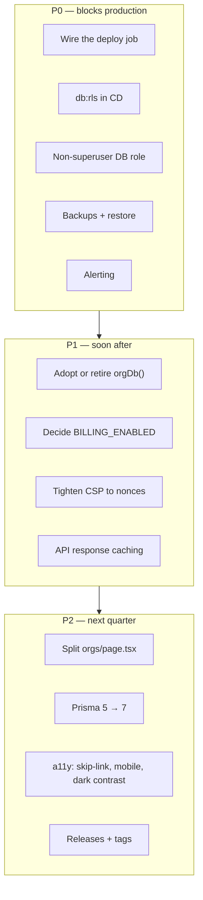

# Roadmap

**Audience:** engineering leads, product, security, DevOps.
**Related:** [PRODUCT-ROADMAP](PRODUCT-ROADMAP.md) · [STATUS](STATUS.md) · [CODE_CLEANUP_REPORT](../CODE_CLEANUP_REPORT.md)

> [!NOTE]
> This document covers **technical** roadmap: debt, security, performance, and scaling — derived from the code as it stands.
>
> For **product** roadmap (spec ↔ status per feature) see [PRODUCT-ROADMAP](PRODUCT-ROADMAP.md); for what is actually built see [STATUS](STATUS.md). This file does not duplicate them.

---

## Table of Contents

- [Priority summary](#priority-summary)
- [P0 — Before production](#p0--before-production)
- [P1 — Soon after](#p1--soon-after)
- [P2 — Next quarter](#p2--next-quarter)
- [P3 — Opportunistic](#p3--opportunistic)
- [Technical debt register](#technical-debt-register)
- [Security improvements](#security-improvements)
- [Performance improvements](#performance-improvements)
- [Scaling improvements](#scaling-improvements)
- [Explicit non-goals](#explicit-non-goals)

---

## Priority summary



| Priority | Meaning |
| --- | --- |
| **P0** | Production is unsafe or unoperable without it |
| **P1** | Material risk or cost; do within weeks |
| **P2** | Quality/maintainability; plan deliberately |
| **P3** | Nice to have |

---

## P0 — Before production

### 1. Wire the deploy job

`cd.yml`'s `deploy` job **only echoes instructions**. Images publish to GHCR; nothing promotes them.

**Do:** implement rolling deploy per the stub's own guidance — api + workers first, then web; gate promotion on `GET /readyz == 200`; roll back on failure. Deploy **all four** API processes (`api`, `worker`, `cron`, `webhook`) — deploying only `api` leaves submissions unjudged and webhooks undelivered.

**Ref:** [DEPLOYMENT](DEPLOYMENT.md#cd-pipeline)

### 2. Add `db:rls` to CD

CI runs `db:rls` *"prod parity"*; **CD does not**. Production migrations do not reapply RLS policies, so a new org table can ship without tenant isolation.

**Do:** add `pnpm --filter @eyf/db db:rls` to the CD `migrate` job, after `migrate deploy`.

**Ref:** [DEVOPS](DEVOPS.md#cicd)

### 3. Run the app as a non-superuser DB role

Superusers **bypass RLS unconditionally**, even with `FORCE ROW LEVEL SECURITY`. If the production role is a superuser, tenant isolation layer 2 is silently inert.

**Do:** create a role with DML only — no `SUPERUSER`, no `BYPASSRLS` — and verify:

```sql
SELECT rolname, rolsuper, rolbypassrls FROM pg_roles WHERE rolname = current_user;
```

Do the same for the test role, which also fixes finding #6.

**Ref:** [SECURITY](SECURITY.md#open-findings)

### 4. Configure backups and test a restore

**No backup automation, retention policy, or restore runbook exists.** Redis is not purely ephemeral either — in-flight judge jobs live only there.

**Do:** automated daily PITR-capable Postgres backups; document and **rehearse** a restore; define RTO/RPO.

> [!WARNING]
> An untested backup is not a backup.

**Ref:** [DEVOPS](DEVOPS.md#backups)

### 5. Add alerting

Sentry captures 5xx, `/metrics` exposes counters and histograms — but **no alert routing exists**. Failures are currently discovered by users.

**Do:** alert on `/readyz` failing >1 min, 5xx rate >1% over 5 min, p99 >2s, judge-queue depth growing, Sentry new-issue spikes.

**Ref:** [DEVOPS](DEVOPS.md#alerting)

### 6. Fix the RLS test's role

The isolation test is a **permanent false negative** locally and in CI.

> [!WARNING]
> The risk is social: a permanently red test invites someone to weaken the assertion, destroying a real guard. Fix the role, not the test.

**Ref:** [TESTING](TESTING.md#the-rls-false-negative)

### 7. Add a `LICENSE`

No `LICENSE` file exists; `package.json` declares no `license`. Contribution terms are undefined.

---

## P1 — Soon after

### 8. Adopt or retire `orgDb()`

`org-scoped.ts` states a **"CODE-REVIEW RULE"** that org tables are *never* queried with bare `prisma.x` — and `orgDb()` has **zero call sites**. Isolation currently holds because each route remembers to filter by hand.

**Options:**

| Option | Effort | Result |
| --- | --- | --- |
| **Adopt** (recommended) | Route-by-route, mechanical | The documented rule becomes real; a forgotten `where` becomes impossible |
| Retire | Small | Delete `orgDb()` and rewrite the comment to describe reality |

> [!WARNING]
> The current state is the worst of both: a documented guarantee that does not execute. Pick one.

**Ref:** [SECURITY](SECURITY.md#open-findings)

### 9. Decide `BILLING_ENABLED`

`requirePlan` returns early unless `BILLING_ENABLED=true`, so **every authenticated user gets full access**. Paid gating has never run in production.

**Do:** enable it deliberately, and load-test the plan-gated paths first — especially LLM endpoints, where a `pro` user has 600 req/min against metered Anthropic calls.

### 10. Tighten CSP to per-request nonces

`script-src 'self' 'unsafe-inline' 'unsafe-eval' https: blob:` — `next.config.mjs` names the fix itself: *"Tightening script-src to per-request nonces is the documented next step."*

Also narrow `connect-src` (currently `https:`) to the explicit API + PostHog origins.

**Ref:** [SECURITY](SECURITY.md#csp--security-headers)

### 11. Add API response caching

**No response caching exists.** Public reads (`/v1/problems`, `/v1/jobs`, `/v1/internships`, `/v1/forum/threads`, `/v1/gamification/badges`) hit Postgres on every request, including anonymous traffic.

> [!TIP]
> This is the **cheapest available scaling win** — `Cache-Control` on public GETs plus a CDN removes the most load for the least work.

**Ref:** [PERFORMANCE](PERFORMANCE.md#caching)

### 12. Verify compression

`@fastify/compress` is not registered and Next compression is not configured. Compression is presumably handled at the edge — **verify**. An uncompressed JSON API is a common, invisible regression.

### 13. Harden the supply chain

| Item | Fix |
| --- | --- |
| `pnpm audit … \|\| true` | Advisories never block — remove `\|\| true`, or gate on `critical` |
| `cd.yml` uses floating action tags | SHA-pin, as `ci.yml` already does — CD holds deploy secrets |

### 14. Fix `.env` drift and consolidate

Three `.env` files; the API reads `apps/api/.env`, not the root. Working copies carry stale `user:password` while compose provisions `eyf:eyf`; `packages/db/.env` omits the required `DIRECT_DATABASE_URL`.

**Do:** re-sync from `.env.example`; consider one root `.env` with explicit `dotenv` paths.

### 15. Add R2 vars to the env schema

`R2_*` are the **only** integration variables absent from `env.ts`'s Zod schema — they fail at runtime instead of boot, breaking the fail-fast guarantee everything else enjoys.

### 16. Hash `Organization.accessCode`

Stored **plaintext**; it is a shared, guessable credential. `ApiKey` is already hashed — follow that pattern, and add rotation.

### 17. Document secret rotation

**No procedure exists** for rotating `JWT_*`, `ADMIN_ACCESS_CODE`, `METRICS_TOKEN`, or provider keys. Note that rotating `JWT_ACCESS_SECRET` invalidates every live session — document the expected blast radius.

---

## P2 — Next quarter

### 18. Split `orgs/page.tsx` (787 lines)

The largest file by far — ~2× the next. A 787-line client component is both a maintainability and a payload problem.

Other candidates: `dashboard/page.tsx` (393), `today/page.tsx` (375), `mcq/page.tsx` (351), `communication/page.tsx` (293).

### 19. Extract a shared quiz runner

`assessment/page.tsx` and `mcq/page.tsx` still share two clones (17 and 22 lines) after cleanup. A shared hook is the obvious extraction — the flows differ enough to warrant a deliberate design pass.

### 20. Prisma 5.22 → 7

The CLI prints an upgrade notice on every command. Given RLS, `directUrl`, and the generated-client re-export, this needs a deliberate migration — not a bump.

### 21. Accessibility programme

| Item | WCAG |
| --- | --- |
| **Skip-to-content link** (highest value, hours of work) | 2.4.1 (A) |
| Audit authenticated routes, not just the landing | — |
| Add a **mobile** Lighthouse preset — the audience is mobile-heavy | — |
| Verify **dark-mode** contrast per token | 1.4.3 (AA) |
| Text alternative for audio-only drills/mocks | 1.2.x |
| Add `eslint-plugin-jsx-a11y` | Multiple |
| Declare a target (2.1 AA) + publish a statement | — |

**Ref:** [ACCESSIBILITY](ACCESSIBILITY.md#gaps)

### 22. Establish releases

410 commits, `"version": "0.1.0"`, no tags. 100% Conventional Commits means `release-please` could generate versions **and** the changelog from history.

**Ref:** [CHANGELOG](CHANGELOG.md#establishing-releases)

### 23. Add Prettier

No formatter config exists. Style is consistent by convention only. Introduce with `eslint-config-prettier`; expect one large reformat commit.

### 24. Audit soft-delete reads

`User.deletedAt` is a **column, not a global scope**. Prisma applies no automatic filter, so every read path must exclude soft-deleted users explicitly. This has not been audited.

> [!WARNING]
> A missed filter means a "deleted" user still appears in leaderboards, talent search, or forums.

### 25. Adopt Fastify JSON schema

Validation is runtime-Zod inside handlers, so **no OpenAPI spec can be generated**. Declaring schemas would enable a spec, response serialization (a real perf win), and typed clients.

### 26. Fix `turbo.json` `globalEnv` gaps

`NEXT_PUBLIC_APP_URL`, `NEXT_PUBLIC_POSTHOG_KEY`, `NEXT_PUBLIC_POSTHOG_HOST` are build args but **absent from `globalEnv`** — changing them may serve a stale cached build.

### 27. Add a staging environment

**None exists.** Production is currently the first real deploy.

### 28. Add coverage thresholds

Coverage is reported to SonarCloud but **not gated**.

### 29. Clean up test fixtures

Integration tests leak `@test.eyf` rows; accumulation contributes to the races that force `fileParallelism: false`.

---

## P3 — Opportunistic

| # | Item | Note |
| --- | --- | --- |
| 30 | Remove `clsx` from `apps/web` | Genuinely unused; `packages/ui` declares its own |
| 31 | Decide on `judgeQueueEvents` | Unused export, but constructing it opens a Redis subscriber — needs a decision, not a deletion |
| 32 | Wire `welcomeEmail`, `generateHint` | Unwired features, not dead code |
| 33 | Rename `AntigravityBackground.tsx` | Last `PascalCase.tsx` holdout |
| 34 | Merge two org route generations | `/v1/org/*` (legacy) vs `/v1/orgs/*` (current) coexist |
| 35 | Log aggregation | No Loki/ELK/CloudWatch config |
| 36 | Read replicas | All reads hit the primary |
| 37 | Phone verification | `User.phone` + `phoneVerifiedAt` exist, but SMS was removed with MSG91 — no verification path |
| 38 | Fix `README` staleness | Says *"`db push` workflow, no migrations dir"*; CI/CD both run `migrate deploy` |
| 39 | Reconcile `render.yaml` | Historical Render artifact vs. the documented Vercel/Railway + GHCR path |
| 40 | Mobile `FLAG_SECURE` | The only real screenshot mitigation; web cannot do it |

---

## Technical debt register

| # | Debt | Severity | Effort |
| --- | --- | --- | --- |
| 1 | `orgDb()` dead — documented rule unenforced | 🔴 High | Medium |
| 2 | RLS test false negative | 🔴 High | Low |
| 3 | `db:rls` missing from CD | 🔴 High | Low |
| 4 | Deploy job is a stub | 🔴 High | Medium |
| 5 | No backups | 🔴 High | Medium |
| 6 | No alerting | 🟠 Medium | Low |
| 7 | CSP `unsafe-inline`/`unsafe-eval` | 🟠 Medium | Medium |
| 8 | No API response caching | 🟠 Medium | Low |
| 9 | `orgs/page.tsx` 787 lines | 🟠 Medium | Medium |
| 10 | Soft delete not globally filtered | 🟠 Medium | Medium |
| 11 | `.env` drift ×3 files | 🟡 Low | Low |
| 12 | R2 vars unvalidated | 🟡 Low | Low |
| 13 | No Prettier | 🟡 Low | Low |
| 14 | No releases/tags | 🟡 Low | Low |
| 15 | `accessCode` plaintext | 🟡 Low | Low |
| 16 | Prisma 5 → 7 | 🟡 Low | High |

> [!NOTE]
> The register is short **because the codebase is genuinely well-kept**: zero ESLint warnings, zero `any` in hand-written code, zero circular dependencies, <0.5% duplication. Most entries are operational gaps, not code rot.

---

## Security improvements

Consolidated from [SECURITY](SECURITY.md#open-findings):

| Priority | Item |
| --- | --- |
| P0 | Non-superuser DB role (or RLS is inert) |
| P0 | `db:rls` in CD |
| P0 | Fix the RLS test role |
| P1 | Adopt or retire `orgDb()` |
| P1 | CSP nonces; narrow `connect-src` |
| P1 | Remove `\|\| true` from the dependency audit |
| P1 | SHA-pin `cd.yml` actions |
| P1 | Hash `Organization.accessCode` |
| P1 | Document secret rotation |
| P2 | Sanitise any future markdown renderer (`Problem.description`, `TheoryNote.content`) |
| P2 | Cost guard on metered LLM endpoints |

> [!TIP]
> Confirm the production checklist before every release: [SECURITY](SECURITY.md#production-checklist).

---

## Performance improvements

| Priority | Item | Impact |
| --- | --- | --- |
| P1 | API response caching + CDN on public GETs | High |
| P1 | Verify edge compression | High |
| P2 | Split large client route files | Medium |
| P2 | Fastify JSON schema → response serialization | Medium |
| P2 | Raise the Lighthouse perf budget above 0.60; audit app routes + mobile; >1 run | Medium |
| P3 | Read replicas | Medium |

---

## Scaling improvements

Current posture is sound; these are the next constraints.

| Component | Today | Next constraint |
| --- | --- | --- |
| `api` / `web` | Horizontal | Postgres connections |
| `judge` worker | Horizontal | Judge0 capacity |
| `cron` | **Single instance — do not scale** | — |
| Postgres | Pooled | Read replicas; partition `SkillEvidence`/`ProblemSolution` |
| Redis | Single | Separate rate-limit and queue instances |

> [!TIP]
> Rate limiting scales correctly **only** because counters live in shared Redis. Never revert to an in-memory store outside tests — the effective limit would multiply by pod count and reset on every deploy.

Watch as tenants grow: `SkillEvidence` (append-only, decaying) and `ProblemSolution` (append-only) are the tables that grow without bound.

---

## Explicit non-goals

Documented so they are not mistaken for gaps:

| Non-goal | Why |
| --- | --- |
| Screenshot prevention on web | **Impossible** on the platform. Mitigations are session caps + forensic watermarking; native `FLAG_SECURE` is the only real control |
| Stripe | Razorpay is the processor (India-first) |
| Supabase / AWS / Cloudinary | Postgres+Prisma, R2, Resend, BullMQ cover it |
| Becoming a general ATS | Hiring is scoped to EYF's own talent graph |
| Becoming a job board or MOOC | Both exist only to move the readiness score |
| Removing the `*-bank.ts` fallbacks | They keep a fresh install alive and resolve legacy ids across a cutover |

---

**Next:** [PRODUCT-ROADMAP.md](PRODUCT-ROADMAP.md) · [STATUS.md](STATUS.md) · [CODE_CLEANUP_REPORT.md](../CODE_CLEANUP_REPORT.md)
