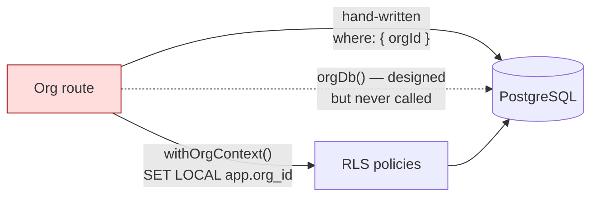
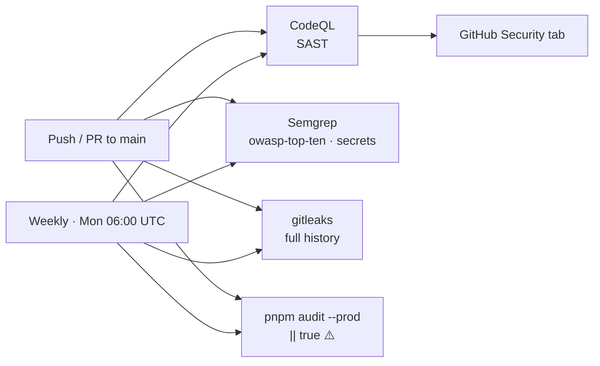

# Security

**Audience:** security engineers, backend engineers, DevOps.
**Related:** [AUTHENTICATION](AUTHENTICATION.md) · [DEPLOYMENT](DEPLOYMENT.md) · [GO-LIVE](GO-LIVE.md) · [CODE_CLEANUP_REPORT](../CODE_CLEANUP_REPORT.md)

---

## Table of Contents

- [Security posture summary](#security-posture-summary)
- [Open findings](#open-findings)
- [OWASP Top 10 mitigations](#owasp-top-10-mitigations)
- [Input validation](#input-validation)
- [SQL injection](#sql-injection)
- [XSS](#xss)
- [CSRF](#csrf)
- [CORS](#cors)
- [CSP & security headers](#csp--security-headers)
- [SSRF](#ssrf)
- [Secrets management](#secrets-management)
- [Rate limiting](#rate-limiting)
- [Authentication & authorization](#authentication--authorization)
- [Multi-tenant isolation](#multi-tenant-isolation)
- [Logging & audit](#logging--audit)
- [Encryption](#encryption)
- [Password hashing](#password-hashing)
- [File upload security](#file-upload-security)
- [Content protection](#content-protection)
- [Dependency security](#dependency-security)
- [Automated security pipeline](#automated-security-pipeline)
- [Production checklist](#production-checklist)

---

## Security posture summary

| Area | Status |
| --- | --- |
| Input validation | ✅ Zod on every mutating route |
| SQL injection | ✅ Prisma parameterised; one justified `$executeRawUnsafe`, regex-guarded |
| XSS | ✅ React escaping + CSP; no `dangerouslySetInnerHTML` in app code |
| CSRF | ✅ Bearer tokens (not cookies) + CORS allowlist |
| CORS | ✅ Explicit allowlist, no wildcard |
| CSP | ⚠️ Enforced; `script-src` still allows `'unsafe-inline'`/`'unsafe-eval'` |
| SSRF | ✅ Dedicated guard on org webhooks |
| Secrets | ✅ Zod-validated, git-ignored, gitleaks scanned |
| Rate limiting | ✅ Redis-backed, per-plan, tightened on brute-force surfaces |
| AuthN/AuthZ | ✅ Fail-closed dev login, dual secrets, capability RBAC, admin gate |
| Tenant isolation | ⚠️ RLS active; **repository layer dead code** |
| Audit logging | ✅ `AuditLog` + `recordAudit()` |
| Password storage | N/A — no passwords (Clerk owns credentials) |
| Dependency scanning | ✅ CodeQL, Semgrep, gitleaks, `pnpm audit` weekly |
| Secrets in repo | ✅ None found |

Overall: **the application is well-secured**, with defence-in-depth applied deliberately and rationale documented in-code. The material gaps are listed below.

---

## Open findings

### 1. `orgDb()` — the mandated isolation layer is dead code (High)

`apps/api/src/lib/org-scoped.ts` opens with an explicit rule:

> **CODE-REVIEW RULE:** org-scoped tables … are NEVER queried with bare `prisma.x` inside org request handlers — always through `orgDb(orgId)`, which injects the orgId filter into every call so a forgotten `where` cannot leak another tenant's rows.

**`orgDb` has zero call sites.** Every org route hand-writes its own `orgId` filter.

This is **not currently a leak** — routes do isolate correctly, either inline (`where: { id, orgId: req.orgCtx!.orgId }`) or via ad-hoc guards like `courseInOrg()` in `org-learn.ts` (a correct check-then-update). The exposure is structural: layer 1 of a documented three-layer defence is not in the request path, and the invariant is enforced only by reviewer memory. One forgotten `where` is a cross-tenant leak.

**Recommendation:** adopt `orgDb()` route by route (preferred — it makes the documented rule real), or delete it and rewrite the comment to describe reality. The current state is the worst of both.

### 2. The RLS isolation test is a false negative (High — test infrastructure)

`orgs.integration.test.ts > "RLS backstop: an UNFILTERED query inside org A's context cannot see org B"` fails locally.

Root cause: `docker-compose.yml` sets `POSTGRES_USER: eyf`, and the Postgres image makes that role a **superuser** (`rolsuper = t`, `rolbypassrls = t`). **Superusers bypass RLS unconditionally**, even with `FORCE ROW LEVEL SECURITY` (which `apply-rls.ts` correctly sets).

The policy itself is sound — proven empirically:

| Connecting role | Rows visible (unfiltered, `app.org_id = ORG_A`) | Verdict |
| --- | --- | --- |
| `eyf` (superuser — what tests use) | ORG_A **and** ORG_B | RLS bypassed → test fails |
| non-superuser (production-like) | **ORG_A only** | Policy correct |

**Risk:** a permanently red test invites someone to weaken the assertion, destroying a real tenant-isolation guard.
**Recommendation:** give the integration suite a dedicated non-superuser role (grant DML, no `BYPASSRLS`).

> [!NOTE]
> CI runs `db:rls` against a `postgres:16` service container using the same superuser, so CI shares this blind spot.

### 3. CSP allows `'unsafe-inline'` and `'unsafe-eval'` (Medium)

`apps/web/next.config.mjs` sets `script-src 'self' 'unsafe-inline' 'unsafe-eval' https: blob:` to accommodate Clerk, PostHog, and Monaco. The file names the fix itself: *"Tightening script-src to per-request nonces is the documented next step."*

### 4. Plan enforcement is disabled (Medium — business risk)

`requirePlan` returns early unless `BILLING_ENABLED=true` (`middleware/auth.ts:97`). Paid gating has never run in production.

### 5. Local `.env` drift (Low — DX)

`.env`, `apps/api/.env`, `packages/db/.env` use stale `user:password` credentials while `docker-compose.yml` provisions `eyf:eyf`; `packages/db/.env` omits `DIRECT_DATABASE_URL` (required by the schema). `.env.example` is correct.

---

## OWASP Top 10 mitigations

| # | Risk | Mitigation | Where |
| --- | --- | --- | --- |
| **A01** | Broken access control | Capability RBAC + org RBAC/ABAC + admin gate + RLS | `permissions.ts`, `org-permissions.ts`, `apply-rls.ts` |
| **A02** | Cryptographic failures | HS256 with ≥256-bit secrets, separate access/refresh secrets, HSTS 2y preload | `env.ts`, `app.ts` |
| **A03** | Injection | Prisma parameterisation; Zod validation; single regex-guarded raw call | `org-scoped.ts:71` |
| **A04** | Insecure design | Three-layer tenant isolation; fail-closed dev login; two-person publish | `org-scoped.ts`, `auth.ts` |
| **A05** | Security misconfiguration | Zod-validated env at boot; `trustProxy` exact hop count; `poweredByHeader: false` | `env.ts`, `app.ts`, `next.config.mjs` |
| **A06** | Vulnerable components | `pnpm audit`, CodeQL, Semgrep weekly | `.github/workflows/security.yml` |
| **A07** | Auth failures | Clerk + session cap + refresh rotation + server-side revocation | `middleware/auth.ts` |
| **A08** | Integrity failures | Webhook signature verification (svix/HMAC) over raw bodies; CI actions SHA-pinned | `routes/auth.ts`, `billing.ts`, `ci.yml` |
| **A09** | Logging failures | `AuditLog`, Sentry on 5xx, `x-request-id` correlation, Prometheus | `lib/audit.ts`, `observability.ts` |
| **A10** | SSRF | Dedicated DNS-resolving guard on org webhooks | `lib/ssrf.ts` |

---

## Input validation

Every mutating route parses input with Zod **inside the handler**:

```ts
const body = z.object({
  title: z.string().trim().min(2).max(120),
  description: z.string().max(2000).default(""),
}).parse(req.body);
```

A `ZodError` is caught centrally (`middleware/error.ts`) → `400 VALIDATION_ERROR` with `err.flatten()` in `details`.

Global input limits:

| Control | Value | Where |
| --- | --- | --- |
| Body limit | 1 MB (`1_048_576`) | `app.ts:34` |
| Env validation | Zod schema, fails boot on violation | `env.ts` |
| Audio content types | Explicit allowlist, parsed as buffer | `app.ts:40` |

> [!NOTE]
> Validation is **runtime-only** — Fastify's `schema` option is not used, so there is no JSON-schema-driven serialization or auto-generated OpenAPI. See [API_DOCUMENTATION](API_DOCUMENTATION.md).

---

## SQL injection

Prisma parameterises all queries. There is **one** raw-SQL site in the codebase, and it is justified:

```ts
export async function withOrgContext<T>(orgId: string, fn) {
  return prisma.$transaction(async (tx) => {
    // cuids are [a-z0-9]; guard anyway — GUC values can't be parameterized.
    if (!/^[a-zA-Z0-9_-]{1,64}$/.test(orgId)) throw new Error("invalid orgId");
    await tx.$executeRawUnsafe(`SET LOCAL app.org_id = '${orgId}'`);
    return fn(tx);
  });
}
```

> [!NOTE]
> `SET LOCAL` **cannot** take a bind parameter — this is a genuine Postgres limitation, not laziness. The value is regex-validated against a strict allowlist before interpolation, and `SET LOCAL` scopes it to the transaction so pooled connections stay clean. `apply-rls.ts` also uses `$executeRawUnsafe`, but only with hardcoded table names from a constant array.

> [!WARNING]
> Any **new** `$executeRawUnsafe` call must be reviewed as a potential injection. Prefer `$executeRaw` (tagged template) which parameterises automatically.

---

## XSS

| Layer | Control |
| --- | --- |
| React | Automatic escaping of interpolated values |
| CSP | `object-src 'none'`, `base-uri 'self'`, `frame-ancestors 'none'` |
| Headers | `X-Content-Type-Options: nosniff` |
| API | Helmet CSP `default-src 'none'` on JSON responses |

No `dangerouslySetInnerHTML` appears in application code.

> [!WARNING]
> `Problem.description` and `TheoryNote.content` are **markdown**. Any renderer added for them must sanitise output. Markdown → HTML without sanitisation is the most likely future XSS vector in this codebase.

---

## CSRF

**Not applicable by design.** The API authenticates with `Authorization: Bearer` headers, not cookies. A cross-site form post cannot attach the header, so classic CSRF does not apply.

Defence in depth:

| Control | Value |
| --- | --- |
| CORS | Explicit origin allowlist |
| CSP | `form-action 'self'` |
| Headers | `X-Frame-Options: DENY` + `frame-ancestors 'none'` |

> [!WARNING]
> If session cookies are ever introduced (e.g. a Clerk cookie session read server-side for mutations), CSRF protection becomes mandatory. The current safety is a consequence of the bearer-token design.

---

## CORS

```ts
await app.register(cors, {
  origin: env.API_CORS_ORIGINS.split(",").map((s) => s.trim()),
  credentials: true,
});
```

`API_CORS_ORIGINS` is a comma-separated allowlist, default `http://localhost:3000`. **No wildcard.**

> [!WARNING]
> `credentials: true` with a wildcard origin would be a critical misconfiguration. Never set `API_CORS_ORIGINS=*`. Set it to the exact production web origin(s) at deploy.

---

## CSP & security headers

### Web (`apps/web/next.config.mjs`)

| Directive | Value |
| --- | --- |
| `default-src` | `'self'` |
| `base-uri` | `'self'` |
| `object-src` | `'none'` |
| `frame-ancestors` | `'none'` |
| `form-action` | `'self'` |
| `script-src` | `'self' 'unsafe-inline' 'unsafe-eval' https: blob:` ⚠️ |
| `style-src` | `'self' 'unsafe-inline'` |
| `img-src` | `'self' data: blob: https:` |
| `font-src` | `'self' data:` |
| `connect-src` | `'self' <apiOrigin> https: wss:` (+ localhost/ws in dev only) |
| `worker-src` | `'self' blob:` |
| `frame-src` | `'self' https:` |
| `upgrade-insecure-requests` | production only |

Additional headers:

| Header | Value |
| --- | --- |
| `Strict-Transport-Security` | `max-age=63072000; includeSubDomains; preload` |
| `X-Frame-Options` | `DENY` |
| `X-Content-Type-Options` | `nosniff` |
| `Referrer-Policy` | `strict-origin-when-cross-origin` |
| `Permissions-Policy` | `camera=(self), microphone=(self), geolocation=(), payment=(), usb=()` |

> [!NOTE]
> `camera`/`microphone` are allowed **to self** because peer mocks and voice interviews need them. `geolocation`, `payment`, and `usb` are denied outright. The `connect-src` builder injects localhost/ws origins **only** when `NODE_ENV !== "production"` — it can never loosen production.

### API (`apps/api/src/app.ts`)

Helmet with `default-src 'none'`, `frame-ancestors 'none'`, `base-uri 'none'`, HSTS 2y preload, `Referrer-Policy: no-referrer`, `crossOriginResourcePolicy: same-site`. Appropriate for a JSON-only surface.

---

## SSRF

Org admins can register arbitrary webhook URLs — an SSRF vector. `apps/api/src/lib/ssrf.ts` blocks non-HTTPS schemes and any host resolving into a private range:

| Blocked range | Covers |
| --- | --- |
| `10/8`, `172.16/12`, `192.168/16` | RFC 1918 private |
| `127/8`, `::1` | Loopback |
| `169.254/16`, `fe80::` | Link-local + **AWS/GCP metadata (`169.254.169.254`)** |
| `100.64/10` | CGNAT |
| `0/8`, `::` | Unspecified |
| `fc00::/7` (`fc`, `fd`) | IPv6 unique-local |
| `::ffff:*` mapped forms | IPv4-mapped IPv6 bypasses |

> [!TIP]
> The module instructs: *"Call at save time AND before each delivery (DNS can be rebound between the two)."* This defeats **DNS rebinding**, where a hostname passes validation then re-resolves to `169.254.169.254` at delivery. Validating only at save time would be a bypass.

---

## Secrets management

| Control | Implementation |
| --- | --- |
| Validation | Zod at boot; `JWT_*` secrets `min(32)`; process refuses to start otherwise |
| Storage | `.env` git-ignored; `.env.example` carries placeholders only |
| CI | Secrets via GitHub Secrets/Variables; scanning by gitleaks |
| Metrics | `/metrics` requires `METRICS_TOKEN` when set |

**No real secrets are committed.** `.env.example` contains only `replace`-style placeholders.

> [!WARNING]
> **Dual-`.env` gotcha:** the API reads `apps/api/.env` (via `dotenv/config` in `env.ts`), *not* the root `.env`. Editing the root file alone will not change API behaviour. `packages/db/.env` is a third copy. Keep them in sync or consolidate.

Secret rotation is **Needs implementation** — no documented rotation procedure exists.

---

## Rate limiting

Global, Redis-backed, per plan:

| Plan | req/min |
| --- | --- |
| `free` | 60 |
| `basic` | 180 |
| `pro` | 600 |
| `elite` | 1200 |

```ts
keyGenerator: (req) => req.session?.id ?? req.ip,
```

| Property | Value |
| --- | --- |
| Store | Shared Redis (`nameSpace: "eyf-rl:"`) → global across instances |
| Test store | In-memory, to isolate test files |
| Excluded | `/livez`, `/readyz`, `/health`, `/v1/health`, `/metrics` |
| Tightened | `POST /v1/org/verify` → **5/min** (guessable access code) |

> [!TIP]
> A Redis store is a security control, not a performance detail: an in-memory store would let the effective limit scale with pod count and reset on every deploy — trivially bypassable by a determined attacker.

### Proxy trust

```ts
trustProxy: env.TRUST_PROXY_HOPS,   // exact hop count, default 1
```

> [!WARNING]
> `trustProxy: true` would trust **any** hop, letting a client spoof `X-Forwarded-For` and defeat IP-based rate limiting entirely. Set `TRUST_PROXY_HOPS` to the real number of proxies (1 behind a single LB; 2 with Cloudflare in front of it).

---

## Authentication & authorization

Full detail: [AUTHENTICATION](AUTHENTICATION.md). Security-relevant highlights:

| Control | Detail |
| --- | --- |
| Dev login | Fail-closed ×2 (`DEV_LOGIN_ENABLED` **and** `NODE_ENV`), returns 404 |
| Token secrets | Access ≠ refresh; both ≥256-bit |
| Refresh | Rotated each use; bound to `sid` + `uid`; revocable server-side |
| Session cap | 3 concurrent; eviction = immediate logout |
| Confused deputy | `isOrgToken()` rejects org tokens on user routes |
| Admin gate | `x-admin-gate` JWT bound to the staff user's id |
| Org code brute force | 5/min |

---

## Multi-tenant isolation

Three designed layers (`apps/api/src/lib/org-scoped.ts`):

| Layer | Mechanism | Status |
| --- | --- | --- |
| 1 — Repository | `orgDb(orgId)` injects `orgId` into every call | ❌ **Dead code — 0 call sites** |
| 2 — Database | Postgres RLS via `withOrgContext()` | ✅ Active on 17 tables + `organizations` |
| 3 — Tests | Cross-tenant integration suite | ⚠️ RLS assertion is a false negative locally |



> [!WARNING]
> Isolation currently holds **because each route remembers to filter**, not because the architecture enforces it. Layers 1 and 3 are both compromised. This is the highest-value security work in the repo.

---

## Logging & audit

| Concern | Implementation |
| --- | --- |
| Request logs | Pino; `API_LOG_LEVEL`; `pino-pretty` in dev only |
| Correlation | `genReqId` reuses inbound `x-request-id` or mints a UUID; echoed on every response |
| Errors | `captureException` → Sentry for 5xx with `{ reqId, url, method }` |
| Metrics | Prometheus `httpRequests` (counter) + `httpDuration` (histogram) by method/route/status |
| Audit | `recordAudit()` → `AuditLog`; surfaced at `GET /v1/admin/audit` (`view:analytics`) |

Audited actions include org member role/status changes, content CRUD, and course lifecycle events.

> [!NOTE]
> Production 5xx responses return *"Something went wrong on our end."* — internal messages are never leaked to clients, but the full error reaches Sentry. `x-request-id` links a user report to the event.

---

## Encryption

| Data | At rest | In transit |
| --- | --- | --- |
| Database | Provider-managed | TLS to Postgres |
| Redis | Provider-managed | TLS (`rediss://`) |
| R2 objects | Provider-managed | HTTPS |
| Tokens | Not stored (stateless JWT; only `UserSession` metadata persisted) | HTTPS + HSTS preload |
| Org API keys | **Hashed** — see `lib/api-keys.ts` | HTTPS |

Application-level field encryption is **not implemented**; no field is marked as requiring it.

---

## Password hashing

**Not applicable.** EYF stores no passwords:

- Clerk owns credentials, social login, and MFA.
- Dev login is password-less and disabled outside development.
- The org portal uses an access code stored in `Organization.accessCode`.

> [!WARNING]
> `Organization.accessCode` is stored **in plaintext** and is a shared, guessable credential. Mitigations: unique constraint + 5/min rate limit. Hashing it (like `ApiKey`) and rotating it periodically would be an improvement — see [ROADMAP](ROADMAP.md).

---

## File upload security

| Control | Implementation |
| --- | --- |
| Body limit | 1 MB globally |
| Audio | Explicit content-type allowlist, `parseAs: "buffer"` |
| Images | `next.config.mjs` `remotePatterns` allowlist (`**.r2.cloudflarestorage.com`, `cdn.eyf.in`) |
| Storage | Cloudflare R2, separate origin from the app |

> [!NOTE]
> There is **no general-purpose user file-upload endpoint**. Uploads are limited to audio buffers for transcription and server-generated PDFs. Virus scanning is **not implemented** and is not currently required by the surface area.

---

## Content protection

Paid content is protected against sharing by:

| Control | Implementation |
| --- | --- |
| Concurrent-session cap | 3 sessions; oldest evicted; token invalid once the row is gone |
| Forensic watermark | `apps/web/components/protection/` |
| Client deterrents | `apps/web/components/protection/` |

> [!WARNING]
> **The web platform cannot block screenshots.** Any control here is a deterrent and a forensic trail, not prevention. Native mobile (`FLAG_SECURE`) is the only real mitigation and is not implemented.

---

## Dependency security

| Control | Frequency |
| --- | --- |
| `pnpm audit --prod --audit-level high` | Every push/PR to `main`, weekly | 
| CodeQL (`javascript-typescript`) | Every push/PR, weekly |
| Semgrep (`p/typescript p/nodejsscan p/owasp-top-ten p/secrets`) | Every push/PR, weekly |
| gitleaks (full history, `fetch-depth: 0`) | Every push/PR, weekly |
| `pnpm.overrides` | Pins `ioredis@5.10.1` |
| Lockfile | `--frozen-lockfile` in CI |
| CI actions | SHA-pinned in `ci.yml` |

> [!WARNING]
> The audit job ends with `|| true`, so **a high-severity advisory does not fail the build**. It reports without blocking. Consider removing `|| true` once the dependency tree is clean, or gate on `critical` only.

> [!NOTE]
> `cd.yml` uses floating tags (`actions/checkout@v4`) while `ci.yml` SHA-pins. Pinning CD too would close a supply-chain gap on the workflow that holds deploy secrets.

---

## Automated security pipeline



Additional pipelines: `sonar.yml` (SonarQube), `lighthouse.yml` (perf budgets), `e2e.yml` (Playwright).

---

## Production checklist

Cross-check with [GO-LIVE](GO-LIVE.md).

### Must

- [ ] `DEV_LOGIN_ENABLED` unset or `false` — **never `true`**
- [ ] `NODE_ENV=production`
- [ ] `JWT_ACCESS_SECRET` and `JWT_REFRESH_SECRET` — distinct, ≥32 chars, `openssl rand -hex 32`
- [ ] `API_CORS_ORIGINS` = exact production origin(s), never `*`
- [ ] `TRUST_PROXY_HOPS` = real proxy count
- [ ] `ADMIN_ACCESS_CODE` set to a strong value
- [ ] `DIRECT_DATABASE_URL` set to the unpooled endpoint
- [ ] `METRICS_TOKEN` set, or `/metrics` blocked at the network layer
- [ ] `pnpm --filter @eyf/db db:rls` run **after** `migrate deploy`
- [ ] Database role used by the app is **not** a superuser (else RLS is bypassed)
- [ ] `SENTRY_DSN` + `RELEASE` set
- [ ] TLS terminated; HSTS preload understood (2-year, includeSubDomains)

### Should

- [ ] `BILLING_ENABLED` decided explicitly (currently gating is off)
- [ ] Tighten `script-src` to per-request nonces
- [ ] Adopt `orgDb()` or retire it
- [ ] Point the RLS test at a non-superuser role
- [ ] Remove `|| true` from the dependency audit
- [ ] SHA-pin actions in `cd.yml`
- [ ] Hash `Organization.accessCode`
- [ ] Document a secret-rotation procedure

### Verify after deploy

- [ ] `GET /readyz` → 200
- [ ] `GET /v1/auth/dev-login` → 404
- [ ] `GET /metrics` without token → 401
- [ ] Security headers present (`curl -I`)
- [ ] Cross-tenant probe returns no foreign rows

---

**Next:** [DEPLOYMENT.md](DEPLOYMENT.md) · [AUTHENTICATION.md](AUTHENTICATION.md) · [GO-LIVE.md](GO-LIVE.md)
