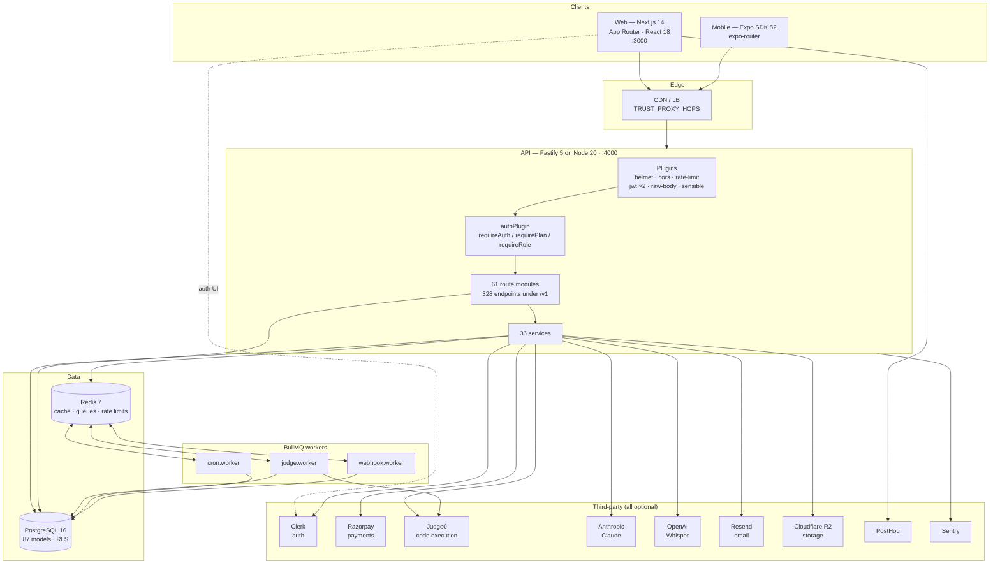
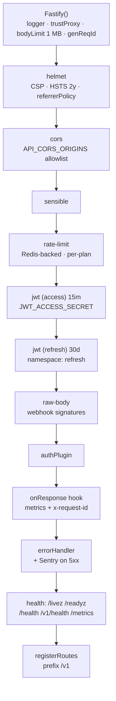
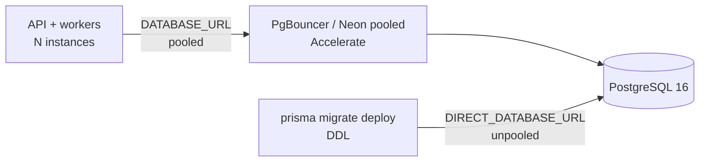
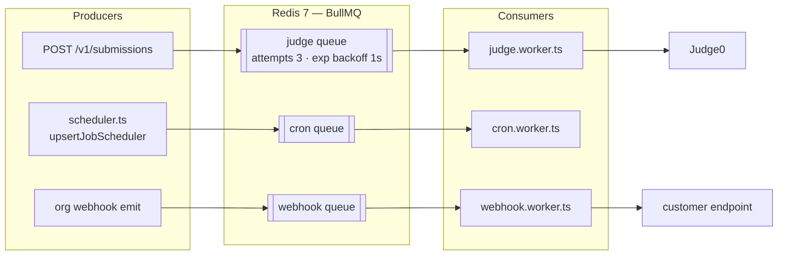
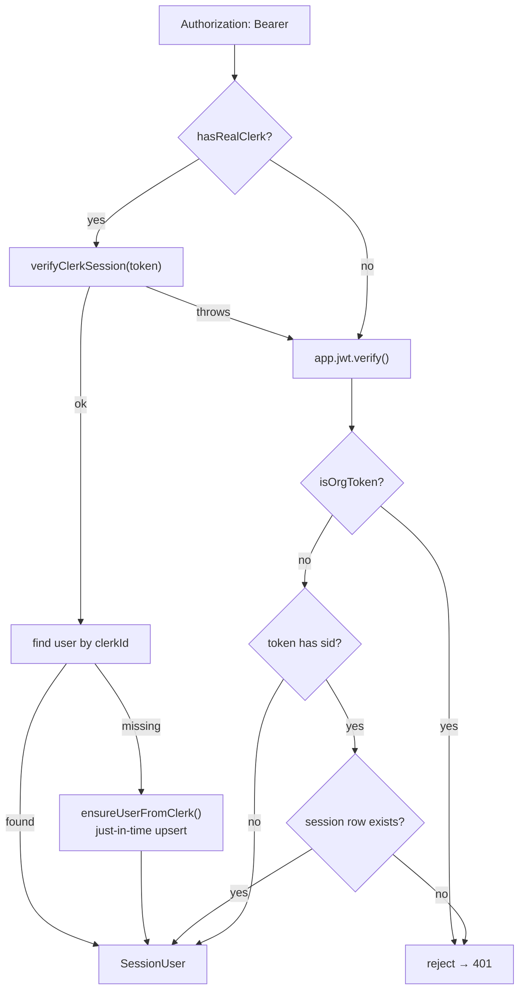
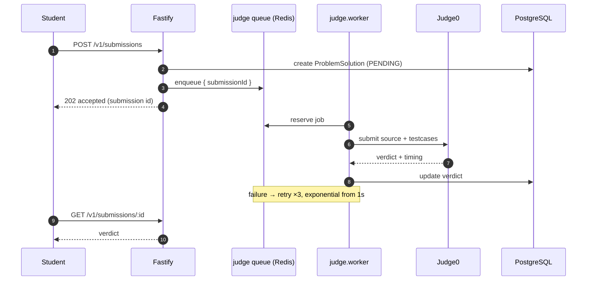
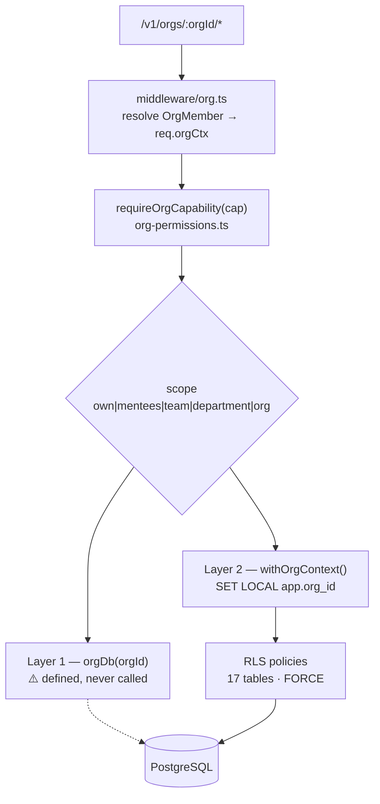
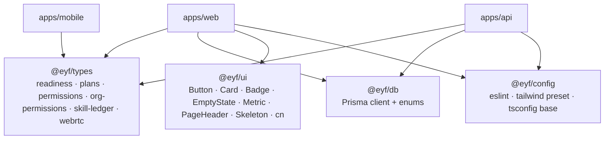

# System Architecture

**Audience:** engineers, architects, DevOps.
**Related:** [BACKEND](BACKEND.md) · [FRONTEND](FRONTEND.md) · [DATABASE](DATABASE.md) · [DEPLOYMENT](DEPLOYMENT.md) · [SECURITY](SECURITY.md)

---

## Table of Contents

- [High-level architecture](#high-level-architecture)
- [Design principles](#design-principles)
- [Layer 1 — Clients](#layer-1--clients)
- [Layer 2 — API](#layer-2--api)
- [Layer 3 — Data](#layer-3--data)
- [Layer 4 — Cache & queues](#layer-4--cache--queues)
- [Layer 5 — Storage](#layer-5--storage)
- [Layer 6 — Authentication](#layer-6--authentication)
- [Layer 7 — Third-party services](#layer-7--third-party-services)
- [Request lifecycle](#request-lifecycle)
- [Background processing](#background-processing)
- [Multi-tenancy architecture](#multi-tenancy-architecture)
- [Shared-code architecture](#shared-code-architecture)
- [Failure modes and degradation](#failure-modes-and-degradation)

---

## High-level architecture



### Component summary

| Component | Technology | Entry point | Port |
| --- | --- | --- | --- |
| Web app | Next.js 14 App Router, React 18, Tailwind, Framer Motion | `apps/web/app/layout.tsx` | 3000 |
| API | Fastify 5, TypeScript, Zod | `apps/api/src/server.ts` → `app.ts` | 4000 |
| Mobile | Expo SDK 52, expo-router | `apps/mobile/` | — |
| Database | PostgreSQL 16 + Prisma 5.22 | `packages/db/prisma/schema.prisma` | 5432 |
| Cache/queue | Redis 7 + BullMQ | `apps/api/src/lib/redis.ts` | 6379 |
| Judge | Judge0 (self-hosted) | `apps/api/src/services/judge0.ts` | 2358 |

---

## Design principles

The architecture follows five rules that are visible throughout the code:

| Principle | Evidence |
| --- | --- |
| **Degrade, never crash** | Every third-party key is `.optional()` in `env.ts`; integrations no-op without keys |
| **One implementation of shared logic** | `packages/types` holds readiness, plans, permissions — imported by web *and* api |
| **Policy in one place** | `permissions.ts` / `org-permissions.ts` are the only definitions of authority |
| **Fail closed on security** | `DEV_LOGIN_ENABLED` defaults `false`; `TRUST_PROXY_HOPS` is an exact count, not `true` |
| **Correlate everything** | `genReqId` mints/reuses `x-request-id`, echoed on every response |

---

## Layer 1 — Clients

### Web (`apps/web`)

Next.js 14 App Router with four route groups:

| Group | Purpose | Auth |
| --- | --- | --- |
| `app/(app)/*` | Student application (40+ sections) | Clerk-protected via `middleware.ts` |
| `app/(admin)/*` | Staff back-office | Role + capability + admin gate |
| `app/(auth)/*` | Sign-in / sign-up | Public |
| `app/org/*` | Employer/LMS portal | Org access code → org token |
| `app/*` (root) | Landing, pricing, legal, verify | Public |

`output: "standalone"` produces a self-contained server bundle for Docker. See [FRONTEND](FRONTEND.md).

### Mobile (`apps/mobile`)

Expo SDK 52 + expo-router — daily challenge, flashcards, streak. Typecheck is skipped gracefully when `react-native` is not installed (`apps/mobile/package.json`).

---

## Layer 2 — API

Fastify 5. `buildApp()` in `apps/api/src/app.ts` composes the stack in a deliberate order:



> [!NOTE]
> Order matters. `authPlugin` is registered **before** the routes but the rate limiter's `max` reads `req.session` — populated per-request by route `preHandler`s. Anonymous traffic keys on `req.ip`; authenticated traffic keys on `req.session.id` (`app.ts:80`).

Key hardening decisions, quoted from the code:

| Setting | Value | Why (per in-code comment) |
| --- | --- | --- |
| `trustProxy` | `env.TRUST_PROXY_HOPS` (default 1) | `true` would trust any hop, defeating IP rate limiting |
| `bodyLimit` | `1_048_576` (1 MB) | Bounded request bodies |
| Helmet CSP | `default-src 'none'` | API returns JSON only |
| HSTS | `63072000`, preload | Refuse downgrade once on TLS |
| Two JWT secrets | access + refresh namespaces | A refresh token cannot be replayed as an access token |

See [BACKEND](BACKEND.md) and [SECURITY](SECURITY.md).

---

## Layer 3 — Data

PostgreSQL 16 via Prisma 5.22. **87 models, 47 enums, 87 indexes, 22 unique constraints, 82 `onDelete: Cascade` rules.**

The client is generated into `packages/db/src/generated/client` and re-exported by `packages/db/src/index.ts`, which also implements the standard dev singleton:

```ts
export const prisma: PrismaClient =
  globalThis.__eyf_prisma ?? new PrismaClient({ /* … */ });
if (process.env.NODE_ENV !== "production") globalThis.__eyf_prisma = prisma;
```

### Pooled vs direct connections



> [!WARNING]
> Migrations **must** use `DIRECT_DATABASE_URL`. Transaction pooling cannot run DDL. When unset, Prisma falls back to `DATABASE_URL` — safe locally, wrong in production.

Full model reference: [DATABASE](DATABASE.md).

---

## Layer 4 — Cache & queues

Redis 7 serves three distinct jobs:

| Use | Detail |
| --- | --- |
| **Rate limiting** | `@fastify/rate-limit` with `redis` store + `nameSpace: "eyf-rl:"` — global across instances |
| **Queues** | BullMQ: `judge`, `cron`, `webhook` |
| **Caching** | via `apps/api/src/lib/redis.ts` |

> [!NOTE]
> In `NODE_ENV=test` the rate limiter deliberately uses the in-memory store so counts don't leak across test files (`app.ts:74`).

### Queue topology



`judgeQueue` retry policy (`apps/api/src/jobs/queue.ts`): `attempts: 3`, exponential backoff from 1s, `removeOnComplete` after 1h/1000 jobs, `removeOnFail` after 24h.

Scheduled jobs (`apps/api/src/jobs/scheduler.ts`):

| Job | Cron (UTC) | Local | Purpose |
| --- | --- | --- | --- |
| `streak-break-alert` | `30 15 * * *` | 21:00 IST | Alert users with an active streak and nothing solved today |
| `weekly-leaderboard` | Mondays | 08:00 IST | Weekly digest |
| `daily-digest` | Daily | 07:00 IST | Content digest |

---

## Layer 5 — Storage

Cloudflare R2 (S3-compatible) for resume/certificate assets.

| Variable | Purpose |
| --- | --- |
| `R2_ACCOUNT_ID`, `R2_ACCESS_KEY`, `R2_SECRET_KEY`, `R2_BUCKET`, `R2_PUBLIC_URL` | R2 credentials + public CDN origin |

`apps/web/next.config.mjs` allowlists `**.r2.cloudflarestorage.com` and `cdn.eyf.in` in `images.remotePatterns`.

> [!NOTE]
> R2 variables appear in `.env.example` but **not** in the API's `env.ts` Zod schema — they are not validated at boot. See [ENVIRONMENT_VARIABLES](ENVIRONMENT_VARIABLES.md).

---

## Layer 6 — Authentication

Two coexisting mechanisms, resolved in order by `resolveSession()` (`apps/api/src/middleware/auth.ts`):



Three authority layers:

| Layer | Guard | Failure |
| --- | --- | --- |
| Authentication | `app.requireAuth` | `401 UNAUTHENTICATED` |
| Plan gating | `app.requirePlan([...])` | `402 PLAN_UPGRADE_REQUIRED` |
| Role/capability | `app.requireRole([...])`, `requirePermission(cap)` | `403 FORBIDDEN` / `403 ADMIN_GATE_REQUIRED` |

Full flows: [AUTHENTICATION](AUTHENTICATION.md).

---

## Layer 7 — Third-party services

| Service | Purpose | Env | Without key |
| --- | --- | --- | --- |
| Clerk | Auth | `CLERK_SECRET_KEY`, `CLERK_PUBLISHABLE_KEY`, `CLERK_WEBHOOK_SECRET` | Falls back to internal JWT + dev-login |
| Razorpay | Subscriptions + payouts | `RAZORPAY_*` | Billing off (`BILLING_ENABLED=false`) |
| Judge0 | Code execution | `JUDGE0_URL`, `JUDGE0_TOKEN` | Submissions cannot be judged |
| Anthropic | Mocks, grading, coaching | `ANTHROPIC_API_KEY` | AI features no-op |
| OpenAI | Whisper transcription | `OPENAI_API_KEY` | Voice no-ops |
| Resend | Transactional email | `RESEND_API_KEY`, `RESEND_FROM` | Email no-ops |
| Cloudflare R2 | Object storage | `R2_*` | Uploads unavailable |
| PostHog | Product analytics | `NEXT_PUBLIC_POSTHOG_*` | Analytics off |
| Sentry | Error tracking | `SENTRY_DSN` | `initSentry()` no-ops |

Detail: [THIRD_PARTY_SERVICES](THIRD_PARTY_SERVICES.md).

---

## Request lifecycle

An authenticated, plan-gated write:

```mermaid
sequenceDiagram
    autonumber
    participant C as Client
    participant LB as CDN/LB
    participant F as Fastify
    participant A as authPlugin
    participant R as Rate limiter
    participant H as Route handler
    participant Z as Zod
    participant DB as PostgreSQL
    participant S as Sentry

    C->>LB: POST /v1/submissions (Bearer)
    LB->>F: + X-Forwarded-For
    Note over F: genReqId → x-request-id
    F->>A: preHandler requireAuth
    A->>A: resolveSession (Clerk → JWT)
    alt no session
        A-->>C: 401 UNAUTHENTICATED
    end
    A->>R: req.session set
    R->>R: key = session.id; max = RATE_LIMIT_PER_MIN[plan]
    alt over limit
        R-->>C: 429 RATE_LIMITED (upgradeRequired)
    end
    R->>H: dispatch
    H->>Z: parse body
    alt invalid
        Z-->>C: 400 VALIDATION_ERROR (+ flatten())
    end
    H->>DB: query
    DB-->>H: rows
    H-->>F: { success: true, data }
    F->>F: onResponse → metrics + x-request-id
    F-->>C: 200
    Note over F,S: 5xx → captureException(reqId, url, method)
```

### Response envelope

Every endpoint returns the discriminated union from `packages/types/src/index.ts`:

```ts
type ApiSuccess<T> = { success: true;  data: T; meta?: { page?; total?; cursor? } };
type ApiError      = { success: false; error: { code; message; upgradeRequired?; plan?; details? } };
```

---

## Background processing



Workers run as separate processes:

```bash
pnpm --filter @eyf/api dev:worker   # judge dispatch + verdicts
pnpm --filter @eyf/api dev:cron     # streaks, digests, leaderboard
```

---

## Multi-tenancy architecture



The RLS policy is an **escape-hatch** model (`packages/db/scripts/apply-rls.ts`): when `app.org_id` is set, foreign-tenant rows vanish; when unset (admin console, cron), everything passes.

> [!WARNING]
> **Layer 1 is dead code.** `orgDb()` has zero call sites; routes hand-write `orgId` filters instead. Isolation currently holds, but the documented safety net is not in the path. See [SECURITY](SECURITY.md) and [CODE_CLEANUP_REPORT](../CODE_CLEANUP_REPORT.md).

---

## Shared-code architecture



`@eyf/types` is the reason the platform stays coherent: readiness scoring, plan ranking, and both capability maps are **pure functions** consumed identically by web and API. Web gates navigation with the same map the API gates routes with.

---

## Failure modes and degradation

| Failure | Behaviour | Handled at |
| --- | --- | --- |
| Redis down | `/readyz` → 503; rate limiting/queues degraded | `lib/health.ts` |
| Postgres down | `/readyz` → 503 | `lib/health.ts` |
| Clerk unreachable | Falls through to internal JWT | `middleware/auth.ts:44` |
| Judge0 down | Submissions retry ×3 then fail | `jobs/queue.ts` |
| Anthropic/OpenAI down | AI/voice features no-op | services |
| No third-party keys at all | Full app runs on dev-login | `env.ts` optionals |
| Unhandled 5xx | Sentry + generic message in prod | `app.ts:125`, `middleware/error.ts` |

> [!TIP]
> `/livez` = process alive (never touches dependencies). `/readyz` = dependencies healthy. Gate deploy promotion on `/readyz`, load-balancer liveness on `/livez`.

---

**Next:** [FOLDER_STRUCTURE.md](FOLDER_STRUCTURE.md) · [BACKEND.md](BACKEND.md) · [DATABASE.md](DATABASE.md)
