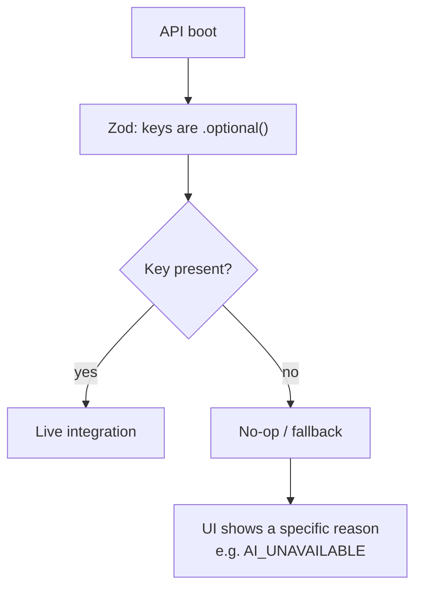
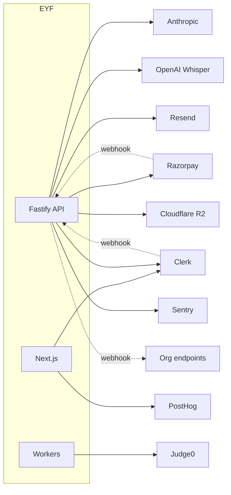
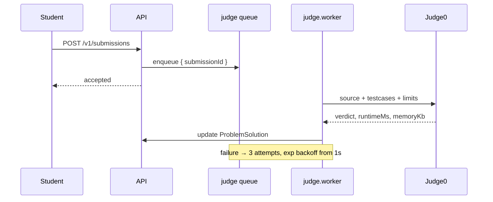

# Third-Party Services

**Audience:** engineers, DevOps, security.
**Related:** [ENVIRONMENT_VARIABLES](ENVIRONMENT_VARIABLES.md) · [SECURITY](SECURITY.md) · [GO-LIVE](GO-LIVE.md)

---

## Table of Contents

- [The graceful-degradation principle](#the-graceful-degradation-principle)
- [Service inventory](#service-inventory)
- [Clerk — authentication](#clerk--authentication)
- [Razorpay — payments](#razorpay--payments)
- [Judge0 — code execution](#judge0--code-execution)
- [Anthropic Claude — AI](#anthropic-claude--ai)
- [OpenAI Whisper — transcription](#openai-whisper--transcription)
- [Resend — email](#resend--email)
- [Cloudflare R2 — storage](#cloudflare-r2--storage)
- [PostHog — analytics](#posthog--analytics)
- [Sentry — error tracking](#sentry--error-tracking)
- [Removed integrations](#removed-integrations)
- [Not implemented](#not-implemented)
- [Adding an integration](#adding-an-integration)

---

## The graceful-degradation principle

**Every third-party key in `apps/api/src/env.ts` is `.optional()`.** The entire product runs with zero external credentials — integrations no-op, auth falls back to dev-login.



> [!TIP]
> This is the single most valuable operational property of the codebase: `pnpm dev` yields a fully explorable product with no accounts to create. It also means a vendor outage degrades one feature instead of taking down the platform.

The pattern in the UI (`apps/web/lib/use-api.ts`):

```ts
if (e.code === "AI_UNAVAILABLE") return e.message || "This AI feature isn't configured yet.";
```

The app explains the gap rather than throwing a generic error.

---

## Service inventory

| Service | Purpose | Env | Required | Without it |
| --- | --- | --- | :-: | --- |
| **Clerk** | Authentication | `CLERK_SECRET_KEY`, `CLERK_PUBLISHABLE_KEY`, `CLERK_WEBHOOK_SECRET`, `NEXT_PUBLIC_CLERK_PUBLISHABLE_KEY` | No | Internal JWT + dev-login |
| **Razorpay** | Subscriptions, payouts | `RAZORPAY_KEY_ID`, `RAZORPAY_KEY_SECRET`, `RAZORPAY_WEBHOOK_SECRET` | No | Billing disabled |
| **Judge0** | Code execution | `JUDGE0_URL`, `JUDGE0_TOKEN` | No | Submissions unjudged |
| **Anthropic** | Mocks, grading, coaching | `ANTHROPIC_API_KEY` | No | `AI_UNAVAILABLE` |
| **OpenAI** | Whisper transcription | `OPENAI_API_KEY` | No | Voice no-ops |
| **Resend** | Transactional email | `RESEND_API_KEY`, `RESEND_FROM` | No | Email no-ops |
| **Cloudflare R2** | Object storage | `R2_*` | No | Uploads unavailable |
| **PostHog** | Product analytics | `NEXT_PUBLIC_POSTHOG_KEY`, `NEXT_PUBLIC_POSTHOG_HOST` | No | Analytics off |
| **Sentry** | Errors | `SENTRY_DSN`, `SENTRY_TRACES_SAMPLE_RATE`, `RELEASE` | No | `initSentry()` no-ops |



---

## Clerk — authentication

| Aspect | Detail |
| --- | --- |
| SDK | `@clerk/nextjs` (web), Clerk backend SDK (api) |
| Code | `apps/api/src/services/clerk.ts`, `clerk-key.ts`; `apps/web/middleware.ts` |
| Detection | `hasRealClerk()` |
| Webhook | `POST /v1/auth/clerk-webhook`, svix-verified |

**Usage:** Clerk owns credentials, social login, and MFA. EYF stores **no passwords**. `verifyClerkSession(token)` yields `claims.sub` (the `clerkId`); users are upserted just-in-time if the webhook has not arrived.

**Configuration:**

```bash
CLERK_SECRET_KEY=sk_live_…
CLERK_PUBLISHABLE_KEY=pk_live_…
NEXT_PUBLIC_CLERK_PUBLISHABLE_KEY=pk_live_…   # build-time
CLERK_WEBHOOK_SECRET=whsec_…
```

**Security:**

- `CLERK_SECRET_KEY` and `CLERK_WEBHOOK_SECRET` are secrets; publishable keys are public.
- Webhook signatures are verified over the **raw** body (`fastify-raw-body`).
- Clerk verification failure **falls through** to the internal JWT — an outage does not lock out existing sessions.

> [!WARNING]
> **Never gate Clerk on key presence naively in the web app.** `middleware.ts` skips `clerkMiddleware` entirely for placeholder keys because Clerk **404s app routes** when it cannot reach a fake host. It checks against `pk_test_replace` *and* a specific base64 placeholder. This was a real P0; do not "simplify" the branch.

> [!NOTE]
> Key detection lives in `clerk-key.ts`, split from `clerk.ts` *"so it can be unit-tested in isolation"* without pulling in env + prisma + the SDK. `clerk-key.test.ts` covers it.

---

## Razorpay — payments

| Aspect | Detail |
| --- | --- |
| Code | `apps/api/src/services/razorpay.ts`, `payouts.ts`, `routes/billing.ts` |
| Models | `Subscription`, `Invoice`, `MentorPayout` |
| Endpoints | `/v1/billing/plans`, `/create-order`, `/confirm`, `/webhook` |

**Two flows:**

1. **Subscriptions** — student plans (`free`/`basic`/`pro`/`elite`), amounts in **paisa** (`Subscription.amountInr`).
2. **Connect payouts** — mentors are paid for mocks minus `PLATFORM_FEE_PCT` (`services/payouts.ts`); `POST /v1/mentors/me/razorpay-link` links the account.

**Webhook idempotency & ordering:**

```prisma
// created_at of the last-applied webhook event — guards against out-of-order delivery.
lastEventAt DateTime?
razorpaySubId String? @unique
```

> [!TIP]
> Two protections worth copying: `razorpaySubId @unique` makes replays idempotent, and `lastEventAt` rejects **stale** events — Razorpay can deliver out of order, and without it a late `cancelled` could downgrade a re-subscribed user.

> [!WARNING]
> `BILLING_ENABLED=false` (the default) makes `requirePlan` a **no-op** — every authenticated user gets full access. Billing has never enforced in production.

The SDK is untyped at one boundary — one of only two `as any` in the codebase:

```ts
const rp = razorpay as any;   // services/payouts.ts:57
```

---

## Judge0 — code execution

| Aspect | Detail |
| --- | --- |
| Code | `apps/api/src/services/judge0.ts`, `lib/judge-retry.ts`, `jobs/judge.worker.ts` |
| Deploy | Self-hosted — `docker compose --profile judge up -d` |
| Default | `http://localhost:2358` |



Per-problem limits come from `Problem.timeLimitMs` (2000 default) and `Problem.memoryLimitKb` (262144 default). `ProblemSolution.judge0Token` correlates the external submission.

> [!WARNING]
> Judge0 **executes untrusted user code**. Run it on an isolated network, never expose it publicly, and set `JUDGE0_TOKEN`. `JUDGE0_URL` should resolve to a private address — note that this is exactly the class of host `lib/ssrf.ts` blocks for *user-supplied* URLs; the Judge0 URL is operator-supplied and therefore trusted.

---

## Anthropic Claude — AI

| Aspect | Detail |
| --- | --- |
| Code | `apps/api/src/services/anthropic.ts` + consumers |
| Env | `ANTHROPIC_API_KEY` |

**Powers:** AI mock interviewer (`ai-mock.ts`), communication feedback, resume/ATS analysis (`ats.ts`), roadmap generation, editorial + problem variants, org course drafting (`lib/ai-course.ts`), guidance/strategy (`strategist.ts`), and `roast.ts`.

**Cost control:** `lib/usage.ts` tracks usage with an `AI_CREDITS_CAP`; org tenants meter via `UsageCounter`.

> [!WARNING]
> Anthropic is **metered and billed per token**. Endpoints that call it (`/v1/mocks/ai/start`, `/v1/mocks/:id/turn`, `/v1/orgs/:orgId/ai/course-draft`, `/v1/admin/problems/:slug/generate`) are the most expensive in the system. Rate limits are per-plan, not per-cost — a `pro` user has 600 req/min against LLM endpoints. Consider a dedicated cost guard before enabling billing.

Without the key, routes return `AI_UNAVAILABLE`, which the UI renders as *"This AI feature isn't configured yet."*

---

## OpenAI Whisper — transcription

| Aspect | Detail |
| --- | --- |
| Code | `apps/api/src/services/whisper.ts` |
| Env | `OPENAI_API_KEY` |
| Endpoints | `POST /v1/mocks/:id/transcribe`, `POST /v1/communication/transcribe` |

Accepts raw audio via the explicit content-type allowlist (`audio/webm`, `audio/mp4`, `audio/mpeg`, `audio/wav`, `audio/ogg`, `application/octet-stream`), parsed as a buffer with a 1 MB body limit. Client capture: `apps/web/lib/use-recorder.ts`.

> [!WARNING]
> `OPENAI_API_KEY` is grouped under **"Web (Next.js)"** in `.env.example`, but it is consumed by the **API** and is **not** a `NEXT_PUBLIC_` variable. It must never reach the browser. The grouping is misleading — see [ENVIRONMENT_VARIABLES](ENVIRONMENT_VARIABLES.md).

---

## Resend — email

| Aspect | Detail |
| --- | --- |
| Code | `apps/api/src/services/email.ts` |
| Env | `RESEND_API_KEY`, `RESEND_FROM` (default `EYF <noreply@eyf.in>`) |

Used by cron digests (streak-break alerts, weekly leaderboard, daily digest) and org invites.

> [!NOTE]
> `welcomeEmail` is defined in `services/email.ts` but **never called** — an unwired feature, not dead code. See [CODE_CLEANUP_REPORT](../CODE_CLEANUP_REPORT.md).

`RESEND_FROM` must use a domain verified in Resend (SPF/DKIM), or mail silently lands in spam.

---

## Cloudflare R2 — storage

| Aspect | Detail |
| --- | --- |
| Purpose | Resume PDFs, certificates, assets |
| Env | `R2_ACCOUNT_ID`, `R2_ACCESS_KEY`, `R2_SECRET_KEY`, `R2_BUCKET`, `R2_PUBLIC_URL` |
| Allowlist | `next.config.mjs` → `**.r2.cloudflarestorage.com`, `cdn.eyf.in` |

S3-compatible.

> [!WARNING]
> **R2 variables are absent from `env.ts`'s Zod schema.** Unlike every other integration, they are not validated at boot — a missing or typo'd R2 key fails at runtime instead of startup, breaking the fail-fast guarantee. Adding them as `.optional()` would close the gap.

> [!TIP]
> `R2_PUBLIC_URL` must match `images.remotePatterns` in `next.config.mjs`, or `next/image` refuses to render stored assets.

---

## PostHog — analytics

| Aspect | Detail |
| --- | --- |
| SDK | `posthog-js` |
| Code | `apps/web/components/analytics-provider.tsx`, `analytics-clerk.tsx`, `lib/analytics.ts` |
| Env | `NEXT_PUBLIC_POSTHOG_KEY`, `NEXT_PUBLIC_POSTHOG_HOST` |
| Consent | `apps/web/components/consent-banner.tsx` |

Both variables are **public and build-time**. Absent key ⇒ analytics disabled.

> [!WARNING]
> PostHog is client-side and covered by CSP `connect-src`, which currently allows `https:` broadly. Tightening CSP (the documented next step) requires explicitly allowlisting the PostHog host.

---

## Sentry — error tracking

| Aspect | Detail |
| --- | --- |
| Code | `apps/api/src/lib/observability.ts` |
| Env | `SENTRY_DSN`, `SENTRY_TRACES_SAMPLE_RATE` (default `0.1`), `RELEASE` (default `dev`) |

`initSentry()` runs first in `buildApp()`. Only **5xx** are captured:

```ts
if (status >= 500) captureException(err, { reqId: req.id, url: req.url, method: req.method });
```

> [!TIP]
> Set `RELEASE=$GITHUB_SHA` to attribute regressions to a deploy, and use the `reqId` to join a user report (`x-request-id` header) to the exact Sentry event.

4xx are **not** sent — deliberate. Validation failures and 401s are user errors, not incidents.

---

## Removed integrations

| Service | Removed | Commit |
| --- | --- | --- |
| MSG91 / WhatsApp bot | 2026-07-12 | `chore: remove MSG91 / WhatsApp bot integration` |

No MSG91 code or env remains.

---

## Not implemented

Explicitly **not** part of this codebase, despite being common in comparable systems:

| Service | Status |
| --- | --- |
| Stripe | **Not implemented** — Razorpay is the processor (India-first) |
| Supabase | **Not implemented** — Postgres + Prisma directly |
| AWS (S3/SES/SQS) | **Not implemented** — R2, Resend, BullMQ instead |
| Cloudinary | **Not implemented** — R2 |
| SMS | **Not implemented** — removed with MSG91 |
| Push notifications | Partially — `PushToken` model + `/v1/push/*` + `services/push.ts`; provider config not in `env.ts` |

> [!NOTE]
> `User.phone` and `phoneVerifiedAt` exist in the schema, but with SMS removed there is no verification path. **Needs implementation** if phone verification is required.

---

## Adding an integration

Follow the established contract:

1. **Add the key as optional** in `apps/api/src/env.ts`:
   ```ts
   NEWSERVICE_API_KEY: z.string().optional(),
   ```
2. **Isolate detection** so it is unit-testable (see `clerk-key.ts`):
   ```ts
   export function hasRealNewService() { return !!env.NEWSERVICE_API_KEY; }
   ```
3. **No-op without the key** — return a typed failure, never throw at boot.
4. **Give the UI a specific code** (e.g. `NEWSERVICE_UNAVAILABLE`) and handle it in `actionMessage()`.
5. **Verify webhooks** over the raw body (`fastify-raw-body`); store a provider id `@unique` for idempotency and a `lastEventAt` for ordering.
6. **Guard outbound user-supplied URLs** through `lib/ssrf.ts`.
7. **Document** in `.env.example` and [ENVIRONMENT_VARIABLES](ENVIRONMENT_VARIABLES.md).
8. **Add to `turbo.json` `globalEnv`** if it affects a build output.

### Checklist

- [ ] Key is `.optional()` in `env.ts`
- [ ] App boots and works **without** it
- [ ] Failure surfaces a specific, human message
- [ ] Webhook signature verified over the raw body
- [ ] Idempotency + ordering guards on webhook-driven state
- [ ] Secret never behind `NEXT_PUBLIC_`
- [ ] Documented

---

**Next:** [ENVIRONMENT_VARIABLES.md](ENVIRONMENT_VARIABLES.md) · [SECURITY.md](SECURITY.md) · [GO-LIVE.md](GO-LIVE.md)
